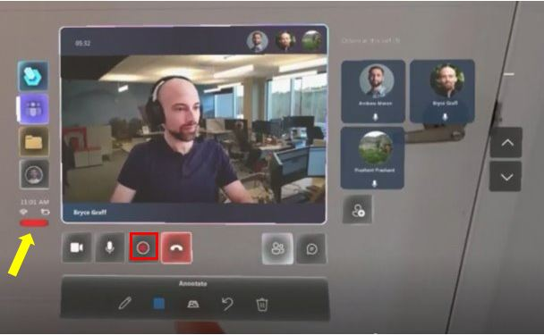
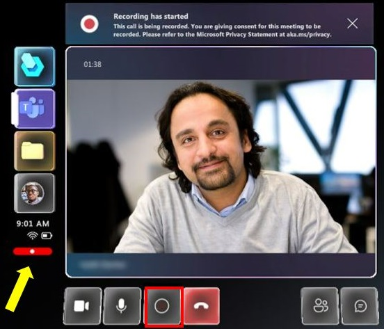
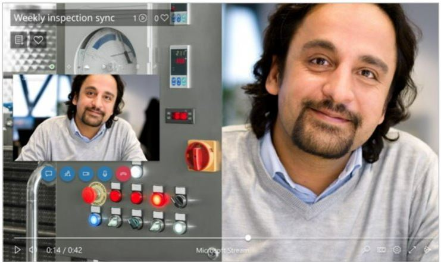
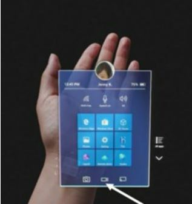

# Record a call from the Dynamics 365 Guides HoloLens app

Recording a call in the Dynamics 365 Guides HoloLens app is great for training or record-keeping purposes. The HoloLens app creates cloud-based recordings that are automatically uploaded to OneDrive for Business or Sharepoint. When the recording finishes uploading, all call participants can access the recording through Microsoft Teams chat. 

Read about the [layout for this type of call](#cloud-based-recording-layout) before deciding whether to record using this method. You may also want to consider [alternatives to cloud-based recordings](#alternatives-to-cloud-based-recording). 

## Overview of cloud-based recording 

A cloud-based call recording can be initiated by the Dynamics 365 Guides Hololens user or the Teams user. 

> [!NOTE]
> You can record one-to-one or group calls in Dynamics 365 Guides. [Learn about prerequisites for Teams cloud meeting recordings and additional exceptions](https://docs.microsoft.com/microsoftteams/cloud-recording#prerequisites-for-teams-cloud-meeting-recording) 

The recorder is the owner of the video. The owner needs to give permission or download the video to share the recording beyond people on the call. 

## Start a recording from the HoloLens app

1. Select the **Start Recording** button to start recording the call. 

     

2. You'll see a reminder that the call recording only captures the middle vertical section of your field of view. This means that if there are procedures or assets that are critical for you to record, you'll need to keep them in the middle of your field of view. [Learn about the Teams recording layout for calls with two participants](#cloud-based-recording-layout). Select **OK** to dismiss the notification. 
    
    The **Start Recording** button becomes a **Stop Recording** button. You'll also see a persistent recording indication at the bottom left of the video card. The persistent recording indication will be visible even if you open the **Settings** tab, so you can always verify whether a recording is ongoing. 
    
    

3. To end the recording, press the **Stop Recording** button or end the call. You'll see a reminder that the recording is being processed and saved securely in OneDrive for Business or SharePoint. 

After the recording is processed and saved, it will appear in your Teams chat history. To view all the call recordings you initiated, go to your OneDrive for Business or SharePoint folder. 

## Start a recording from Teams

[Learn about using Teams to record the call](https://support.microsoft.com/office/record-a-meeting-in-teams-34dfbe7f-b07d-4a27-b4c6-de62f1348c24?ui=en-us&rs=en-us&ad=us)

## Cloud-based recording layout 

The layout of the cloud-based recording depends on the number of call participants, and the layout cannot be configured. When using Dynamics 365 Guides or Teams to record the call, the Dynamics 365 Guides HoloLens user's view (their outgoing video feed) never occupies the entire recording unless the HoloLens user is the only person in a call or meeting. 

If it's imperative that your recording capture as much of the HoloLens user's view as possible and as little of the Teams user's outgoing video feed or avatars as possible, consider using one of the [alternative recording methods](#alternatives-to-cloud-based-recording). 

The next section of this article shows what the recording layout looks like when you use Teams or Dynamics 365 Guides to record the call.  

Below are several examples of what the recording layout looks like when you use Teams or Dynamics 365 Guides to record.

- In a recording with two participants, each participant's outgoing video (or avatar) occupies one-half of the recording, and both halves are vertical. This means that during a Dynamics 365 Guides call, a Teams user sees a horizontal slice of what you see, but the recording only captures the middle vertical slice of what you see. Furthermore, during the Dynamics 365 Guides call, the Teams user only sees their outgoing video feed in the corner of the call, but in the recording, their outgoing video feed occupies half the recording. (If the Teams user turns off their outgoing video feed, their avatar will occupy half the recording.)

    
    
## Alternatives to cloud-based recording

Consider the following alternatives to cloud-based recording if the cloud-based recording layouts don't work for your purposes. 

### Use the HoloLens operating system to record only what you see in the HoloLens, what you hear around you, and what you hear through the HoloLens speakers

Use this option when:

- No call participant can initiate a cloud-based call recording.

- You only want the recording to capture what you see through the HoloLens. For example, the recording will only show the participants in the Dynamics 365 Guides call if you manually navigate to the participants panel and it is in your field of view.

You can use the HoloLens operating system to record only what you see in the HoloLens, what you hear around you, and what you hear through the HoloLens speakers. There are three ways to do this:

1. From the **Start** menu:

   1. Select the **Video** button from the bottom tool pane.
  
   2. Air tap when you are ready to record.
  
   3. To stop recording, do the **Start Gesture**, and then press the **Video** button.
  
      

      > [!NOTE]
      > If you use this method to record your environment outside a call, joining a call will end the recording.

2. By voice: 

    1. Say "Hey Cortana, Record a video."

    2. Cortana's blue ring will appear, and your voice command will be displayed on the screen while giving feedback by voice.

    3. There will be a countdown from three to one, and then the recording will start.

    4. You'll see a red recording indicator in the top right-hand corner of your view while the recording is live.

    5. To stop recording, say "Hey Cortana, Stop recording."

    6. The video will be available in your **Camera Roll**. Use the **Start** menu to go to your camera roll.

3. By HoloLens hardware:

    - Press and hold the volume-up and volume-down buttons simultaneously until a three-second countdown begins. To stop recording, tap both buttons simultaneously.

    These videos are saved to the HoloLens camera roll. Keep in mind that the video will not be uploaded automatically, but there are two ways to get a photo or video off the HoloLens camera roll.

    **Upload to OneDrive**

      1. Go to the **Start** menu.
       
      2. Select the **Windows App Store**.
      
      3. Download the OneDrive app.
      
      4. Sign into OneDrive.
      
      5. Upload your file to OneDrive.

    **Manual connection to a PC with a USB-C cable**

      1. On a PC, access the internal storage through File Explorer.
      
      2. Go to **Pictures** > **Camera Roll folder**.

      3. Copy your images or videos from this folder.

    [Learn more about taking photos and videos, and getting them off the device](/hololens/holographic-photos-and-videos#capture-a-mixed-reality-photo).
