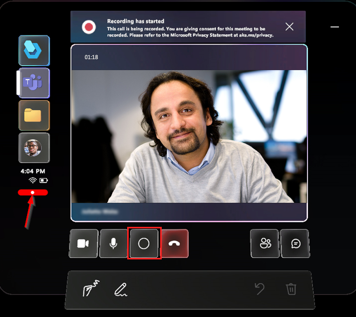

# Record a call from the Dynamics 365 Guides HoloLens app

Recording a call in the Microsoft Dynamics 365 Guides HoloLens app is great for training or record-keeping purposes. The HoloLens app creates cloud-based recordings that are automatically uploaded to OneDrive for work for the user who initiates the recording. When the recording finishes uploading, all call participants can access the recording through Microsoft Teams chat. Recordings of scheduled Teams channel meetings are saved to the SharePoint folder for that channel.

You can record one-to-one or group calls. [Learn about prerequisites and exceptions for Teams cloud meeting recordings](/microsoftteams/cloud-recording#prerequisites-for-teams-cloud-meeting-recording). A cloud recording layout is different from what participants in a call see. On a call, the video of the HoloLens user takes over the full stage for Teams users. In the recording, all video streams have the same amount of screen space. Read more about the [layout for this type of call](#cloud-based-recording-layout) before deciding whether to record using this method. Or, you can use the [alternatives to cloud-based recordings](#alternatives-to-cloud-based-recording).

## Use cloud-based recording

The Dynamics 365 Guides HoloLens user or the Teams user can start a cloud-based call recording. The recorder is the owner of the video. The owner needs to [give permission](https://support.office.com/article/Play-and-share-a-meeting-recording-in-Teams-7d7e5dc5-9ae4-4b94-8589-27496037e8fa#bkmk_sharemeetingrecording) or [download](https://support.office.com/article/Play-and-share-a-meeting-recording-in-Teams-7d7e5dc5-9ae4-4b94-8589-27496037e8fa#bkmk_downloadmeetingrecording) the video to share the recording beyond people on the call.

Call recording isn't available to users [signed in to Dynamics 365 Guides as a guest](admin-add-guest-user.md).

Don't record calls if the [explicit recording consent for Teams Audio Conferencing](/microsoftteams/conferencing-recording-consent) is enabled. This Teams feature isn't supported because users can't unmute themselves.

### Start a recording from the HoloLens app

1. Select the **Recording** button. A message indicates you're giving consent for the meeting to be recorded.

   At the bottom left of the video card, indicator lets you know that you're recording. This indicator remains visible even if you do another action such as opening a guide or file.

   

1. To end the recording, press the **Recording** button again or end the call. A reminder indicates that the recording is being processed and saved securely in OneDrive for work or SharePoint.

After the recording is processed and saved, it appears in your Teams chat history. To view all the call recordings you initiated, go to your OneDrive for work or SharePoint folder. 

### Start a recording from Teams

Go to [Record a meeting in Microsoft Teams](https://support.microsoft.com/office/record-a-meeting-in-teams-34dfbe7f-b07d-4a27-b4c6-de62f1348c24)

## Cloud-based recording layout

The layout of the cloud-based recording depends on the number of call participants, and the layout can't be configured. When using Dynamics 365 Guides or Teams to record the call, the Dynamics 365 Guides HoloLens user's view (their outgoing video feed) never occupies the entire recording unless the HoloLens user is the only person in a call or meeting. 

If your recording must capture as much of the HoloLens user's view as possible and as little of the Teams user's outgoing video feed or avatars, use the [HoloLens operating system](#use-the-hololens-operating-system).

If you use Teams or Dynamics 365 Guides to record a call with two participants, each participant's outgoing video (or avatar) occupies one-half of the recording. Both halves are vertical. During a Dynamics 365 Guides call, a Teams user sees a horizontal slice of what the Dynamics 365 Guides user sees. But the recording only captures the middle vertical slice of what the Dynamics 365 Guides user sees. Furthermore, during the Dynamics 365 Guides call, the Teams user only sees their outgoing video feed in the corner of the call, but in the recording, their outgoing video feed occupies half the recording. (If the Teams user turns off their outgoing video feed, their avatar occupies half the recording.)

## Alternatives to cloud-based recording

### Use the HoloLens operating system

Use this option when:

- No call participant can initiate a cloud-based call recording.

- You only want the recording to capture what you see through the HoloLens, what you hear around you, and what you hear through the HoloLens speakers. For example, the recording only shows the participants in the Dynamics 365 Guides call if you manually navigate to the participants panel and it's in your field of view.

There are three ways to use the HoloLens operating system.

#### Use the HoloLens app

1. From the **Start** menu, select the **Video** button from the bottom tool pane.
  
1. Air tap when you're ready to record.
  
1. To stop recording, perform the **Start Gesture**, and then press the **Video** button again.
  
   

   > [!NOTE]
   > If you use this method to record your environment outside a call, joining a call will end the recording.

#### Use your voice

1. Say "Record call." A short countdown occurs, and then the recording starts. A red recording indicator in the top right-hand corner of your view indicates the recording is live.

1. To stop recording, say "Stop recording." The video is saved to your **Camera Roll**. Use the **Start** menu to go to your camera roll.

#### Use the HoloLens hardware

1. Press and hold the volume-up and volume-down buttons simultaneously until a three-second countdown begins.

1. To stop recording, tap both buttons simultaneously. The video is saved to the HoloLens camera roll. The video doesn't upload automatically.

1. To get a photo or video off the HoloLens camera roll, choose one of the following methods:

   - Upload to OneDrive: Sign into OneDrive and upload your file.

   - Connect to a PC with a USB-C cable: On a PC, access the internal storage through File Explorer. Go to **Pictures** > **Camera Roll folder** and copy your images or videos from this folder.

    [Learn more about taking photos and videos and getting them off the device](/hololens/holographic-photos-and-videos#capture-a-mixed-reality-photo).

### Ask a Teams desktop user to use the Windows Game Bar

Use this option when you want the recording to capture exactly what the Teams desktop user sees during the call. For example, you want to see the Teams user interface and call layout the Teams desktop user configures.

1. Make sure the Teams Desktop is in focus, and then press **Windows logo key** + **G** to open the Game Bar.

1. Select **Capture** and then select the **Start Recording** button (or press **Windows logo key** + **Alt** + **R**).

1. To stop recording, select **Stop Recording**.

Learn more about the [Windows Game Bar](https://support.xbox.com/help/friends-social-activity/share-socialize/record-game-clips-game-bar-windows-10).

## See also

- [Call a remote collaborator](calling-start-call.md)
- [Join a scheduled meeting](calling-meetings.md)
- [Chat](calling-chat-file-sharing.md)
- [Screen and file sharing](calling-screen-sharing.md)
- [Annotations](calling-annotations.md)
- [Access OneDrive files](onedrive-files.md)
