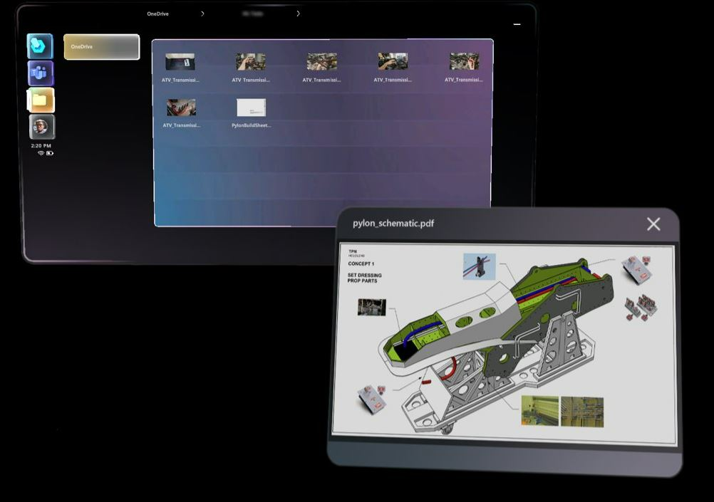
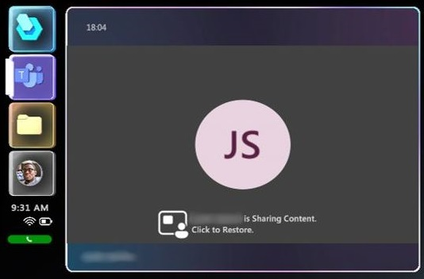
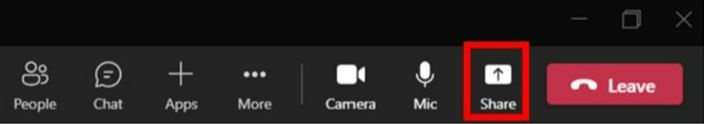
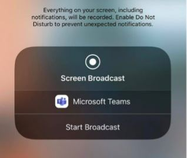

# Screen sharing in Dynamics 365 Guides on HoloLens

A remote collaborator on Microsoft Teams (PC, Mac, or mobile) may want to share their desktop or application window with you when you're on a call in Dynamics 365 Guides on HoloLens. Sharing a desktop or application window is useful if the remote collaborator wants to communicate information that's not captured in a file type that's supported by the file-sharing feature (.jpg, .bmp, .png, .tif/.tiff, .pdf, and still .gif.). For example, the remote collaborator might want to share an instructional video playing in their browser, or a series of instructions embedded in a PowerPoint presentation. 

## Use Dynamics 365 Guides to view and work with a remote collaborator's shared screen 

When a remote collaborator shares their screen with you, the screen automatically appears as a new window in your Dynamics 365 Guides environment.

The live video feed of the person sharing their screen is suspended in the Meeting window in this case. The video feed and the shared screen cannot both be on at the same time.

You can use direct touch to move the shared screen around, and to size it. You can also interact with the screen by using your gaze cursor. Using the gaze cursor is particularly useful for situations where you want to move the window further away from you. 

If the video feed is switched to another person on the call while a screen is being shared, that person's video feed is displayed in the Meeting window and the shared screen is suspended (turns gray). A button appears on the suspended screen that you can select to make the shared screen active again. 

You can also make the shared screen active by selecting a similar button in the live video feed in the Meeting window. 

If you make the shared screen active by using either of these buttons, the video feed for the person displayed in the Meeting window is suspended again. 

If the person who shared their screen stops sharing, the shared screen disappears, and the video feed for the person sharing their screen appears in the Meeting window again. 

## Use Microsoft Teams (PC or Mac) to share your desktop or a running application with a Dynamics 365 Guides user on HoloLens

1. Select **Share**.

   
   
2. Select the application window you want to share, or share your screen. 

  > [!Note]
  > You can share one application window or screen at a time. If you want to share a different screen, select the **Close share tray** button to stop sharing, select a different screen, and then start sharing again.

The shared screen and the live video feed follow the behavior described earlier in this article.

## Use Microsoft Teams mobile to share your screen with a Dynamics 365 Guides user on HoloLens

To share your screen, go to the call controls, select the ellipses icon […], select **Share**, then select **Start Broadcast**.

The shared screen and the live video feed follow the behavior described earlier in this article.

After a few seconds, a live view of your screen will be displayed as a new window in the Dynamics 365 Guides HoloLens user’s environment. 
