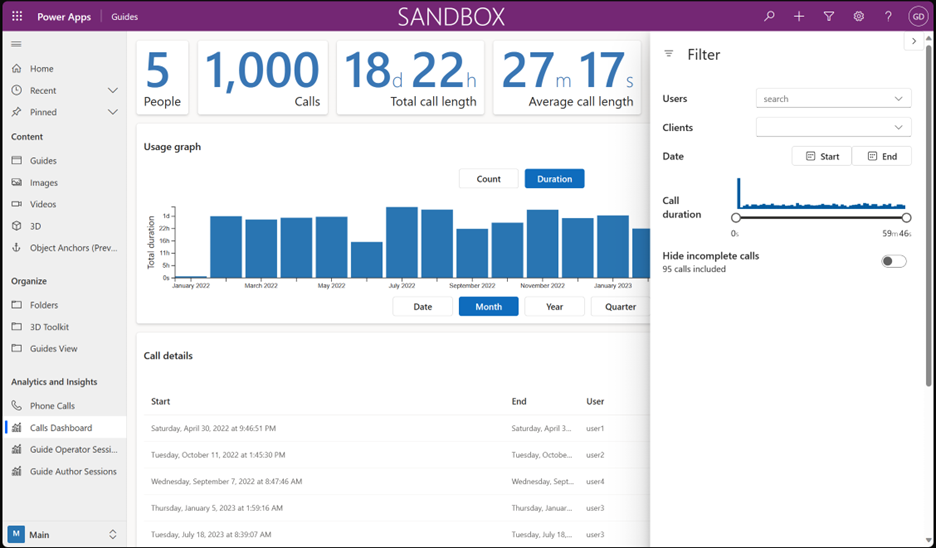
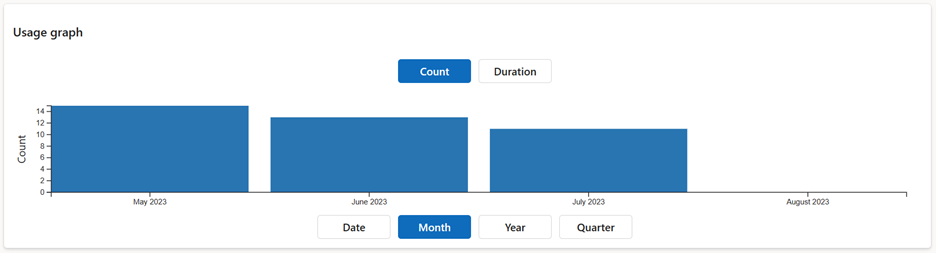

# Monitor key metrics with the Guides Calls Dashboard

The Dynamics 365 Guides Calls Dashboard is a web-based tool that lets you monitor and analyze the calls made with Guides and Remote Assist. You can monitor key operational metrics, identify operational efficiencies, and gain insights into how your workers are using Guides to collaborate.

Use the dashboard to:

- See the count and duration of calls made with Guides and Remote Assist.
- Filter the calls by date, device, location, and other properties.
- View the details of each call such as location and duration.

> [!NOTE]
> This feature is intended to help supervisors and managers derive insights regarding operational efficiencies and usage of Dynamics 365 Guides. This feature is not intended for use in making, and should not be used to make decisions that affect the employment of an employee or group of employees, including compensation, rewards, seniority, or other rights or entitlements. Customers are solely responsible for using Dynamics 365, this feature, and any associated feature or service in compliance with all applicable laws, including laws relating to accessing individual employee analytics and monitoring. End users will need to enable access from their device to phone call records and specifically consent to sharing location information before that information is shared and available through the dashboard. However, customers are also encouraged to have a mechanism in place to inform their users that analytics (such as call duration and location) relating to their communications are collected.

## Prerequisites

- Access to the Guides model-driven app or Power Apps

## Access the Calls Dashboard

With the standard roles, Admins can view all data. Authors can view their own call data. Visibility may differ if a custom security group is in use.

1. [Open the model-driven app](open-model-driven-app.md).

1. On the left side of the screen, under **Analytics and Insights**, select **Calls Dashboard**.

   

## Understand the Calls Dashboard

The Calls Dashboard has several sections of information. Use filters to refine the calls shown. You can filter by specific users, specific device types, date range, and hiding incomplete calls. Incomplete calls have a duration of zero seconds. Select the **Filter** icon to open and close the filter menu.

> [!TIP]
> A call record is generated for each Dynamics 365 Guides and Remote Assist user participating in each call. Call records for Microsoft Teams participants are not generated. It may take a few seconds after a call has ended to log the data.

### Summary metrics

The top section of the dashboard contains high-level metrics for the current data.

| Key | Description |
| --- | --- |
| People | Total number of unique people who made calls.|
| Calls | Total number of unique calls that were made. |
| Total call length | Total time spent in calls aggregated across all calls. |
| Average call length | Average time spent in a call based on all calls. |

### Usage graph

This section contains a visualization of the current data.

- To toggle between call count and call duration, select **Count** or **Duration**.

- To group data by time period, select **Date**, **Month**, **Year**, or **Quarter**.

### Call details

This section shows a tabular list of the filtered call data. Select any column to sort by that column. The following columns are available:

| Column | Description |
| --- | --- |
| Start | Start time of the call. |
| End | End time of the call. |
| User | Name of the Guides or Remote Assist user who was in a call or meeting. |
| Device type | Type of device such as HoloLens, Android, or iOS. |
| Location | Name of the location provided by the device during the call. If the information isn't available, this column is blank. |
| Duration | Duration of the call in hours, minutes, and seconds. |

#### Location information

End users can choose whether to give location permissions to the Guides app. If permission isn't granted, the **Location** on the call records from those specific users are blank. To enable or disable location services on all devices, [set the *LetAppsAccessLocation* privacy policy.](/windows/client-management/mdm/policy-csp-privacy#privacy-letappsaccesslocation)

Location information is retrieved asynchronously from the app only after a call has started; it might be missing if the call is ended abruptly or shortly (0 - 10 seconds, for example) after it has started.

## Next steps

- [Call data stored by Guides](call-data-logs.md)
- [View and access call data stored by Guides](call-logging.md)
- [Analyze Guides usage data](analytics-overview.md)