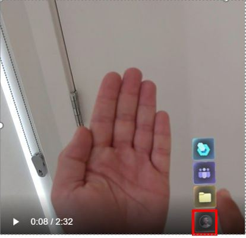
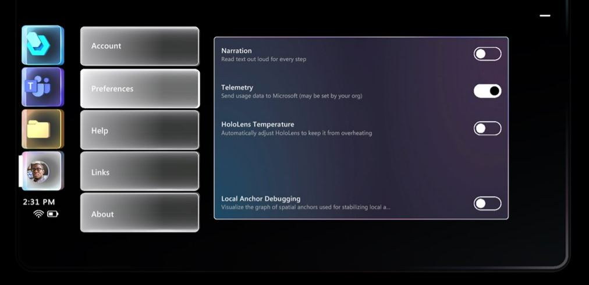

# Change a setting in the Dynamics 365 Guides HoloLens app

You can use direct touch in Microsoft Dynamics 365 Guides to change a setting in the HoloLens app. The **Settings** screen includes the following settings:

- **Narration**. Turn on or off the ability to have HoloLens read instructions out loud. [Learn more about using the narrator](voice-commands.md#narration) 

- **Telemetry**. For privacy reasons, you can turn off the ability to send telemetry data to Microsoft in the HoloLens app. Microsoft uses this data to improve the product. By opting out, you prevent Microsoft from collecting any data about your activity. [Learn more about data opt out](hololens-app-data-opt-out.md)

- **HoloLens Temperature**. When this setting is turned on, outgoing video quality in calls is automatically reduced if the HoloLens device heats up. [Learn more](calling-hololens-thermal-adjusting.md)

## Change a setting

1. Look at the palm of your hand to open the Main menu, and then select the **Settings** button.

    
    
2. Select the **Preferences** button.

3. Make changes to settings. 

    

## See also

[Learn more about using the Main menu](main-menu.md)
