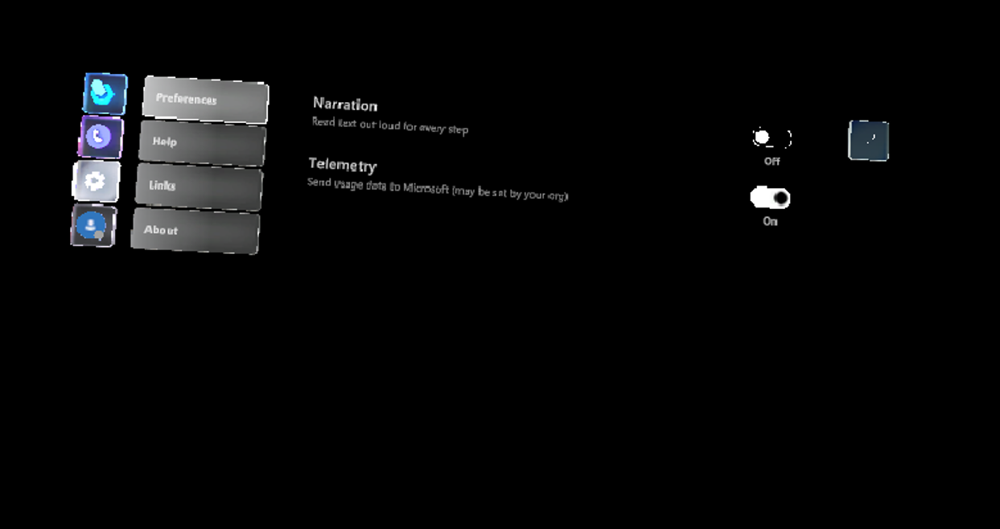

# Change a setting in the Dynamics 365 Guides version 7.0 HoloLens app

If you're using Dynamics 365 Guides version 7.0, you can use touch to change a setting in the HoloLens app. The **Settings** screen has two settings:

- Narration
- Telemetry

Preferences – User preferences for narration and telemetry 

Help- Links to tutorial videos and documentation 

Links- Policy and License links 

About- Software Information 

1. Look at the palm of your hand to open the Main menu, and then select the **Settings** button.

    
    
2. Use touch to change the setting you want. 

    

