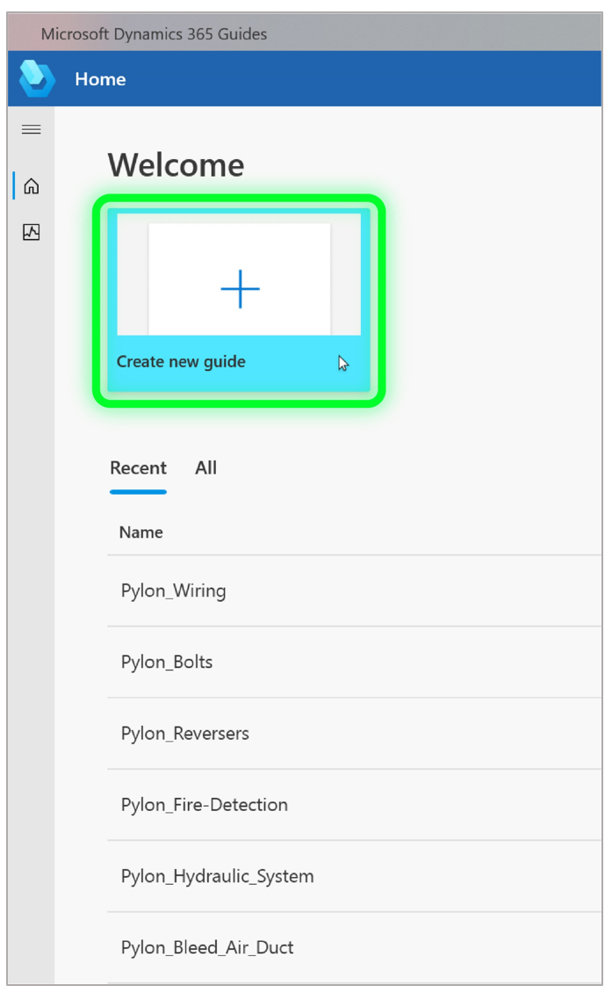

# Create a guide using the Dynamics 365 Guides PC app

1. [Open the Dynamics 365 Guides PC app](install-sign-in-pc-app.md).

2. Select **Create new guide**.

    

3. Enter a name for the guide, and then select **Create**. 

    >[!TIP]
    >If you’re planning to create multiple versions of the guide, you might want to add _v2, _v3, and 
so on as part of the name. You can also use the **Save a Copy** command on the **File** menu if you're creating multiple versions of the same guide.

    
     
>[!NOTE]
>When you create a guide by using the PC app, a JSON data file is automatically created in Common Data Service. This file is for internal use only. We don't recommend building functionality on top of this file because it might change over time. 

## How changes are synced between the PC app and HoloLens app

The PC authoring app and the [!include[pn-hololens](../includes/pn-hololens.md)] app are connected through the cloud, where your [!include[pn-dyn-365-guides](../includes/pn-dyn-365-guides.md)] files and content are stored. 
When you author a guide, all changes are saved on both the PC and [!include[pn-hololens](../includes/pn-hololens.md)]. This makes it easy to switch between devices. 
Autosave checks for changes every 4 seconds. You must be online to use [!include[pn-dyn-365-guides](../includes/pn-dyn-365-guides.md)].

> [!NOTE]
> When you switch from one device to the other, it's best to close the guide to make sure you don't lose any work. 

## What's next?

[Anchor your guide to the real world](anchor.md) 
[Structure your guide in the Outline page](structure-guide.md) 
[Create steps and add 3D content or 2D media](create-steps-assign-media.md) 
[Learn about keyboard shortcuts](keyboard-shortcuts-pc-app.md) 

