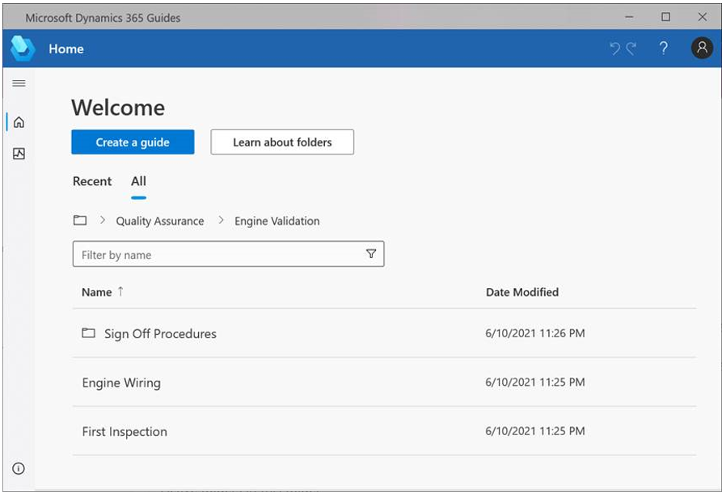
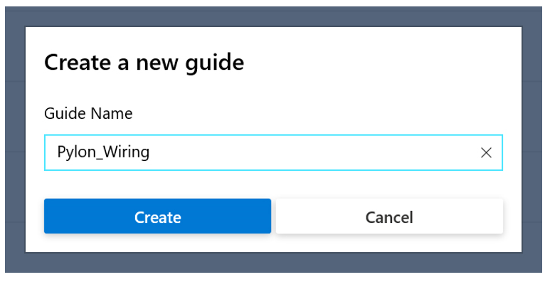
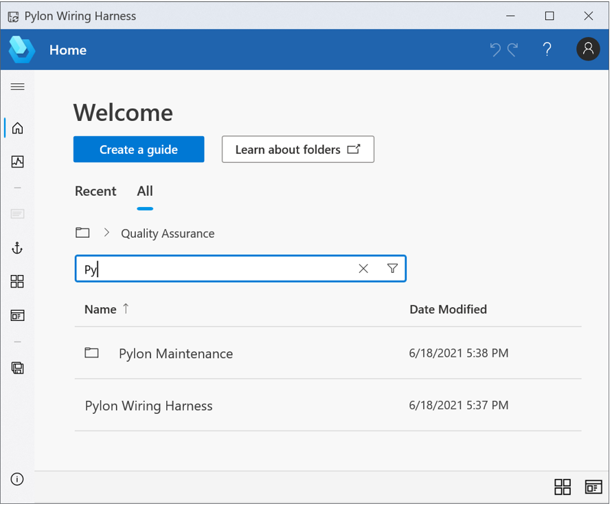

# Create or find a guide in the Dynamics 365 Guides PC app

[!include [rename-banner](~/includes/cc-data-platform-banner.md)]

## Create a guide

1. [Open the PC app](install-sign-in-pc-app.md).

2. Select **Create a guide**.

    

3. Go to the folder that you want to save the guide in. You can use the folder breadcrumbs above the **Filter by name** box to navigate the folder structure. 

    > [!NOTE]
    > To learn how to create a folder by using the Guides model-driven app, select **Learn about folders**. 

4. Enter a name for the guide, and then select **Create**.

    > [!TIP]
    > If you're planning to create multiple versions of the guide, you might want to add **\_v2**, **\_v3**, and so on, as part of the name. You can also use the **Save a Copy** command on the **File** menu if you're creating multiple versions of the same guide.

    

    > [!NOTE]
    > When you create a guide by using the PC app, a JavaScript Object Notation (JSON) data file is automatically created in Microsoft Dataverse. This file is for internal use only. We don't recommend that you build functionality on top of this file, because it might change over time.

After you create your guide, the **Outline** page appears. To learn more about how to work on the **Outline** page, see [Structure your guide in the Outline page](structure-guide.md).

## Find a guide

1. [Open the PC app](install-sign-in-pc-app.md).

2. Open the **Home** page, enter a name in the search box, and then select the **Search** button (magnifying glass).

    
    
    > [!TIP]    
    > You can also select the **Recent** or **All** tabs to look for a guide. After you select one of these tabs, you can sort the resulting list by selecting the **Name** and **Date Modified** column headers (on the **All** tab), or the **Name** and **Date Accessed** column headers (on the **Recent** tab).

## How changes are synced between the PC app and the HoloLens app

The PC authoring app and the [!include[pn-hololens](../includes/pn-hololens.md)] app are connected through the cloud, where your [!include[pn-dyn-365-guides](../includes/pn-dyn-365-guides.md)] files and content are stored.

When you author a guide, all changes are saved on both the computer and the [!include[pn-hololens](../includes/pn-hololens.md)]. Therefore, it's easy to switch between devices. Autosave checks for changes every four seconds.

You must be online to use [!include[pn-dyn-365-guides](../includes/pn-dyn-365-guides.md)].

> [!NOTE]
> When you switch from one device to the other, it's a good idea to close the guide, to make sure that you don't lose any work.

## What's next?

[Anchor your guide to the real world](anchor.md) 
[Structure your guide in the Outline page](structure-guide.md) 
[Create steps and add 3D content or 2D media](create-steps-assign-media.md) 
[Add a website or Power Apps link to a step](pc-app-website-powerapps-link.md) 
[Create and copy a link to a guide or step](pc-app-copy-link-guide-step.md) 
[Learn about keyboard shortcuts](keyboard-shortcuts-pc-app.md) 
[Deactivate a guide](pc-app-deactivate-guide.md)

[!INCLUDE[footer-include](../includes/footer-banner.md)]
