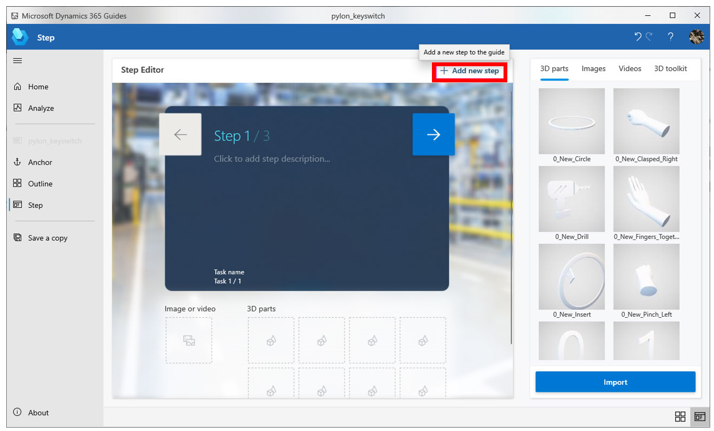
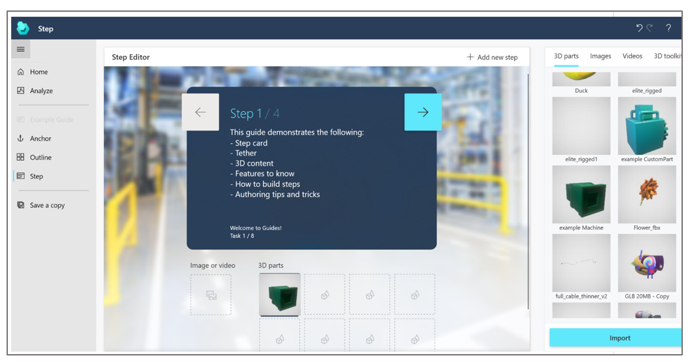

# Create steps and add 3D models or media in the Dynamics 365 Guides PC app

Steps are the central building block for creating a guide in Dynamics 365 Guides. After creating the [structure for your guide in the **Outline** page](structure-guide.md), you add instructional text and 3D models or media to support those steps in the **Step Editor**. The instructions you create in the WYSIWYG **Step Editor** match what the operator will see in the Step card on [!include[pn-hololens](../includes/pn-hololens.md)]. The following graphic shows the Step Editor  in the PC app and the Step card that the user sees on HoloLens.

## Open the Step Editor and add instructions

You open the **Step Editor** from the **Outline** page.

1. Select any step on the **Outline** page, or select **Step** in the left navigation. 

   

2. Enter your instructional text in the blue rectangle in the middle of the screen.

   

3. When you're ready to add another step, select **Add new step**.

   

### Best practices for instructional text and supporting content

- Don’t be afraid to add lots of steps, but keep the text short. Instruction text is limited to 280 characters per step.

- Write your guide in casual human language for best results. Avoid technical jargon.

- Use descriptive words. Examples: locate, find, get, go to, pick up, put down, insert, attach, remove.

- Adding a **NOTE** step is useful for quality checks. This type of step can come before or after another step. Just make sure to put it in the right spot.

- Add a **WARNING** step for things that could be dangerous or cause a quality issue. To reinforce the warning, you can [add a style in the HoloLens app](hololens-authoring.md).

- Adding sub-steps inside a step can be helpful, but don’t be afraid to create separate steps for easier reading.

- When you’re done writing a step, be sure to move the cursor outside of the text box to activate AutoSave.

## What types of 3D content or media can you add to help operators with a step?

You can add 3D content and/or media to help operators complete a step. You can also add a link to a website. For example, you could add a link to a parts inventory. The following table shows the different types of supporting items you can add.

|Content type|Description|Example|
|-------------------------|---------------------------------------------|----------------------------------------------------------|
|3D toolkit|Ready-to-use 3D models such as numbers, arrows, and hands.|Add a holographic arrow to help operators find a focus area.|
|3D part|3D models specific to your company.|Use a 3D part to help operators find a 3D part in the real world.|
|Image|2D image file|Add a diagram to help operators complete a complex step.|
|Video|Video file|Add a video to help operators complete a complex step.|
|Website link|Link to an external website|Add a link to a parts inventory system.|

### Add 3D content or media

1. On the right side of the screen, select the label for the type of item you want to add (**3D parts**, **Images**, **Videos**, or **3D toolkit**).

2. Drag the object to the appropriate box below the instructional text. For example, to add an image or video, drag the image or video to the **Image or video** box. To add a 3D part or an object from the 3D toolkit, drag it to one of the **3D parts** boxes. 

   
   
  >[!TIP]
  >Try to stick to one type of content (image, video, or 3D object) per step. Too much media or 3D content can be overwhelming to the operator and too time-consuming to absorb. Think about what type of content gets the point across best.

### Import a custom 3D model to use as a 3D part

You can import your own custom 3D models to add to the **3D parts** library. You can can drag and drop files from a local file folder to import them or use the **Import** command.

>[!NOTE]
> You can also drag media files to the gallery.

To import files by using drag and drop:

1. Open Windows File Explorer, and then go to the folder that contains the 3D model(s). 

2. Drag the file(s) to the gallery.

   

To import a 3D model by using the **Import** command:   

1.	Select the **Import** command in the upper-right corner of the Step card screen. 

ADD SCREEN SHOT HERE

2.	Locate the 3D object you want to import, and then select **Open**.

    
    
> [!NOTE]
> [!include[pn-dyn-365-guides](../includes/pn-dyn-365-guides.md)] supports glTF, GLB, FBX, STL, and PLY file formats. You can use a combination of third-party tools and the [!include[pn-dyn-365-import-tool](../includes/pn-dyn-365-import-tool.md)] to prepare your 3D (CAD) models, or you can use the Import Tool's concierge service to have [!include[cc-microsoft](../includes/cc-microsoft.md)] convert and optimize the models for you. For more information about the Import Tool, see these topics: - [Import Tool overview](https://docs.microsoft.com/dynamics365/mixed-reality/import-tool/index) - [Optimize your 3D models](https://docs.microsoft.com/dynamics365/mixed-reality/import-tool/optimize-models) - [Best practices for 3D models](https://docs.microsoft.com/dynamics365/mixed-reality/import-tool/best-practices) - [Use Dynamics 365 Import Tool](https://docs.microsoft.com/dynamics365/mixed-reality/import-tool/import-tool)

### Add numbers, arrows, hand positions, and more with the 3D toolkit

[!include[pn-dyn-365-guides](../includes/pn-dyn-365-guides.md)] comes with a library of predefined 3D objects. These objects are optimized to work perfectly with [!include[pn-hololens](../includes/pn-hololens.md)]. 
 
The 3D toolkit includes markers, arrows, generic tools, hands, numbers, symbols, and zones. 

You can use the same object (instance) as many times as you like in a step.

> [!NOTE]
> You can also add 3D objects from the 3D toolkit in [!include[pn-hololens](../includes/pn-hololens.md)] authoring. You don't have to add them on the PC if you prefer to do it in [!include[pn-hololens](../includes/pn-hololens.md)] authoring.

### Best practices for the 3D toolkit

- Use pointers to communicate simple spatial information like position, direction, and translation.

- Use the arrow when you want the operator to insert a part into something stationary (hand tightening a bolt into a tapped hole, for example). 

- Use one of the hand poses when you want the operator to use their hand in a specific way to influence or manipulate something. There are various poses for specific interactions such as Pull, Push, Pinch, Grab, and others. Combine these standards with arrows and/or icons to add additional meaning.

- Adjust the size of the pointer, but never go below 1 cm. Otherwise, it can cause errors.

For more information on ways to use objects from the 3D toolkit, see [Create a great guide](great-guide.md).

## Add a website link to a step

You can add a website link to a step so operators can see and interact with information outside of Dynamics 365 Guides. For example, you might want to provide a link to a parts diagram, parts inventory system, analytics dashboard, or information about IoT sensors. Website links enable authors to create a seamless workflow for operators.

>[!NOTE]
>Only one website link can be added to each step.

1.	On the right side of the screen, select the **Action** tab. 

    
 
2.	Drag the **Website link** graphic to the **Action** circle in the lower-right corner of the Step card.

     

3.	In the **Website link** dialog box, enter a valid URL that begins with **http://** or **https://**, and then select **Save**.
 
    

4.	To view, edit, or delete the link, right-click the **Website link** button in the Step card.

    

## What's next?

[Anchor your guide to the real world](anchor.md) 
[Structure your guide in the Outline page](structure-guide.md) 
[Learn what makes a great guide](great-guide.md)
[Learn about keyboard shortcuts](keyboard-shortcuts-pc-app.md) 

