# Create steps and add 3D models or 2D media in the Dynamics 365 Guides PC app

Steps are the central building block for creating a guide in [!include[cc-microsoft](../includes/cc-microsoft.md)] [!include[pn-dyn-365-guides](../includes/pn-dyn-365-guides.md)]. After you create the [structure for your guide on the **Outline** page](structure-guide.md), you use the Step Editor to add instructional text and 3D models or media to support those steps. The instructions that you create in the what-you-see-is-what-you-get (WYSIWYG) Step Editor match what the operator will see on the Step card on [!include[pn-hololens](../includes/pn-hololens.md)]. The following illustration shows the Step Editor in the PC app and the Step card that the user sees on [!include[pn-hololens](../includes/pn-hololens.md)].

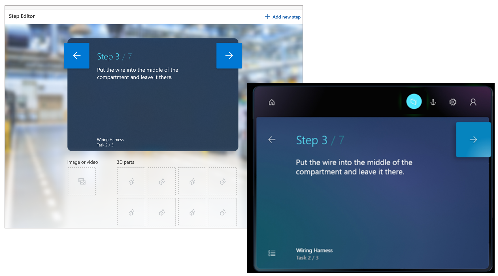

## Open the Step Editor and add instructions

You open the **Step Editor** page from the **Outline** page.

1. Select any step on the **Outline** page, or select **Step** in the left navigation.

    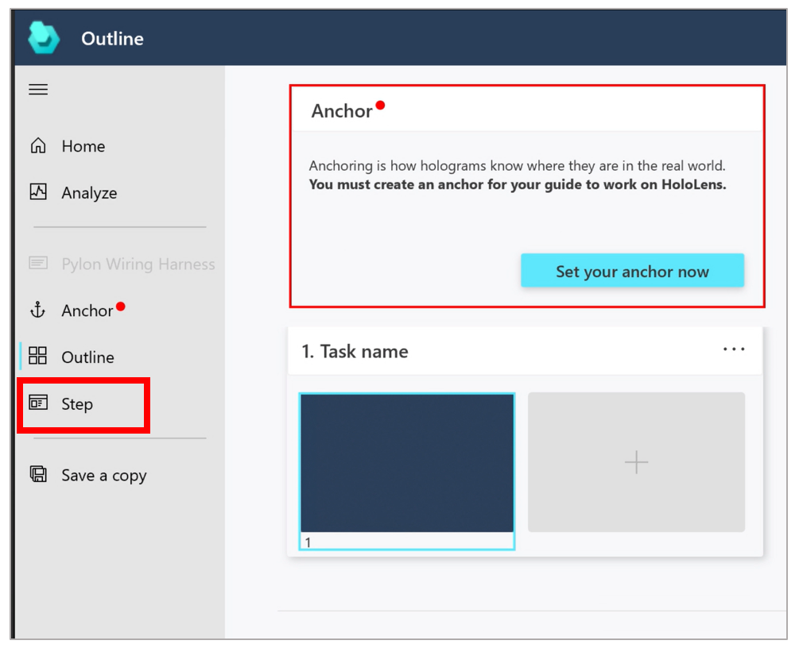

2. Enter your instructional text in the blue rectangle in the middle of the page.

    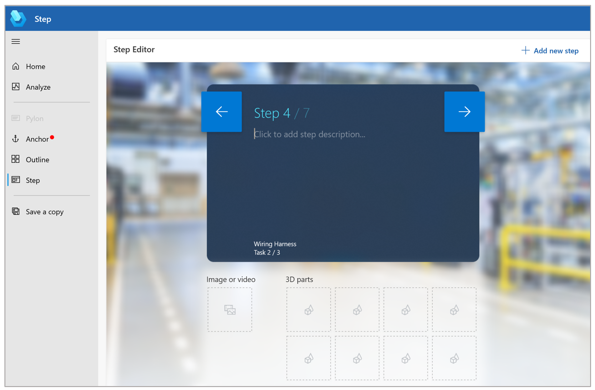

3. When you're ready to add another step, select **Add step** in the upper-right corner of the page.

### Best practices for instructional text and supporting content

- Don't be afraid to add lots of steps, but keep the text short. Instruction text is limited to 280 characters per step.

- For the best results, write your guide in casual human language. Avoid technical jargon.

- Use descriptive words, such as *locate*, *find*, *get*, *go to*, *pick up*, *put down*, *insert*, *attach*, and *remove*.

- **NOTE** steps are useful for quality checks. This type of step can come before or after another step. Just be sure to add it in the right place.

- Add a **WARNING** step for things that could be dangerous or cause a quality issue. To reinforce the warning, you can [add a style in the HoloLens app](hololens-app-orientation.md#add-styles-for-emphasis).

- Sub-steps inside a step can be helpful, but don't be afraid to create separate steps for easier reading.

- When you've finished writing a step, be sure to move the cursor outside the text box to activate AutoSave.

- Try to use limit yourself to one type of content per step. Too much media or 3D content can overwhelm the operator and can be too time-consuming to absorb. Think about the type of content that best gets the point across.

## Go to other pages from the Step Editor page

Use the buttons in the navigation pane on the left side of the **Step Editor** page to go to other pages in the PC app. The following table describes the buttons in the navigation pane.

| Button | Name | Action |
|---|---|---|
| 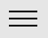 | Open Navigation | Expand the navigation pane so that it includes a description for each button. |
|  | Home | Go to the **Welcome** page, where you can create a new guide or open an existing guide. |
| 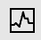 | Analyze | Go to the **Analyze** page, where you can set up Microsoft Power BI reports (Guides Analytics) to analyze your guides. |
| 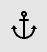| Anchor | Open the **Choose an anchor method** wizard, where you can select different anchor methods for your guide or change the type of anchoring method. |
| | Outline | Go to the **Outline** page, where you can structure or restructure your guide. You can also open the **Choose an anchor method** wizard from that page. |

## What can you add to help operators with a step?

You can add 3D content, media, or website links to help operators complete a step. The following table describes the different types of content that you can add.

| Content type | Description | Example |
|---|---|---|
| 3D models from the 3D toolkit | Ready-to-use 3D models, such as numbers, arrows, and hands | A holographic arrow that helps operators find a focus area |
| 3D part | 3D models that are specific to your company | A 3D part hologram that helps operators find a 3D part in the real world |
| Image | A 2D image file | A diagram that helps operators complete a complex step |
| Video | A video file | A short video that helps operators complete a complex step |
| Website link | A link to an external website | A link to a parts inventory system |

## Add a 3D model from the 3D toolkit

[!include[pn-dyn-365-guides](../includes/pn-dyn-365-guides.md)] includes a library of predefined 3D objects that are optimized to work perfectly with [!include[pn-hololens](../includes/pn-hololens.md)]. The 3D toolkit includes markers, arrows, hands, numbers, symbols, zones, and generic tools. The following illustration shows an example where holographic numbers, arrows, and zones are used to help operators complete a step.

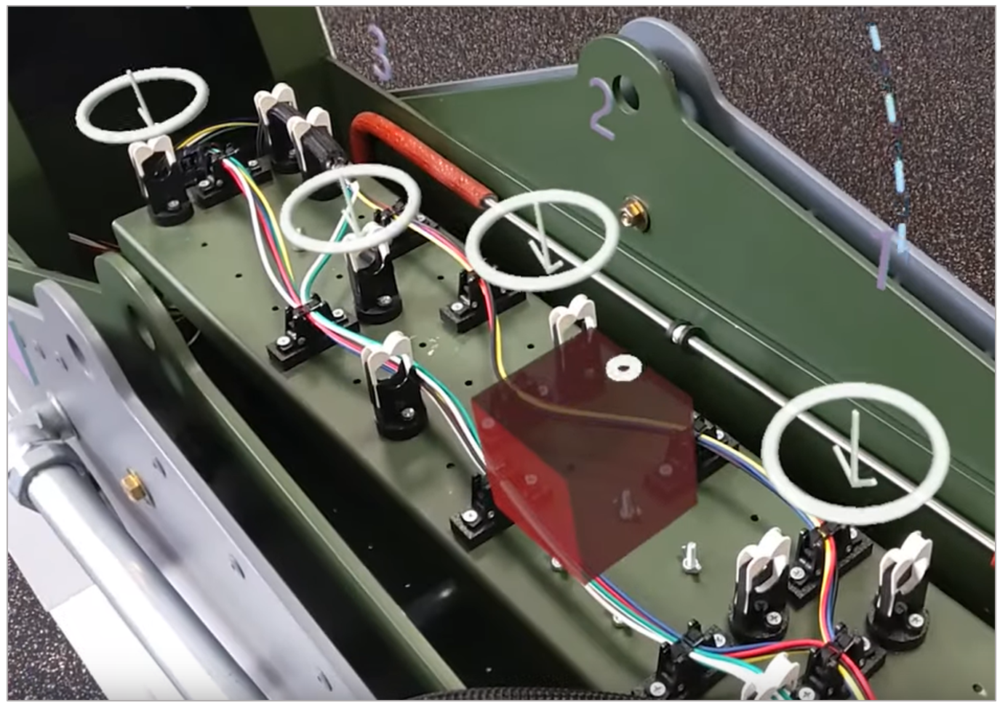

You can mix and match different types of 3D models. You can also use the same object (instance) as many times as you want in a step.

To add a model from the 3D toolkit, follow these steps.

1. On the right side of the page, select the **3D toolkit** tab, and then select the category for the type of item that you want to add.

    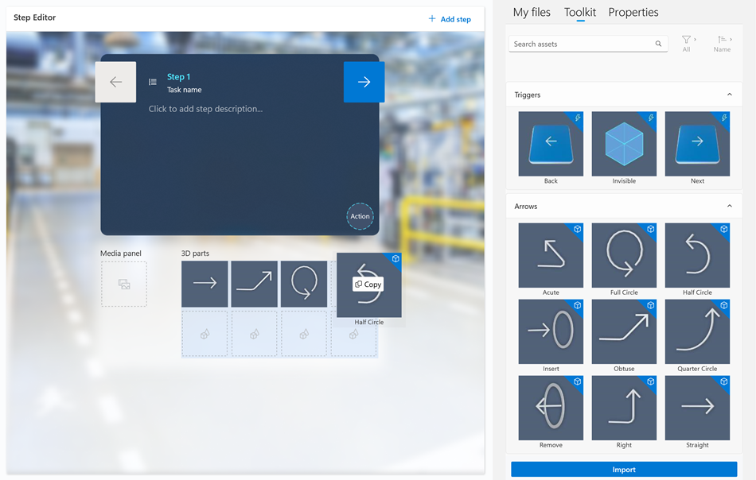

2. Drag the 3D model that you want to one of the **3D parts** boxes.

    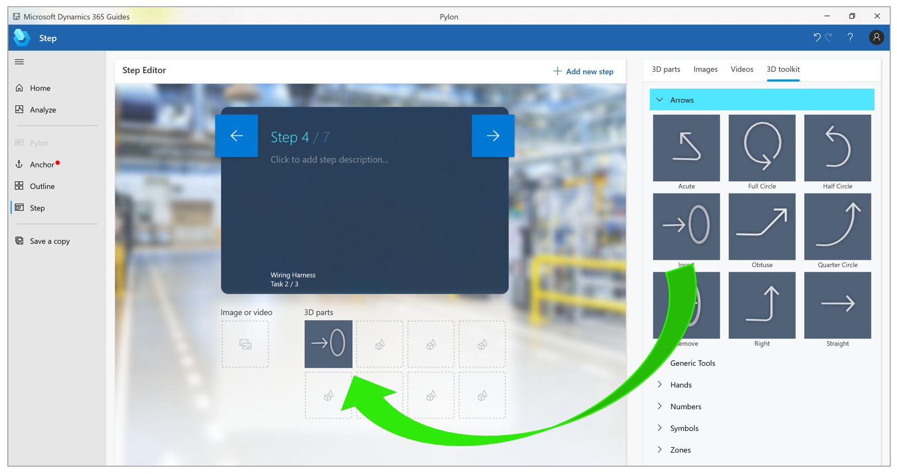

> [!NOTE]
> You can also add 3D models from the 3D toolkit directly in the [!include[pn-hololens](../includes/pn-hololens.md)] app.

### Best practices for the 3D toolkit

- Use pointers to communicate simple spatial information, such as position, direction, and translation. You can adjust the size of the pointer, but you should never reduce it below 1 cm. Otherwise, errors can occur.

- Use the arrow when you want the operator to insert a part into something stationary (for example, to hand-tighten a bolt into a tapped hole).

- Use one of the hand poses when you want the operator to use his or her hand in a specific way to influence or manipulate something. There are various poses for specific interactions, such as Pull, Push, Pinch, and Grab. Combine these standard poses with arrows and/or icons to add additional meaning.

- You can preview the image or video on the right side of the screen by selecting it (click or double-click) in the **Library**.

For more information about ways to use objects from the 3D toolkit, see [Create a great guide](great-guide.md).

## Add a 3D part

1. On the right side of the page, select the **3D parts** tab.

    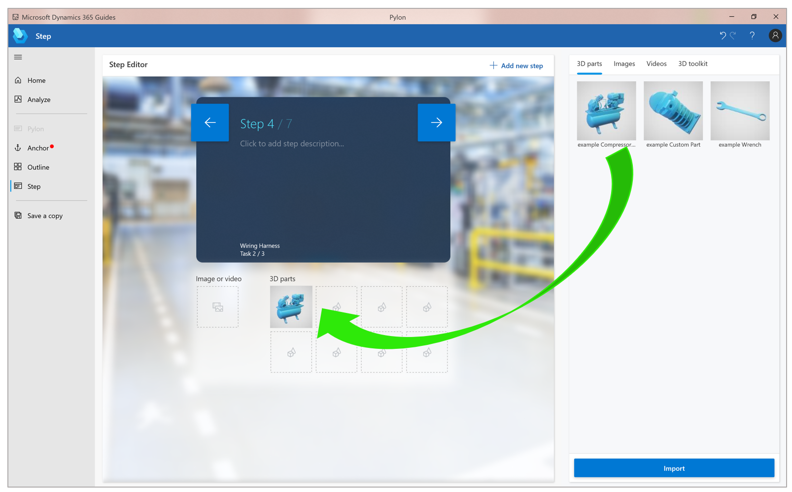

2. Drag the 3D part that you want to one of the **3D parts** boxes.

    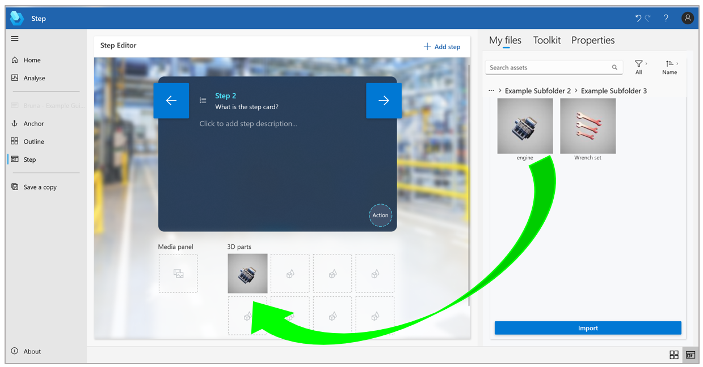
    
> [!TIP]
> To find items that were recently added to the gallery, you can sort by name or by the date when the item was added.

## Import a custom 3D model to use as a 3D part

You can import your own custom 3D models and add them to the **3D parts** library. To import files, you can drag them from a local file folder or use the **Import** command.

### Import a file by using a drag-and-drop operation

1. Open Windows File Explorer, and go to the folder that contains the 3D models that you want to import.

2. Drag the files to the gallery.

    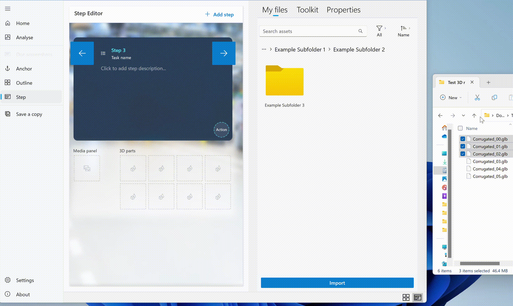

### Import a file by using the Import command

1. Select **Import** in the lower-right corner of the page.

    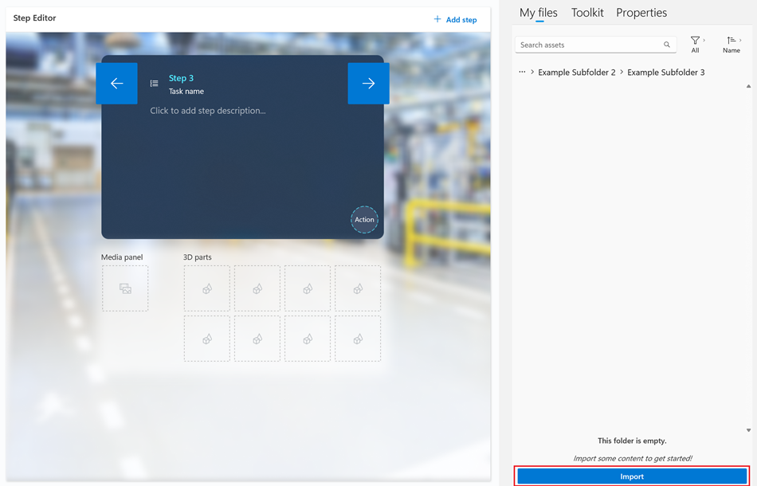

2. Find the files that you want to import, and then select **Open**.

    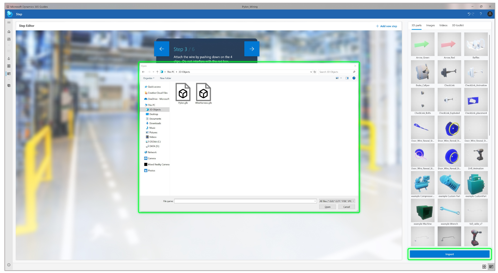

> [!NOTE]
> You can use a combination of third-party tools to prepare your 3D (computer-aided design \[CAD\]) models. For more information, see these topics:
>
> - [Optimize your 3D models](3d-content-guidelines/optimize-models.md)
>
> - [Best practices for 3D models](3d-content-guidelines/best-practices.md)
>
> - [Tutorials overview](3d-content-guidelines/tutorials-overview.md)

## Add media (images or videos)

1. On the right side of the page, select the **Images** or **Videos** tab.

    

2. Drag the image or video to the **Media panel** box.

    
    
> [!NOTE]
> You can preview the image or video on the right side of the screen by selecting it (click or double-click) in the **Library**. 

## What file formats are supported for 3D models, images, and videos?

[!include[pn-dyn-365-guides](../includes/pn-dyn-365-guides.md)] supports the following file formats.

| Media | Supported formats | Best practice |
|-------|-------------------|---------------|
| 3D models | FBX, GLB, glTF, STL, PLY | Optimize your 3D models as much as possible, to help maintain optimal performance on [!include[pn-hololens](../includes/pn-hololens.md)]. For more information, see [Convert CAD drawings to use as holograms](author-convert-3D-models.md). |
| Images | PNG, JPG, JPEG, BMP, GIF, TIF | |
| Video/audio | MP4, MOV, WMV, ASF, AVI M2TS, MKV, WAV | Keep your videos less than two minutes long and focused on one step at a time. |

> [!IMPORTANT]
> - **The file size limit is 128 MB. Transcoding may occur when uploading. This may change the size of the file that needs to be stored.**
> - The supported video format and resolution is 854 x 480 H.264 MP4 (commonly called Advanced Video Recording or "AVC"). Any other formats are transcoded when imported and may result in a larger file size than the original.
> - Dynamics 365 Guides uses meters as the default scale unit. If your 3D model scale is set to millimeters when you export from your CAD solution, the model will be converted to meters in Dynamics 365 Guides. For example, if your model is 50 millimeters, it will be converted to 50 meters. To ensure size consistency between your CAD solution and Dynamics 365 Guides, make sure to set your model scale unit to meters when you  export. 

## Preview an image, video, or 3D model and view its properties

You can preview an image, video, or 3D model on the right side of the PC app and access the **Step Editor** at the same time. 

- Select (click or double-click) the image, video, or 3D model in the **Library**.

    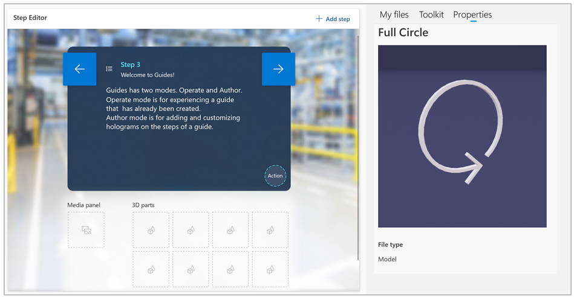
    
    The image and its properties are displayed on the right side of the screen.   
    
## Deactivate a guide or specific guide content

You can deactivate a guide or specific guide content (video, image, or 3D part) if you no longer need it. For more information, see [Deactivate a guide or specific guide content](pc-app-deactivate-guide.md). 

If you're an admin, you can reactivate content, if needed. As an admin, you can also deactivate or permanently delete a guide or guide content. For more information on deactivating, deleting, or reactivating a guide or guide content as an admin, see [Deactivate, reactivate, or delete a guide or guide content](admin-deactivate-guide.md).

## What's next?

[Anchor your guide to the real world](anchor.md) 
[Structure your guide in the Outline page](structure-guide.md) 
[Add a website or Power Apps link to a step](pc-app-website-powerapps-link.md) 
[Create and copy a link to a guide or step](pc-app-copy-link-guide-step.md) 
[Learn about keyboard shortcuts](keyboard-shortcuts-pc-app.md) 
[Deactivate a guide or guide content (authors)](pc-app-deactivate-guide.md) 
[Deactivate, delete, or reactivate a guide or guide content (admins)](admin-deactivate-guide.md) 
[Learn what makes a great mixed reality guide](great-guide.md)

[!INCLUDE[footer-include](../includes/footer-banner.md)]
