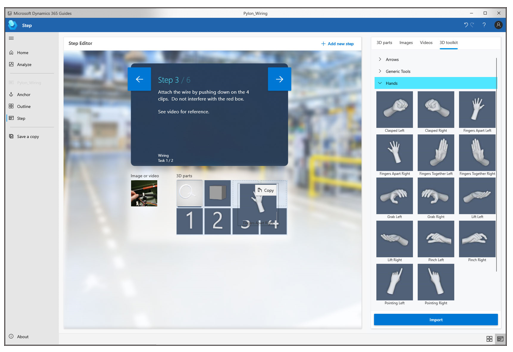
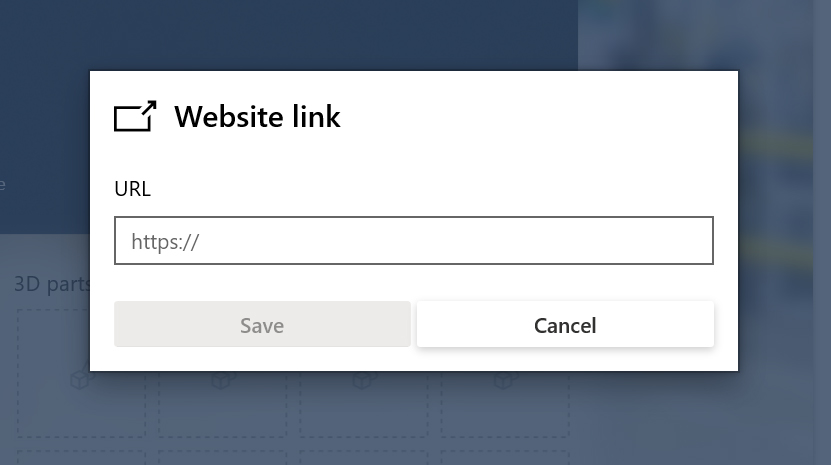
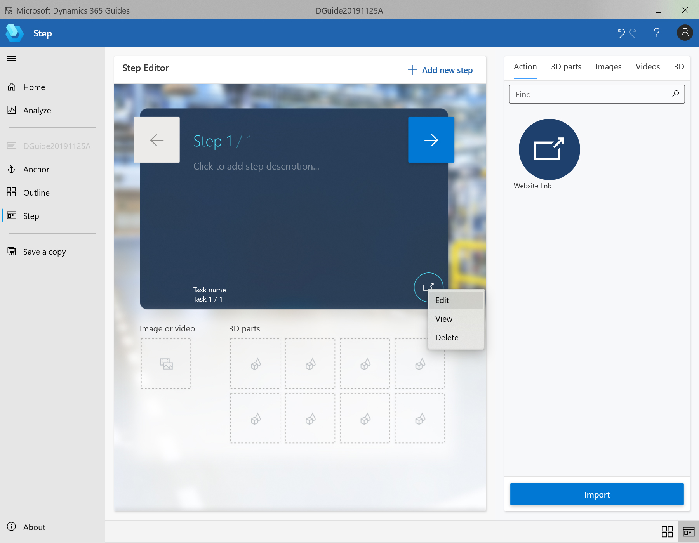

# Create steps and assign 3D models or media in the Dynamics 365 Guides PC app

Steps are the central building block for creating a guide in Dynamics 365 Guides. In the PC app, you can create steps in the **Outline** page, but you’ll probably create most of your steps from the WYSIWYG Step card page. The instructions you create on the Step card page match what the operator will see on [!include[pn-hololens](../includes/pn-hololens.md)].

In the Step card page, you write your instructional text and assign supporting content for that step, like 3D content or media (image or video). 

## Open the Step card page and add instructions

1. Select any step on the **Outline** page, or select **Step** in the left navigation. 

   

2. Enter your instructional text in the rectangle in the middle of the Step card screen.

## Add 3D content or media to support a step 

1. On the right side of the screen, select the label for the type of item you want to add (**3D parts**, **Images**, **Videos**, or **3D toolkit**).

2. Drag the object to the appropriate box below the instructional text. For example, to add an image or video, drag the image or video to the **Image or video** box. To add a 3D part or an object from the 3D toolkit, drag it to one of the **3D parts** boxes. 

   

   > [!NOTE]
   > The collection of boxes below the instructional text is called the “bin.”
  
When you view your guide on [!include[pn-hololens](../includes/pn-hololens.md)] in Author mode, you’ll see all the content that you associated with the steps, and you can place the content in the relevant spaces in the real world. For example, if you assign a pointer to a step in the PC application, you’ll align that pointer to the thing you want to point to in [!include[pn-hololens](../includes/pn-hololens.md)] authoring in the real world. What you see in the Step card page is very similar to what you see on [!include[pn-hololens](../includes/pn-hololens.md)]. 

## Best practices for the Step card page

- It’s easy to add another step from the Step card page. Just select **Add new step** in the top right corner of the page. No need to go back to the **Outline** page. 

  

- Don’t be afraid to add lots of steps, but keep the text short. Instruction text is limited to 280 characters per step to help keep the text short.

- Try to stick to one type of content (image, video, or 3D object) per step. Too much media or 3D content can be overwhelming to the operator and too time-consuming to absorb. Think about what type of content gets the point across best.

- Write your guide in casual human language for best results. Don’t use technical jargon that people don’t know or understand.

- Use descriptive words like “locate,” “find,” “get,” “go to”, “pick up,” “put down,” “insert,” “attach,” and “remove.”

- Adding a **NOTE** step is useful for quality checks. This type of step can come before or after another step. Just make sure to put it in the right spot.

- Add a **WARNING** step for things that could be dangerous or cause a quality issue. When you move to Author mode on [!include[pn-hololens](../includes/pn-hololens.md)], you can add a style to reinforce the warning.

- Adding numbered small steps inside a step can sometimes help, but don’t be afraid to create separate steps for easier reading.

- When you’re done writing a step, be sure to move the cursor outside of the text box to activate AutoSave. 

### Import your own custom 3D models

You can import your own custom 3D models to add to the **3D parts** library, and then assign parts to a step. You can use the **Import** command or you can drag and drop files from a local file folder to import them.

To import files using drag and drop:

1. Open Windows File Explorer, and then go to the folder that contains the 3D model(s). 

2. Drag the file(s) to the gallery.

   

To import a 3D model using the **Import** command:   

1.	Select the **Import** command in the upper-right corner of the Step card screen. 

2.	Locate the 3D object you want to import, and then select **Open**.

    
    
> [!NOTE]
> [!include[pn-dyn-365-guides](../includes/pn-dyn-365-guides.md)] supports glTF, GLB, FBX, STL, and PLY file formats. You can use a combination of third-party tools and the [!include[pn-dyn-365-import-tool](../includes/pn-dyn-365-import-tool.md)] to prepare your 3D (CAD) models, or you can use the Import Tool's concierge service to have [!include[cc-microsoft](../includes/cc-microsoft.md)] convert and optimize the models for you. For more information about the Import Tool, see these topics: - [Import Tool overview](https://docs.microsoft.com/dynamics365/mixed-reality/import-tool/index) - [Optimize your 3D models](https://docs.microsoft.com/dynamics365/mixed-reality/import-tool/optimize-models) - [Best practices for 3D models](https://docs.microsoft.com/dynamics365/mixed-reality/import-tool/best-practices) - [Use Dynamics 365 Import Tool](https://docs.microsoft.com/dynamics365/mixed-reality/import-tool/import-tool)

## Add 3D objects from the 3D toolkit to support your steps

[!include[pn-dyn-365-guides](../includes/pn-dyn-365-guides.md)] comes with a library of predefined 3D objects included in the 3D toolkit that are optimized to work perfectly with [!include[pn-hololens](../includes/pn-hololens.md)]. Use objects from the 3D toolkit like any other content to support your steps and get your point across. Having a ready-made library makes it easy to get started if your company doesn’t have any 3D content.
 
The 3D toolkit includes markers, arrows, generic tools, hands, numbers, symbols, and zones. Here’s what the models look like:

You add a 3D object from the 3D toolkit in the Step card page, and then place it in [!include[pn-hololens](../includes/pn-hololens.md)] Author mode. You can use the same object (instance) as many times as you like in a step.

> [!NOTE]
> You can also add 3D objects from the 3D toolkit in [!include[pn-hololens](../includes/pn-hololens.md)] authoring. You don't have to add them on the PC if you prefer to do it in [!include[pn-hololens](../includes/pn-hololens.md)] authoring.

To add an object from the 3D toolkit:

1. Select the **3D toolkit** tab.

2.	Select the appropriate category of objects.
    
3.	Drag the object you want from the list to a **3D parts** box below the Step card.

    
 
## Best practices for the 3D toolkit

- Use pointers to communicate simple spatial information like position, direction, and translation.

- Use the arrow when you want the operator to insert a part into something stationary (hand tightening a bolt into a tapped hole, for example). 

- Use one of the hand poses when you want the operator to use their hand in a specific way to influence or manipulate something. There are various poses for specific interactions such as Pull, Push, Pinch, Grab, and others. Combine these standards with arrows and/or icons to add additional meaning.

- Adjust the size of the pointer, but never go below 1 cm. Otherwise, it can cause errors.

## Add a website link to a step

You can add a website link to a step so operators can see and interact with information outside of Dynamics 365 Guides. For example, you might want to provide a link to a parts diagram, parts inventory system, analytics dashboard, or information about IoT sensors. Website links enable authors to create a seamless workflow for operators.

>[!NOTE]
>Only one website link can be added to each step.

1.	On the right side of the screen, select the **Action** tab. 

   
 
2.	Drag the **Website** graphic to the **Action** circle in the lower-right corner of the Step card.

    

3.	In the **Website** dialog box, enter a valid URL that begins with http:// or https://, and then select **Save**.
 
   

4.	To test, edit, or delete the link, right-click the **Website** button in the Step card.

   

## What's next?

[Anchor your guide to the real world](anchor.md) 
[Structure your guide in the Outline page](structure-guide.md) 
[Learn about keyboard shortcuts](keyboard-shortcuts-pc-app.md) 
[Opt out of sending telemetry data to Microsoft](data-opt-out-pc-app.md)
