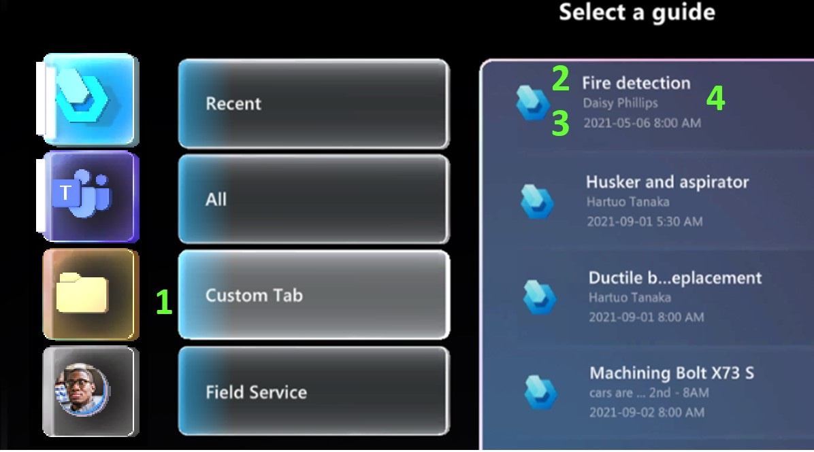

# Show a list of guides on a custom tab for a specific set of Dynamics 365 Guides users

If you want to create a custom list of guides for a specific user or set of users in Microsoft Dynamics 365 Guides, create a custom view. Operators access the view through a custom tab on HoloLens. This tab contains only the guides that are defined in the custom view.

The following illustration shows an example of a tab named **Custom Tab**. The numbers and table below the illustration show where the values for each part of the tab come from.

1. The name of the view that you create.

1. The **Guides** field.

1. The **Date and Time** field.

1. Another field that you want to add (optional).

Custom views are useful when you want to show a set of guides that is related to a specific workflow. For example, you might want to show a different set of guides to each team or business unit. Or, you might want to show a list of guides that is targeted at a specific type of operator role.

## Prerequisites

- Dynamics 365 Guides solution version 104.1907.0.33 or later.

- Dynamics 365 Guides PC and HoloLens app versions 104.1907.19001 or later.

- **System Administrator** role for the Dynamics 365 Guides environment that you're working with.

- A general understanding of [Microsoft Dataverse](/powerapps/maker/common-data-service/data-platform-intro), the database that Dynamics 365 Guides is based on.

## Create a new table in Microsoft Dataverse

Create a new table in Microsoft Dataverse with at least two columns to include in the view. If you want to use an existing table instead of creating a new table, skip to [Create the view](#create-the-view).

1. Sign in to [https://powerapps.microsoft.com](https://powerapps.microsoft.com) as an admin.

    

1. Select **Environments** on the top right and select the environment where you want to add the custom tab.

1. In the left pane, select **Tables**.

1. [Create a table](/power-apps/maker/data-platform/create-edit-entities-portal?tabs=excel#create-a-table). Make sure the display name is singular.

    > [!IMPORTANT]
    > The display name must be singular. For example, **Custom Tab**. If it's plural, the tab won't appear correctly on HoloLens.

1. Select **New** > **Column** and add a column with the following properties:

    - **Display name**: Enter **Date and Time**.

    - **Data type**: Select **Date and Time**.

    - **Format**: Select **Date and Time**.

1. Select **Save**.

1. Select **New** > **Column** again and add a column with the following properties:

    - **Display name**: Enter **Guide**.

    - **Data type**: Select **Lookup**. You'll use this field to search the database and assign a guide to the table through the view.

    - **Related table**: Select **Guide**.

1. Select **Save**.

1. In the lower-right corner of the page, select **Save Table**.

## Add a view to the table

Add a view to the table that you created and include the same fields that you added to the new table.

The following rules apply to the view:

- At least two columns. Other columns are optional.
- The first column must be a **Date and Time** field (that is, it must have the **Date and Time** data type), and the field can't be empty.
- The second column must be a lookup to the **msmrw\_guide** table, and the field can't be empty.
- If a formatted value is available, it's used.
- Nonempty values are concatenated and shown below the guide name.

### Create the view

1. Make sure that the table you created is open in Power Apps.

    > [!NOTE]
    > You can't create the view on the **msmrw\_guide** table.

1. Select **New** > **View**.

1. In the **Create a view** dialog box, enter a name for the view that you want to display on the HoloLens tab.

1. Select **Create**.

1. Select the down arrow next to **New column**, and then select **Insert view column**.

1. Select the **Date and Time** field.

1. Select **Insert view column** again, and then select **Guide**.

    

    > [!NOTE]
    > You can drag columns to move them after they are created.

1. If you want another field to appear on the custom tab, select **Insert view column** again, and then select a field.

1. In the upper-right corner of the page, select **Save and Publish**, and then refresh the page.

1. Copy and save the record ID for the saved query. This record ID appears after "view" in the URL.

    

    > [!IMPORTANT]
    > When you copy the URL, **do not** include the question mark (?) at the end of it.

## Create a Guides view configuration record

Create a configuration record that tells HoloLens that view to use for the custom tab.

1. In the left pane, select **Apps**, and then select **Guides** to open the Guides model-driven app.

1. In the left pane, under **Organize**, select **Guides View**, and then select **New**.

    

1. In the **New Guide View Configuration** page, enter the following information:

   - **Name**: A name to identify this configuration record, such as Custom Tab View. This name isn't used for the tab name on HoloLens.

   - **Saved Query ID**: The record ID that you saved. This value isn't validated, so copy it carefully to ensure that it's correct.

1. Select **Save & Close**.

> [!WARNING]
> There is no relationship between the Guide view configuration record and the saved view. If you delete the target view or table, a fetch of the data will fail, and data won't be shown on HoloLens.

## Add specific guides to the list

With the App Designer, add the list of guides to display on the custom HoloLens tab.

> [!NOTE]
> The following procedure is an example that shows how to use the App Designer. You can configure the App Designer in different ways, depending on your experience with Dynamics 365.

1. In Power Apps on the left pane, select **Apps**. Then select the ellipsis (&hellip;) next to **Guides**, and select **Edit**.

1. Select the ellipsis (&hellip;) in the command bar, and then **Switch to classic**.

1. In the App Designer, select **Edit** (pencil symbol) next to **Site Map**.

    

1. Select the **Organize** heading, select **Add**, and then select **Group**.

    

1. Enter a name for the new group (for example, **Custom Tab**). This name appears to the right of the other headings on the **Sitemap Designer** page.

1. Select the heading for the new group, select **Add**, and then select **Subarea**.

1. On the **Properties** tab on the right side of the page, in the **Entity** field, select the name of the table that you created in the [Create a new table in Microsoft Dataverse](#create-a-new-table-in-microsoft-dataverse) section.

1. In the upper-right corner of the page, select **Save**, and then select **Publish**.

1. In the upper-left corner of the page, select **App Designer** to return to the App Designer.

1. Scroll down to the **Forms** item for your table, and select it.

1. On the **Components** tab on the right side of the page, in the **Main Forms** section, select the **Edit** button (pencil symbol).

    

1. Drag the **Date and Time** and **Guide** fields from the list of fields in the left pane to the center of the page.

    

1. Select **Save and publish**.

## Add guides to the view

1. [Open the model-driven app](open-model-driven-app.md) in Guides. The new group and view appear at the bottom of the left pane.

1. Select the view to open it, and then, select **New**.

1. Enter the following information:

   - **Name**: The name of the guide to display on the custom tab.
   - **Owner**: The user who can access the list.
   - **Date and Time**: Date and time to display the guide. This date must be either the current date or a future date. Otherwise, the guide won't appear on the custom tab.
   - **Guide**: Select a guide to add to the list.

    

1. To add more guides to the list, select **New**.

[!INCLUDE[footer-include](../includes/footer-banner.md)]
