# Create a custom list of guides for a specific set of users in Dynamics 365 Guides users

If you want to create a custom list of guides for a specific user or set of users in Microsoft Dynamics 365 Guides, you can create a custom view. Operators access the custom view through a tab on HoloLens. The tab contains only the guides defined by the custom view. For example, the following picture shows an **Assigned Tasks** tab with a custom list of guides.

Custom views are useful when you want to show a set of guides related to a particular workflow. For example, you might want to show a 
different set of guides per team or business unit, or a list of guides targeted at a specific type of operator role.

## Prerequisites

To create a custom view, you need:

- Dynamics 365 Guides solution version 104.1907.0.33 or later

- Dynamics 365 Guides PC and HoloLens app versions 104.1907.19001 or later 

You also need to be an administrator for the Dynamics 365 Guides instance that you're working with and it's useful to have a general understanding of the [Common Data Service](https://docs.microsoft.com/powerapps/maker/common-data-service/data-platform-intro), the database that Dynamics 365 Guides is based on.

## Overview of creating a custom view

Creating a custom view involves these basic steps:

1. Create a new entity in the Common Data Service that contains the fields (at least two) that will be included in the view.

2. Create the view.

3. Create a Guides view configuration record.

4. Use the App Designer to add specific guides to the list displayed in the view.

Each of these steps is described in detail below.

## Step 1: Create a new entity in the Common Data Service

>[!NOTE]
>If you want to use an existing entity instead of creating a new entity, skip to **Step 2: Create the view**.

1. Go to https://powerapps.microsoft.com, open the instance you want to work with, and then sign in with your admin credentials.

    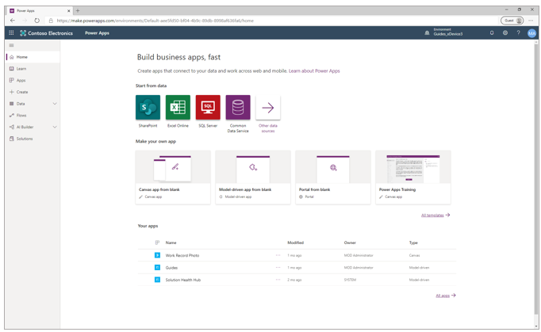

2. In the left pane, select **Data**, select **Entities**, and then select **New entity**.

    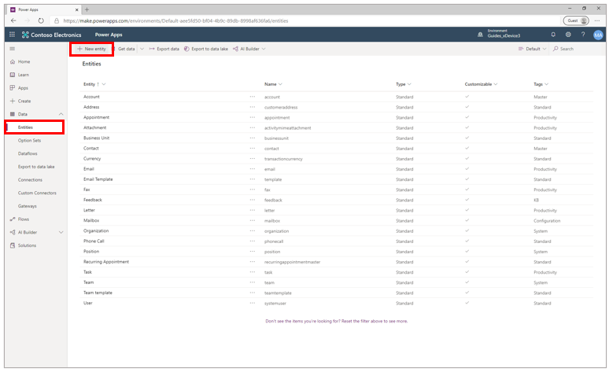

3. In the **New entity** pane on the right side of the screen, enter a display name (for example, **My assignments**). 

    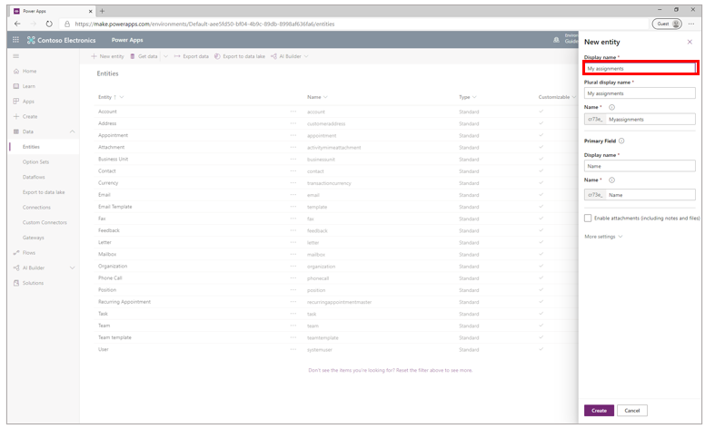

4. Select **Create**.

5. With the new entity open, select **Add field.**

    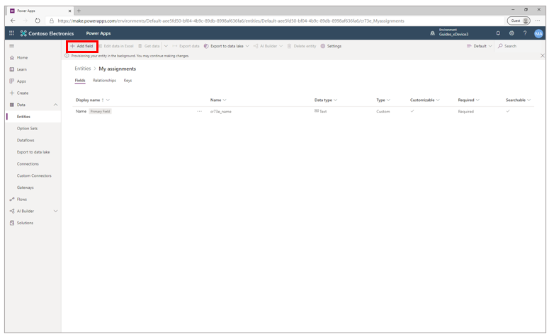

6. In the **Field properties** pane on the right side of the screen:

   1. In the **Display name** field, enter **Date and Time**.
   
   2. In the **Data type** field, select **Date and Time**. 
   
       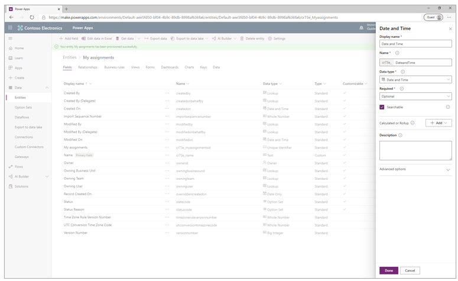
   
   3. Select **Done**.
   
7. Select **Add field** again, and then enter the following values for this field:

   1. In the **Display name** field, enter **Guide**.
   
   2. In the **Data type** field, select **Lookup**. You'll use this field to search the database and assign a guide to the 
   entity through the view.
   
   3. In the **Related entity** field, enter **Guide**. 
   
       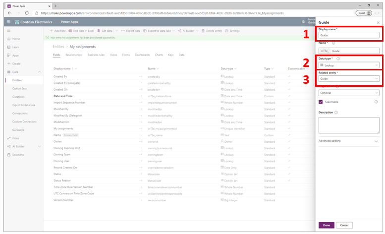
   
   4. Select **Done**.
   
8. In the lower-right corner of the screen, select **Save Entity**. 

## Step 2: Create the view

In this step, you'll add a view to the entity you created in Step 1. The view will include the same fields you added to the new entity.

Rules for the view include the following:

- It must have at least two columns. Additional columns are optional. See the example below that shows a third field. 

- The first column must be a **Date and Time** field (have the **Date and Time** data type) and the field can't be empty.

- The second column must be a lookup to the **msmrw_guide** entity and the field can't be empty. 

- If a formatted value is available, it will be used. 

- Nonempty values are concatenated and displayed below the guide name.

The following illustration shows an example tab on HoloLens called **Assigned Tasks** and where the values for each part of the tab come from. 

   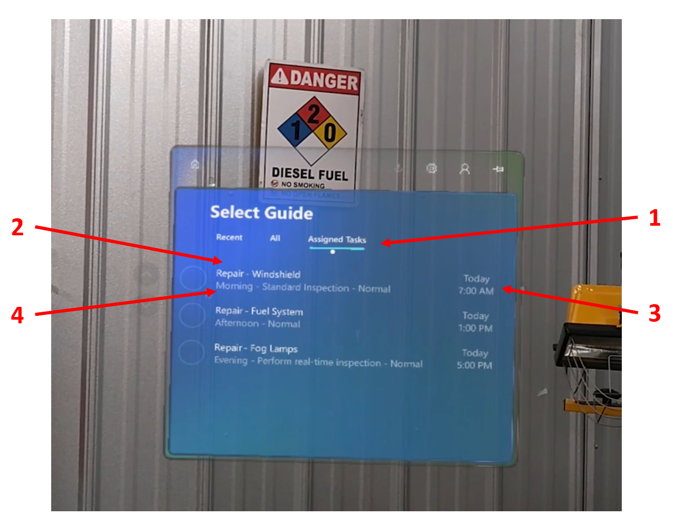
   
   1. Name of the view that you create
   
   2. **Guides** field
   
   3. **Date and Time** field
   
   4. Additional field (could be any field you want to add)

### To create the view

1. Make sure the entity you created in Step 1 is open.

    >[!NOTE]
    >You can't create the view on the **msmrw_guide** entity.

2. Select **Views**, and then select **Add view**.

    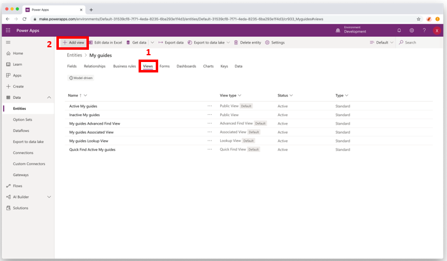

3. In the **Create a view** dialog box, enter a name for the view. This name will be displayed in the **HoloLens** tab.

    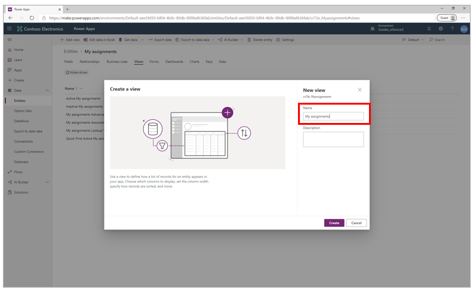

4. Select **Create**.

5. Select **Add column**, and then select **Date and Time**.

    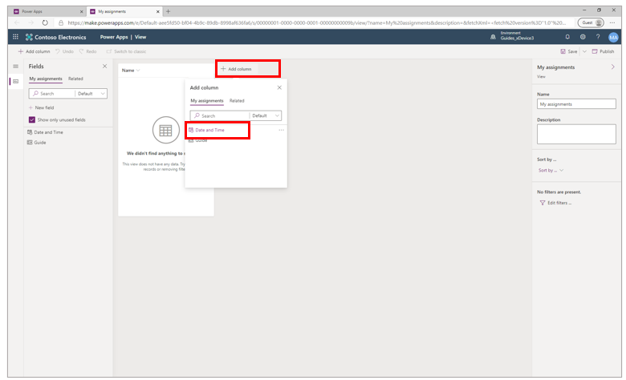

6. Select **Add column** again, and then select **Guide**. Your screen should look like this after adding the two columns:

    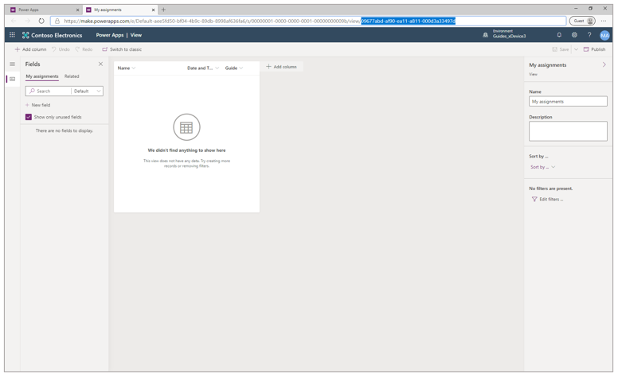

   >[!NOTE]
   >You can drag columns to move them after they're created.
   
7. In the upper-right corner of the screen, select **Save**, select **Publish**, and then refresh the page.

8. Copy and save the saved query record ID. This record ID appears at the end of the URL for the window after https://make.powerapps.com/.../view/

    

## Step 3: Create a Guides view configuration record

The purpose of the configuration record is to tell HoloLens which view to use.

1. Go to [powerapps.com](https://powerapps.com) and sign in as an administrator for the instance.

2. In the left pane, select **Apps**, and then select **Guides**.

    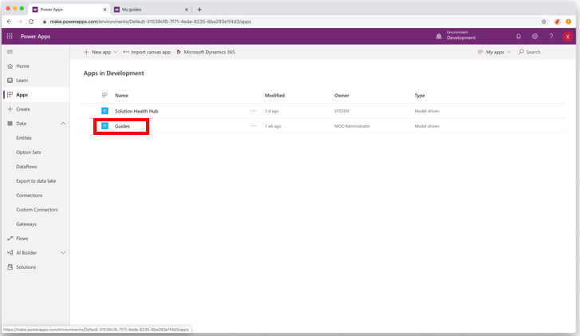

3. In the left pane, under **Configuration**, select **Guides View**, and then select **New**.

    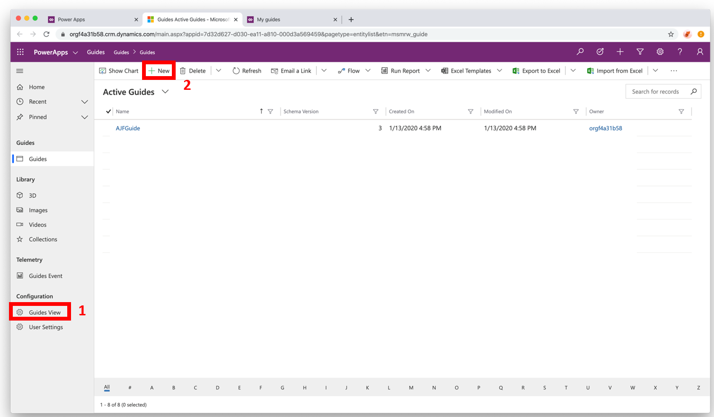

4. In the **New Guide View Configuration** screen, enter a name that will help you remember what this configuration record is for. This is not used for the HoloLens tab name. 

    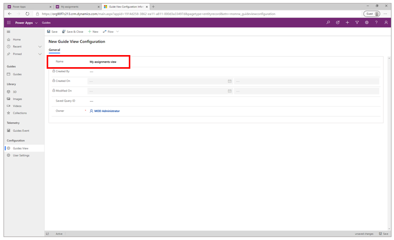

5. In the **Saved Query ID** field, enter the record ID you saved in step 8 of the previous procedure. This value isn't validated, so make sure to copy it carefully to make sure it's the correct record ID.

    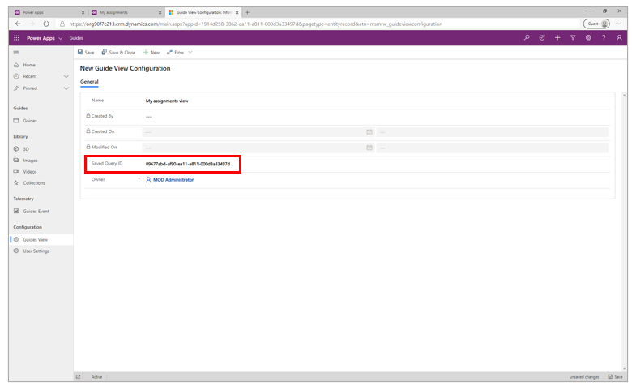
    
6. Select **Save and Close**.

>[!WARNING]
>There's no relationship between the Guide view configuration record and the saved view. If you delete the target view/entity, fetching the data will fail and data will not be displayed on HoloLens. 

## Step 4: Use the App Designer to add specific guides to the list displayed in the view

In this step, you'll add the list of guides that will appear on the HoloLens tab. 

>[!NOTE]
>This step shows an example of how to use the App Designer. You can configure the App Designer in different ways, depending on your experience with Dynamics 365.

1. Go to [powerapps.com](https://powerapps.com) and sign in as an administrator for the instance.

2. In the left pane, select **Apps**, select the **More Commands** (...) button next to **Guides**, and then select **Edit**.

    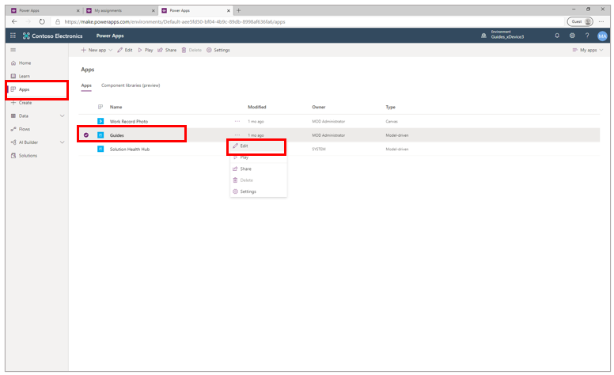

3. In the App Designer, select the **Edit** button next to **Site Map**.

    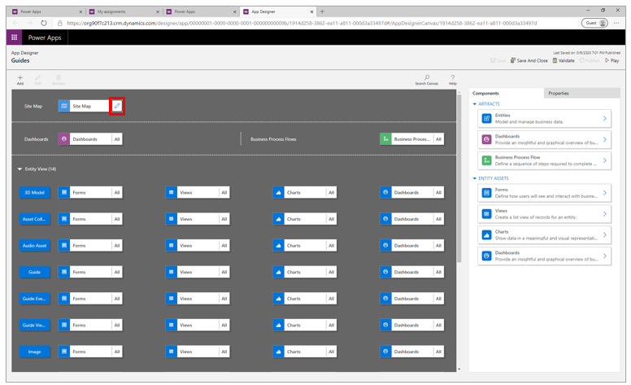

4. Select the **Configuration** heading, select **Add**, and then select **Group**.

    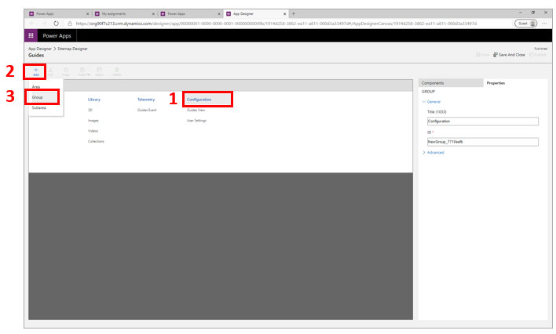

5. Name the new group (for example, **My work**). The new group name will appear to the right of the other headings in the **Sitemap Designer** screen.

6. Select the heading for the new group, select **Add**, and then select **Subarea**.

    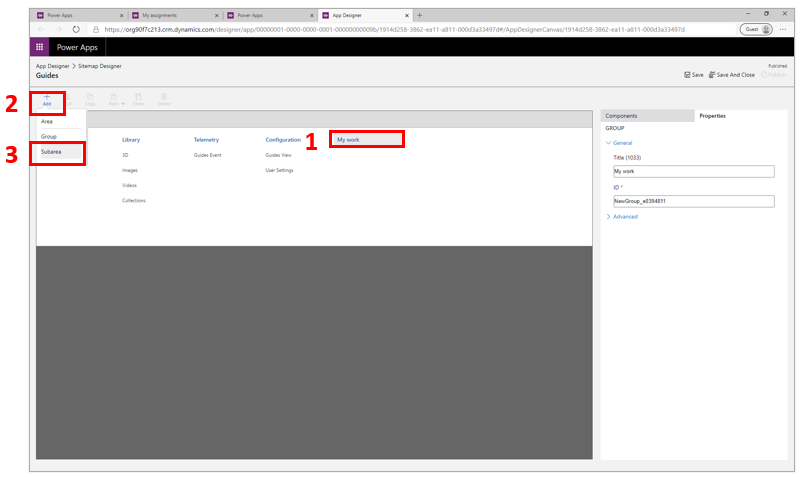

7. In the **Properties** tab on the right side of the screen, in the **Entity** field, select the name of the entity you created in [Step One of this topic](#step-1-create-a-new-entity-in-the-common-data-service) to link the subarea. 

    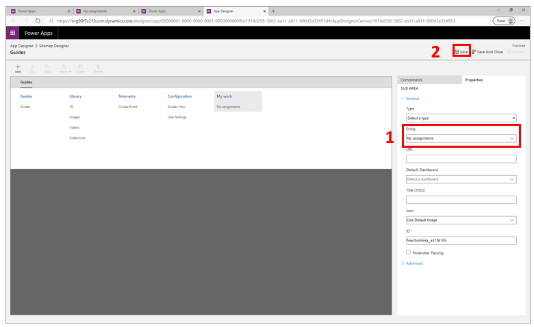

8. In the upper-right corner of the screen, select **Save**, and then select **Publish**.

9. Select **App Designer** in the upper-left corner of the screen to go back to the App Designer.

10. Scroll down to the **Forms** item for your entity, and then select it.

    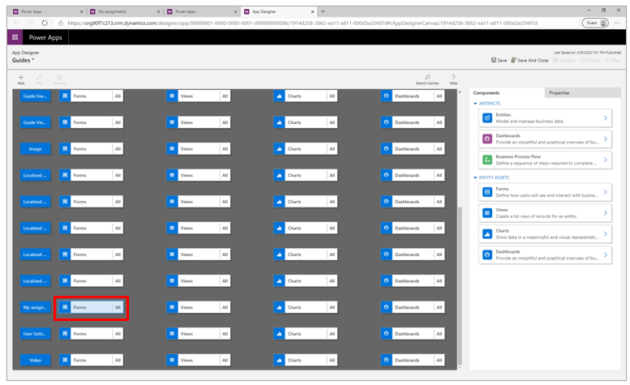

11. In the **Main Forms** section, select the **Edit** button.

    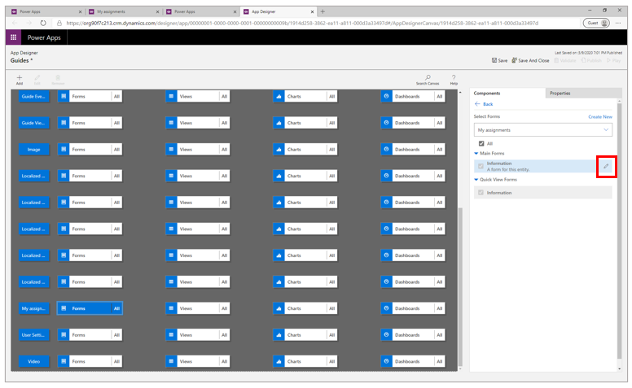

12. Drag the **Date and Time** and **Guide** fields from the left menu. 

    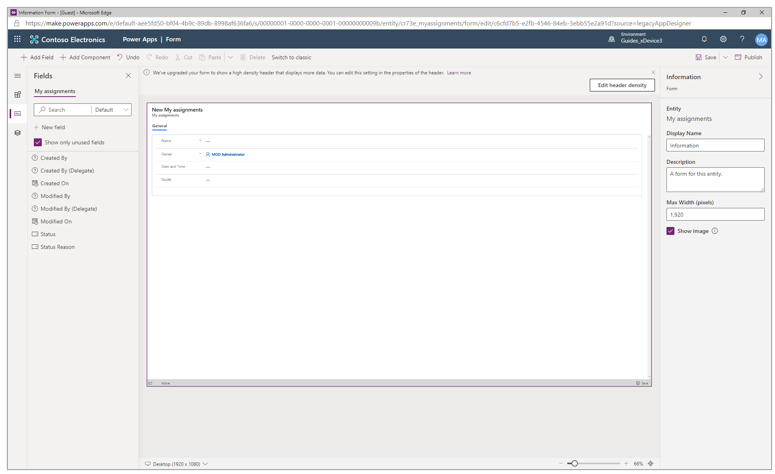

13. Go to powerapps.com. In the left pane, you'll see your new group and view at the bottom. 

    

14. Select the view to open it, and then in the **Guide** field, select a guide to add to the list.

    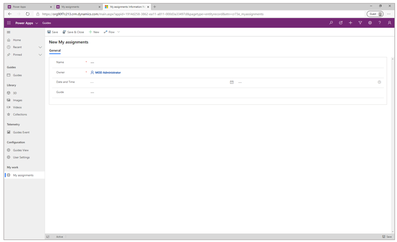
    
15. In the **Owner** field, assign the user who will have access to the list. 

16. To add more guides to the list, select **New** and then fill in the **Guide** and **Owner** field again.

   

