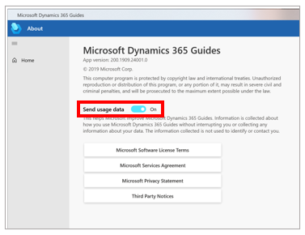

# Opt out of sending telemetry data to Microsoft in the Dynamics 365 Guides PC app

[!include [rename-banner](~/includes/cc-data-platform-banner.md)]

For privacy reasons, you can turn off the ability to send telemetry data to Microsoft when you use the Microsoft Dynamics 365 Guides PC app. Microsoft uses this data to improve the product. By opting out, you prevent Microsoft from collecting any data about your activity.

To turn off telemetry data for the PC app, follow these steps.

1. On the **File** menu, select **About**.

2. In the **About** dialog box, set the **Send usage data** option to **Off**.

    

> [!NOTE]
> This option applies only to the device where it's set. If you use [!include[pn-dyn-365-guides](../includes/pn-dyn-365-guides.md)] on more than one device, you must change the setting on the other devices too. For information about how to turn off this setting for HoloLens, see [Author in the HoloLens application](hololens-app-data-opt-out.md). Database admins can also prevent usage data from appearing on Microsoft Power BI dashboards for Guides Analytics. For more information, see [Opting out of storing Dynamics 365 Guides events data in Common Data Service](data-opt-out.md).

## See also

[Opt out of sending telemetry data in the HoloLens app](hololens-app-data-opt-out.md)
