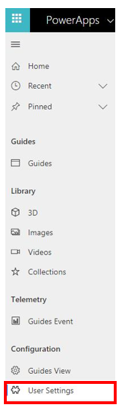
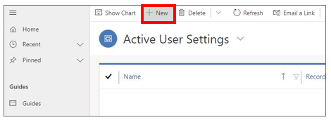
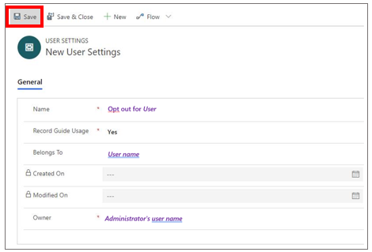

# Opt out of storing Dynamics 365 Guides operations data in Microsoft Dataverse

[!include [rename-banner](~/includes/cc-data-platform-banner.md)]

Dynamics 365 Guides apps enable teams to capture usage statistics and detailed time-tracking information. This data is used to 
provide metrics for operator performance and help you identify opportunities for process optimization. Administrators can turn off 
data collection for specific users if they like. 

To do this:

1.	Go to powerapps.microsoft.com and sign in with your admin account.

2.	In the tenant/instance drop-down, select the instance that has Dynamics 365 Guides installed.

3.	Select the Guides app in the list. A new tab for the Guides model-driven app is opened.

    > [!NOTE]
    > The Guides model-driven app isn't intended as a replacement for authoring in the PC and HoloLens apps. If you use the model-driven app to create, update, or delete records, you might make Guides nonfunctional or prevent users from using the PC or HoloLens apps in the intended way. Currently, modification through the model-driven app isn't fully supported and should be reserved for experienced Dynamics 365 developers who are familiar with Microsoft Dataverse.

4.	In the left navigation, go to **User Settings**.

    
 
5.	Select **New**.

    
 
6.	Fill out the form as follows:

    - **Name:** Opt out for *add user name here*.

    - **Record Guide Usage:** Yes.

    - **Belongs To:** User's name. 

7.	Select **Save**.

    
 
## See also

[Analyze guides usage](analytics-guide.md)
