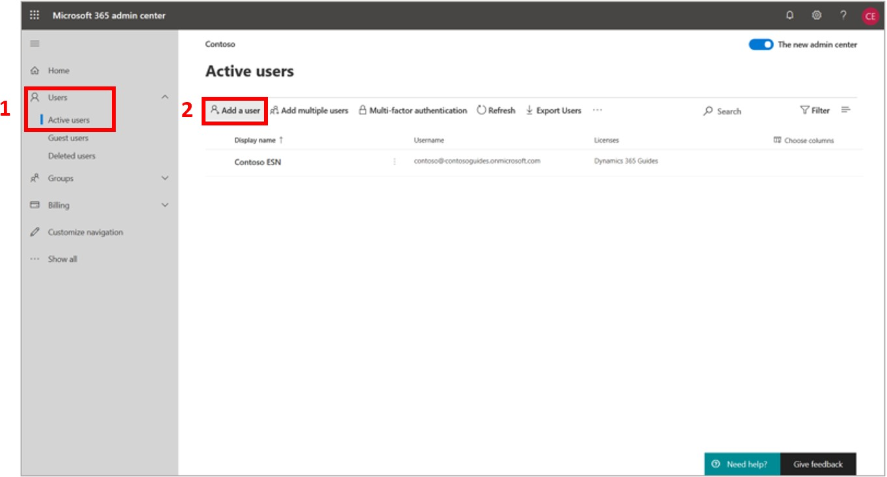
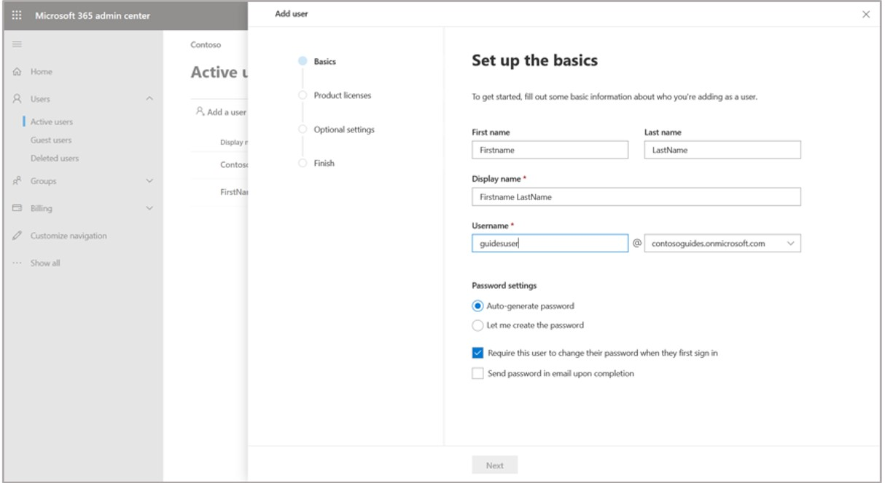
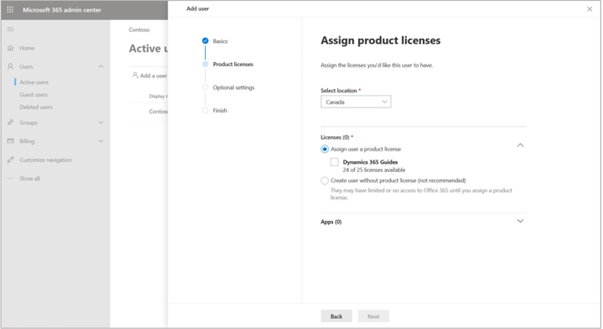
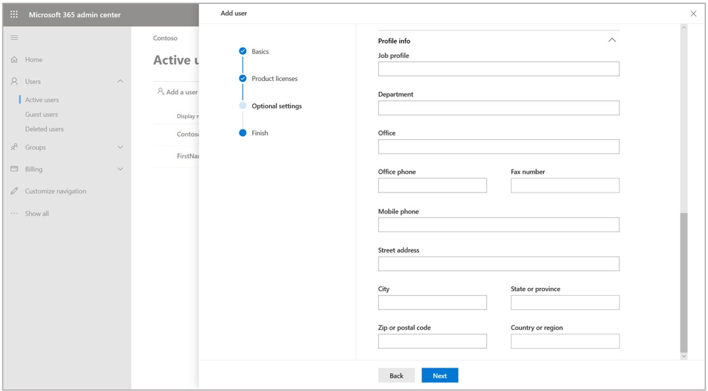
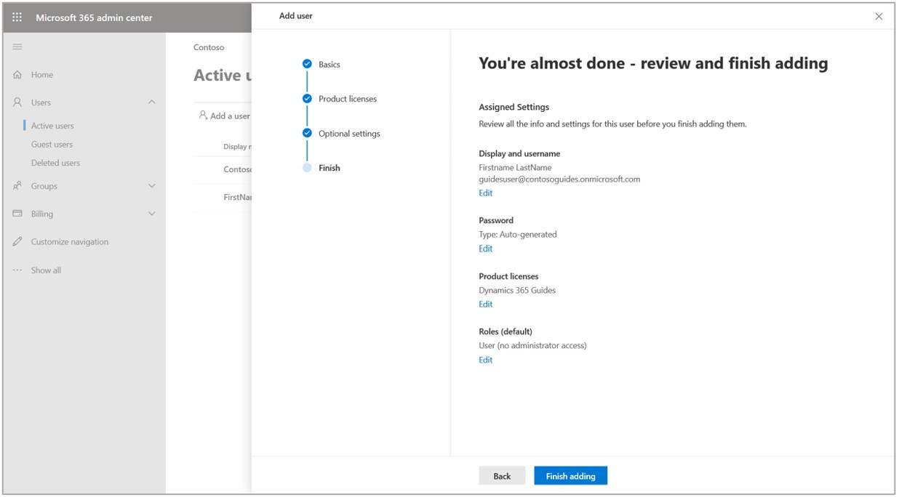
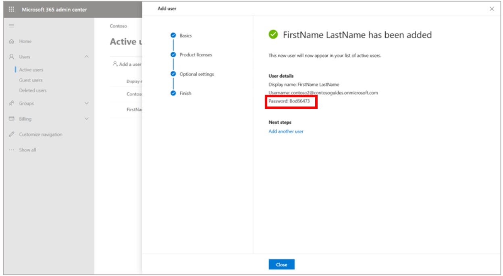

# Set up a Dynamics 365 Guides device license for multiple operators on a shared HoloLens device

A device license in Dynamics 365 Guides allows multiple operators to use Dynamics 365 Guides on a single device under a shared user account. This type of license is useful in scenarios where operators may not be known ahead of time (such as a classroom). It can also save licensing costs for customers with many operators that require infrequent access to the device. Device licenses can be purchased through your Microsoft account manager or reseller. This article describes how to configure a Dynamics 365 Guides device license.

> [!NOTE]
> When you set up a shared HoloLens device for multiple operators, data collected is for the device only (HoloLens 1 device, for example). No user-specific data for the device is captured. [Learn more about what data is collected in Dynamics 365 Guides](analytics-data-collected). 

## Prerequisites

A Dynamics 365 Guides device license should be configured after you have [deployed your Guides solution and apps](setup.md). You should be familiar with the process of assigning licenses, 
assigning roles, and creating guides for use by operators. Note that a device license is limited to operating a guide and you need a working environment to test 
your device license.

## Create a shared account

A Dynamics 365 Guides device license must be assigned to a shared Active Directory user account. A shared account is just like a regular user account except it's shared by all 
people using Dynamics 365 Guides on a specific HoloLens device. Since the account is shared by multiple people, you manage credentials and other account details differently than regular accounts.

1. [Open the Microsoft 365 admin center](https://admin.microsoft.com/AdminPortal/Home).

2. In the left pane, select **Users** > **Active users**, and then select **Add a user**.
 
   
   
3. On the **Set up the basics** page, fill in the first name, last name, display name, and username of the shared user account. Since this account is not tied to a specific user, you may want to identify the user by location name, device name, and so on.

   

4. Since this is a shared account, you'll want to set a shared password. Otherwise, the first operator using the account will be prompted to select a password. To set the shared password, select the **Let me create the password** check box and clear the **Require this user to change their password when they first sign in** check box.    
 
5. On the **Assign product licenses** page, select the location for the shared account, and then, under **Licenses**, select the **Dynamics 365 Guides** check box. When you're finished, select **Next**.

    
 
6. On the **Optional settings** page, leave the **User (no administrator access)** check box selected. A shared operator account should not have administrator privileges.

    
 
7. Scroll down, expand the **Profile info** section, and fill in any profile information that will help you manage the shared account. When you're finished, select **Next**.

    
 
8. Review the information on the last page. To make changes, select the **Edit** button below the relevant sections. When you're finished, select **Finish adding**.

   
 
9.	If you selected the **Auto-generate password** option in step 4, make a note of the password. You (and the guide operators) will need this password to sign in.

    
 
10. Select **Close**.

## Assign an operator role to the shared account

Next, you must assign either the **Operator** or **Restricted Operator** role to the shared account. Assigning a role gives the account permission to use the HoloLens app to view and operate a guide. [Learn about the Author and Operator user roles](admin-role-types.md). The main difference between the two operator roles is that operators with the **Restricted Operator** role can access only guides that are explicitly shared or assigned to the account by an author. The **Operator** role provides access to all guides and content in the environment. When ready, follow the instructions to [assign an operator role to a user](assign-role.md#assign-roles-to-a-user). The process is no different than a regular user account.

## Grant access to a restricted environment (optional)

If you restricted your Microsoft Dataverse environment as described in [Restrict access to an environment in Dynamics 365 Guides by using security groups](admin-security.md), be sure to add the shared account to the security group. For more information, see [Control user access to environments: security groups and licenses](https://docs.microsoft.com/power-platform/admin/control-user-access).

## Test the device license

Make sure to test the device license by operating a guide on the HoloLens with the shared account. This will also validate your password and optionally cache the credentials for use by your operators.

1. If you need to create a test guide, [sign into the PC app with an author or admin account](install-sign-in-pc-app.md#sign-in-to-the-app) so you can create a guide. For quick testing, [anchor the guide using a holographic anchor](pc-app-anchor-holographic.md) since this type of anchor doesn’t require a QR code printout.

2. Make sure your shared account has access to the test guide. This should happen automatically if you assigned the **Restricted Operator** or **Operator** role to the shared account. Otherwise [assign](admin-access-assign.md) or [share](admin-access-teams.md) the guide.

3. Put on your HoloLens and [sign in to the Dynamics 365 Guides HoloLens app](hololens-app-install-sign-in.md) using the shared operator account.

4. Since this will be the first time using the shared account, you may get prompted to reset the password (depending on how you set up the account). Respond to any prompts, and 
then [find and open the guide](find-guide.md).

5. When the guide opens, you'll be prompted to set the holographic anchor. If you reach this stage, your shared operator account is set up correctly.

## Troubleshooting

- If you receive a sign-in error, confirm the shared account has been assigned the device license, and has been assigned the **Basic User** role and the **Operator** or **Restricted Operator** role. 

- If you can't find the guide, you probably need to [assign](admin-access-assign.md) or [share](admin-access-teams.md) the guide to the shared account.

- If you're prompted to select **Author** or **Operator**, you probably assigned an incorrect role to the account, or you're not signed into the app with the right account.

## Frequently asked questions

### Can I author a guide with a Dynamics 365 Guides device license?

No. A Dynamics 365 Guides device license can be used to operate a guide but not to author a guide.

### Can a Guides device license be shared with multiple devices?

No. Each device using Dynamics 365 Guides needs its own device license.

### Does a Guides device license provide the same database capacity as a Dynamics 365 Guides user license?

Yes. The device license provides the same additional capacity as each user license. 

### Where can I learn more about Dynamics 365 Guides licensing?

Refer to the following topics:

- [Dynamics 365 Licensing Guide](https://go.microsoft.com/fwlink/?LinkId=866544&clcid=0x409)
- [Licensing requirements](requirements.md)

