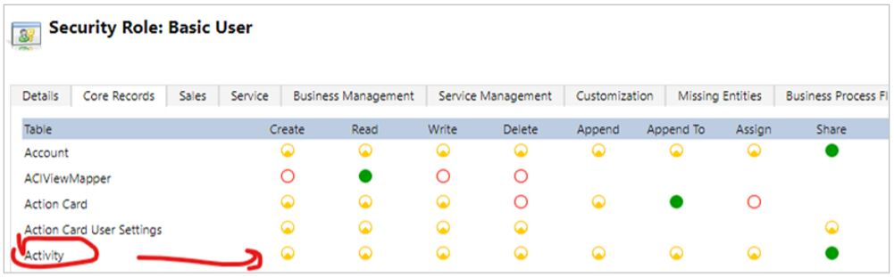

# FAQ: Dynamics 365 Guides 8.0

This FAQ addresses questions related to Dynamics 365 Guides 8.0. The Dynamics 365 Guides release includes many of the Microsoft Teams collaboration/calling features that are also available in Dynamics 365 Remote Assist.  

## Feature comparison: Dynamics 365 Remote Assist and Dynamics 365 Guides 8.0

|Feature|Dynamics 365 Remote Assist|Dynamics 365 Guides 8.0|
|-------------------------------------|-------------------------------------|-------------------------------------|
|Annotations (ability for both the remote expert and HoloLens user to annotate the HoloLens user's environment)| Yes| Yes|
|Join and schedule a meeting| Yes| Yes (significantly improved in Dynamics 365 Guides 8.0)|
|Group calling| Yes| Yes|
|Call recording| Yes| Yes|
|Chat| Yes|Yes (improved in Dynamics 365 Guides 8.0)|
|Screen sharing| Yes| Yes (improved in Dynamics 365 Guides 8.0)|
|Spotlighting| Yes| Yes|
|File access| Yes| Yes|
|Call data storage/display| Yes| Yes (Dynamics 365 Guides does not provide a built-in Calls dashboard, however)|
|Teams policy support| Yes| Yes|
|HoloLens temperature management| Yes| Yes|

## What licenses do I need to access the new collaboration features in Dynamics 365 Guides?

You need a Dynamics 365 Guides license and a Microsoft Teams license.

## Can I collaborate with Teams users in the same way as I do in Dynamics 365 Remote Assist?

Yes.

## Does Dynamics 365 Guides 8.0 store call data the same way as Dynamics 365 Remote Assist?

Yes, it stores data in the same table and columns. In addition, Dynamics 365 Guides provides many improvements to the reliability of data collection, especially in environments where internet connections are spotty. 

## Does Dynamics 365 Guides 8.0 provide a Calls dashboard like Dynamics 365 Remote Assist to analyse call data?

No, Dynamics 365 Guides 8.0 doesn't have a Calls dashboard but it provides a table-like view with all of the same information. And since Dynamics 365 Guides 8.0 sends call usage events to the same PhoneCall table that Dynamics 365 Remote Assist uses (which is the default table in Microsoft Dataverse), calls made from Dynamics 365 Guides are displayed in the Dynamics 365 Remote Assist Calls dashboard if both apps are installed in the same environment.

## Do I need to update privileges for custom security roles to write call data to the PhoneCall table?

Yes. Activity table (PhoneCall table) privileges are mandatory for users trying to sign in to both apps. Users must have the following seven privileges to be able to sign in:

- prvAppendActivity
- prvAppendToActivity
- prvAssignActivity
- prvCreateActivity
- prvReadActivity
- prvShareActivity
- prvWriteActivity

## Can I share a deep link to a guide through a HoloLens chat?

Yes, Teams desktop users can share a link to a guide directly in chat. HoloLens users can open a guide directly (or even a particular step in a specific guide) by selecting the link. 

## Do I need to configure any new permissions?

There are two new permissions: 

- The Location permission (optional) can be enabled if you want to store location information in the PhoneCall table.

- The Background spatial perception (movement) permission is required if you want to use the new annotations capabilities.

## What Dynamics 365 Remote Assist functionality is not supported in the Dynamics 365 Guides 8.0 October release but will be added in upcoming releases?

- Support for incoming calls on HoloLens

- Ability to restrict access (calling and contacts, OneDrive files, and ability to sign out of the HoloLens app). 

- Ability to take a snapshot during a call (for low-connectivity situations)

## If I'm using both Dynamics 365 Guides and Dynamics 365 Remote Assist for a period of time, will I be able to filter call data by app?

Yes, you can filter by subject in the Guides model-driven app. The subject value for Dynamics 365 Remote Assist calls is "Dynamics 365 Remote Assist Call".

## How do I configure roles for users who need to use calling and annotations functionality only and who are mostly using Dynamics 365 Remote Assist currently?

There’s no built-in way to limit access in Dynamics 365 Guides to just calling functionality. Dynamics 365 Guides users also get access to the ability to author and operate guides. 

To transition a specific user to Dynamics 365 Guides 8.0, you need to do two things:

1. Assign the Dynamics 365 Guides license to that user.

2. Assign one of Dynamics 365 Guides roles.

The user will be able to sign into Dynamics 365 Guides after doing these two steps.

## Does Guides 8.0 support HoloLens kiosk mode? 

The 8.0 release does not support kiosk mode. This will be added in an upcoming release.

## Can I send a deep link to a guide from a meeting in Dynamics 365 Guides 8.0?

The 8.0 release does not support sending a deep link from a meeting. This will be added in an upcoming release.

