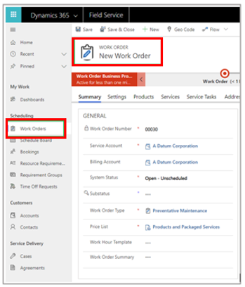
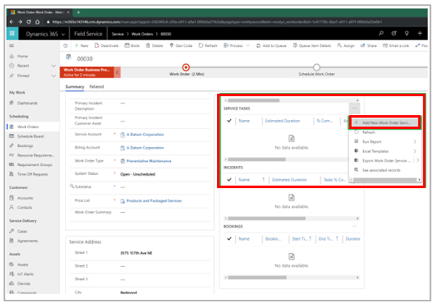
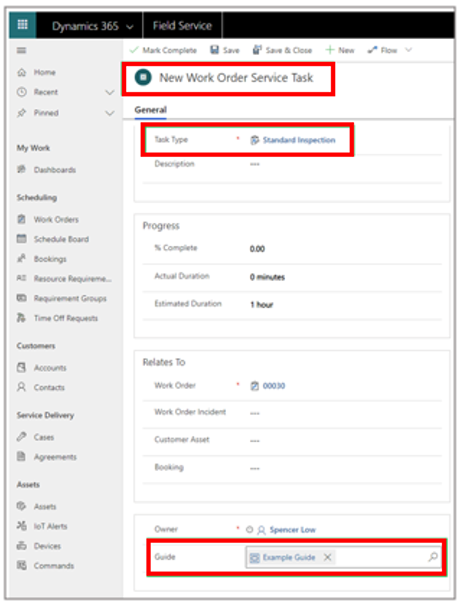
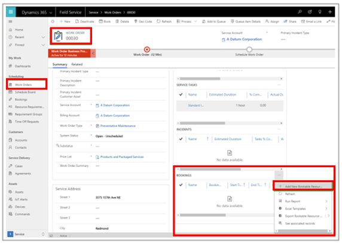
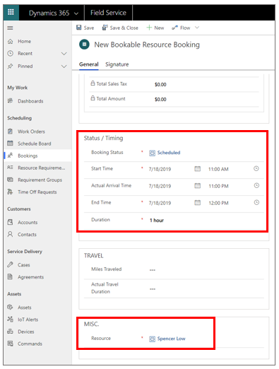

# Integrate Dynamics 365 Field Service with Dynamics 365 Guides

 [Watch a video on integrating Dynamics 365 Field Service with Dynamics 365 Guides](https://www.youtube.com/watch?v=IzTU-6o1XqE)

[!include[cc-microsoft](../includes/cc-microsoft.md)] [!include[pn-dyn-365-field-service](../includes/pn-dyn-365-field-service.md)] integration (included in version 104.1907.19001) enables [!include[pn-field-service](../includes/pn-field-service.md)] 
customers to attach guides to [!include[pn-field-service](../includes/pn-field-service.md)] tasks in [!include[pn-dyn-365-field-service](../includes/pn-dyn-365-field-service.md)]. When work orders are assigned to technicians, 
the technicians can use a dedicated **[!include[pn-field-service](../includes/pn-field-service.md)]** tab in the [!include[pn-dyn-365-guides](../includes/pn-dyn-365-guides.md)] [!include[pn-hololens](../includes/pn-hololens.md)] app to launch the assigned guide and do their work.

   

> [!IMPORTANT]
> To attach guides to service tasks in [!include[pn-dyn-365-field-service](../includes/pn-dyn-365-field-service.md)], you need to have an existing [!include[pn-dyn-365](../includes/pn-dyn-365.md)] Customer Engagement (CRM) instance with [!include[pn-dyn-365-field-service](../includes/pn-dyn-365-field-service.md)] version 8.6.0.183 or later. You also need to update to [!include[pn-dyn-365-guides](../includes/pn-dyn-365-guides.md)] solution version 104.1907.0.33 or later ([learn how to upgrade the Dynamics 365 Guides 
solution](upgrade.md)) and [!include[pn-dyn-365-guides](../includes/pn-dyn-365-guides.md)] PC and [!include[pn-hololens](../includes/pn-hololens.md)] app versions 104.1907.19001.

## Enable your technicians to use Dynamics 365 Guides for work orders

1. Create a guide using the [!include[pn-dyn-365-guides](../includes/pn-dyn-365-guides.md)] PC and [!include[pn-hololens](../includes/pn-hololens.md)] apps. For information on creating a guide, see:
  
   - [Overview of authoring a guide in the PC app](pc-app-overview.md)
   
   - [Overview of authoring a guide in the HoloLens app](hololens-app-overview.md)
   
2. Create a [!include[pn-field-service](../includes/pn-field-service.md)] work order and attach a service task to it. 

   1. To create a new work order in [!include[pn-dyn-365-field-service](../includes/pn-dyn-365-field-service.md)], select **Work Orders** in the left navigation, and then select **New Work Order**.
   
        
      
   2. In the **Service Tasks** view, select the **More Commands** button (...), and then select **Add New Work Order Service Task**.
   
         
      
   3. In the **New Work Order Service Task** view, select a task type, provide an optional description, and then select a 
   guide to associate with the service task. Select **Save** when you're done.
   
         
      
3. Assign the work order to a resource (the technician). To do this, you need to create a booking for the resource:

   1. In the **Work Order** view, scroll down to the **Bookings** tab, select the **More Commands** (...) button, and then select **Add New Bookable Resource**.
   
         
      
   2. In the **New Bookable Resource Booking** view, schedule the service task at the appropriate time for the technician, and then select the appropriate technician as the resource.
   
         
      
4. Have your technician launch the [!include[pn-dyn-365-guides](../includes/pn-dyn-365-guides.md)] app on [!include[pn-hololens](../includes/pn-hololens.md)]. After signing in, the technician will see the **[!include[pn-field-service](../includes/pn-field-service.md)]** tab. The tab shows the guide (and any other guides assigned to them) along with a brief description of the booking and when that order is scheduled.

       
    

> [!NOTE]
> Keep the following points in mind:
>
> - The [!include[pn-dyn-365-guides](../includes/pn-dyn-365-guides.md)] [!include[pn-hololens](../includes/pn-hololens.md)] app shows work orders that are scheduled for the current day and the following eight days.
>
> - Work orders continue to appear on [!include[pn-hololens](../includes/pn-hololens.md)] until they are either marked as **Complete** in [!include[pn-field-service](../includes/pn-field-service.md)] or assigned to someone else.

### Known issues

- Service task names that are longer than approximately 50 characters are cut off in the [!include[pn-hololens](../includes/pn-hololens.md)] user interface.

- When assigning a guide to a [!include[pn-field-service](../includes/pn-field-service.md)] service task, there's an option to create a new guide. Do not use this option to create a new guide. Guides must be created using the [!include[pn-dyn-365-guides](../includes/pn-dyn-365-guides.md)] PC and [!include[pn-hololens](../includes/pn-hololens.md)] apps as described in step 1 of this procedure.
   
      

## See also

[Overview of Dynamics 365 Field Service](/dynamics365/field-service/overview)
      
      
   

[!INCLUDE[footer-include](../includes/footer-banner.md)]