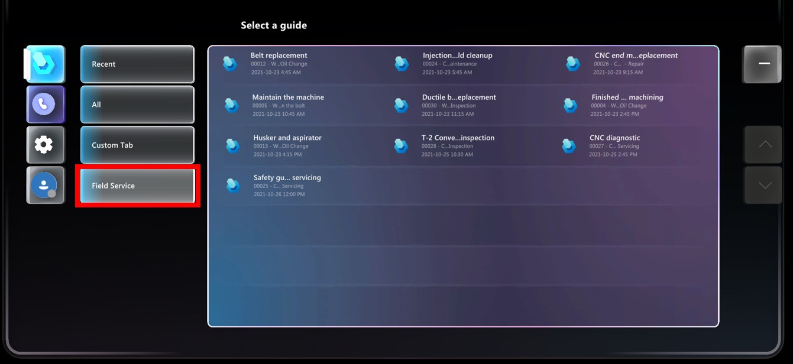

# Integrate Dynamics 365 Field Service with Dynamics 365 Guides

 [Watch a video on integrating Dynamics 365 Field Service with Dynamics 365 Guides](https://www.youtube.com/watch?v=IzTU-6o1XqE)

Microsoft Dynamics 365 Field Service integration enables Field Service customers to attach guides to Field Service tasks in Dynamics 365 Field Service. When work orders are assigned to technicians, the technicians can use a dedicated **Field Service** tab in the Dynamics 365 Guides HoloLens app to launch the assigned guide and do their work.

> [!IMPORTANT]
> To attach guides to service tasks in Dynamics 365 Field Service, you need to have an existing Dynamics 365 Customer Engagement (CRM) environment with Dynamics 365 Field Service version 8.6.0.183 or later.

## Enable your technicians to use Dynamics 365 Guides for work orders

1. Create a guide using the Dynamics 365 Guides PC and HoloLens apps. For information on creating a guide, see:
  
   - [Overview of authoring a guide in the PC app](pc-app-overview.md)

   - [Overview of authoring a guide in the HoloLens app](hololens-app-overview.md)

1. Create a Field Service work order and attach a service task to it.

   1. To create a new work order in Dynamics 365 Field Service, select **Work Orders** in the left navigation, and then select **New Work Order**.

        

      > [!NOTE]
      > When assigning a guide to a Field Service service task, there's an option to create a new guide. Do not use this option to create a new guide. Guides must be created using the Dynamics 365 Guides PC and HoloLens apps as described in step 1 of this procedure.

   1. In the **Service Tasks** view, select the **More Commands** button (...), and then select **Add New Work Order Service Task**.

      

   1. In the **New Work Order Service Task** view, select a task type, provide an optional description, and then select a guide to associate with the service task. Select **Save** when you're done.

        

1. Assign the work order to a resource (the technician). To do this, create a booking for the resource:

   1. In the **Work Order** view, scroll down to the **Bookings** tab, select the **More Commands** (...) button, and then select **Add New Bookable Resource**.

      

   1. In the **New Bookable Resource Booking** view, schedule the service task at the appropriate time for the technician, and then select the appropriate technician as the resource.

      

1. Have your technician launch the Dynamics 365 Guides app on HoloLens. After signing in, the technician selects the **Field Service** tab. The tab shows the guide (and any other guides assigned to them) along with a brief description of the booking and when that order is scheduled.

    

The Dynamics 365 Guides HoloLens app shows work orders that are scheduled for the current day and the following eight days. Work orders continue to appear on HoloLens until they are either marked as **Complete** in Field Service or assigned to someone else.

## Next steps

[Overview of Dynamics 365 Field Service](/dynamics365/field-service/overview)

[!INCLUDE[footer-include](../includes/footer-banner.md)]
