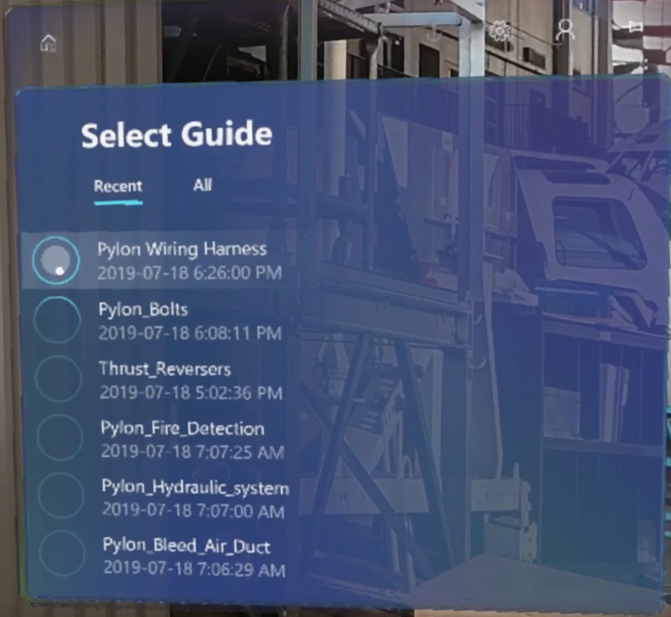
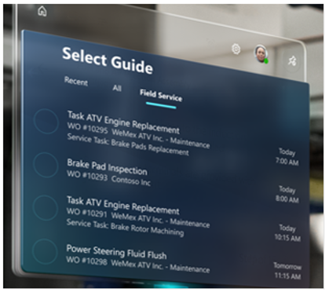

# Integrate Dynamics 365 for Field Service with Dynamics 365 Guides

Dynamics 365 for Field Service integration (included in version 104.1907.XXXX) enables Field Service 
customers to attach guides to field service tasks in Dynamics 365. When work orders are assigned to technicians, 
the technicians can use a dedicated tab in the Guides HoloLens app to retrieve and launch the assigned guide and do their work.

   

## Prerequisites

Integration between Dynamics 365 Guides and Dynamics 365 Field Service requires:

- A Dynamics 365 instance (not a Common Data Service instance) with Field Service version 8.6.0.183 or later.

- Dynamics 365 Guides Common Data Service version 104.1907.0.18 or later. [Learn how to upgrade the Dynamcis 365 Guides 
solution.](upgrade.md)

- Dynamics 365 Guides PC and HoloLens app versions 104.1907.XXXX or later. [Learn how to install the apps.]()

## Enable your technicians to use Dynamics 365 Guides for work orders

1. Create a guide using the Dynamics 365 Guides PC and HoloLens apps. For information on creating a guide, see:
  
   - [Use the PC authoring app to create a guide](pc-authoring.md)
   
   - [Use the HoloLens app to place your holograms](hololens-authoring.md)
   
2. Create a Field Service work order and attach a service task to it. To do this:

   1. To create a new work order in Dynamics 365 for Field Service, select **Word Orders**, and then select **New Work Order**.
   
        
      
   2. In the **Service Tasks** view, select the More info button (...), and then select **Add New Work Order Service Task**.
   
         
      
   3. In the **New Work Order Service Task** view, select a task type, provide an optional description, and then select a 
   guide to associate with the service task. Select ** Save** when you're done.
   
         
      
3. Assign the work order to a resource (the technician). To do this, you need to create a booking for the resource:

   1. In the **Work Order** view, scroll down to the **Bookings** tab, select the More Info (...) button, and then select **Add New Bookable Resource**.
   
         
      
   2. In the **Resource Booking** view, schedule the service task at the appropriate time for the technician, and then select the appropriate technician as the resource.
   
         
      
4. Have your technician launch the Dynamics 365 Guides app on HoloLens. After signing in, the technician will see the **Guides for Field Service** tab. The tab shows the guide (and any other guides assigned to them) along with a brief descriptoin of the booking and when that order has been scheduled.

       
    
    
[!NOTE]

- The Dynamics 365 Guides HoloLens app shows work orders scheduled for the current day and the following eight days. - Work orders continue to appear on HoloLens until they're marked as **Complete** in Field Service, or assigned to someone else.

### Known issues

- Service task names that are longer than approximately 50 characters are cut off in the HoloLens user interface.

- When assigning a guide to a Field Service service task, there's an option to create a new guide. Do not use this option to create a new guide. Guides must be created using the Dynamics 365 Guides PC and HoloLens apps as described in step 1 of this procedure.
   
   

      
      
      
   
