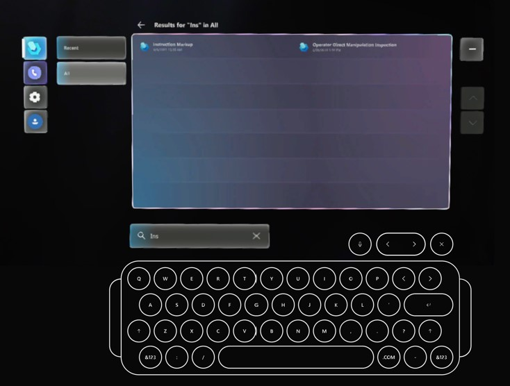
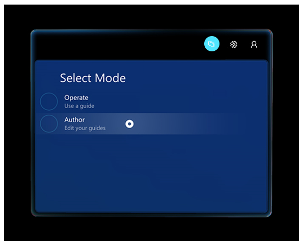

# Find and open a guide in the Dynamics 365 Guides HoloLens app 

You use the [Main menu](main-menu.md) to find and open a guide in the Microsoft Dynamics 365 Guides HoloLens app. 

1. Look at the palm of your hand to open the Main menu, and then select the **Work activity** button.

    
    
2. Use direct touch to select the **Recent** or **All** tab, and then select the appropriate guide or guide folder. Folders appear on the **All** tab, but not the **Recent** tab. If you have a long list of guides and/or folders, use the up and down arrows on the right side of the screen to scroll the list. 

     

    > [!TIP]
    > To clear the **Select a guide or folder** screen from your view at any time, select the **Minimize** button on the right side of the screen. You don't have to remember where you put the screen in your environment. To open it again quickly, just look at the palm of your hand again to open the Main menu, and then select the **Work activity** button again. 

3. To search for a guide, select the **Search** button at the bottom of the screen to display the holographic keyboard, and then enter some characters for the guide you're looking for or use the **Microphone** button to say the characters. As you start to enter the characters, the guide list automatically filters to the guide names that match those characters. Search returns all results that match the characters you enter. 

    

    Select the **Close** button on the upper-right side of the keyboard to close the keyboard and return to the guide list.

    

4. When you select a guide, the **Select mode** screen appears. Select whether you want to open the guide as an author or operator.

    
    
    > [!NOTE]
    > If you're a Dynamics 365 Guides admin, you can assign the **Operator** role to operators so that they can view guides but can't edit them. If you assign the **Operator** role to a user, the user can skip the **Select mode** screen and open a guide directly. For more information, see [Assign an Author or Operator role to a user](assign-role.md).

## What's next?

- [Learn more about the Main menu](main-menu.md)
- [Learn how to create folders if you're an admin or an author](admin-create-folders.md)

