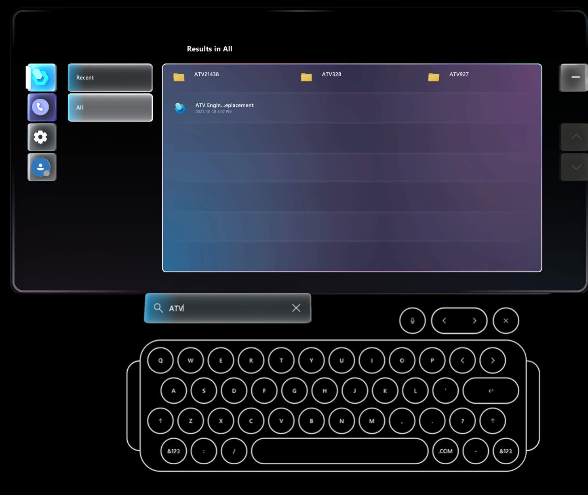
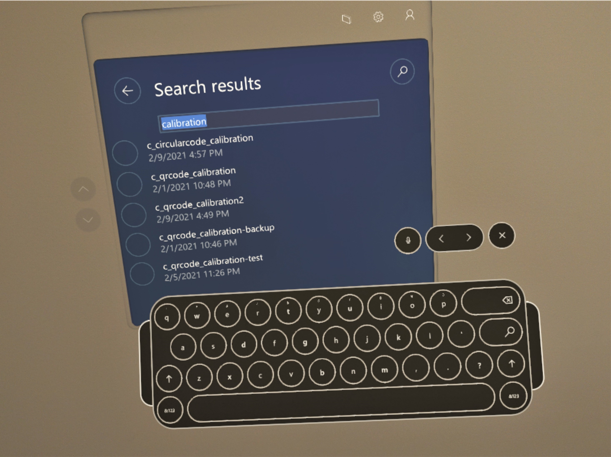

# Find a guide to use in the HoloLens app (HoloLens 2 only) for Dynamics 365 Guides

If you have access to a long list of guides created with Microsoft Dynamics 365 Guides, if you're using HoloLens 2, you can use the holographic keyboard to find it fast.

1.	In the **Select guide** dialog box, gaze at the magnifying glass until the holographic keyboard appears.   

    

2.	Type the characters for the guide you're looking for. As you start to type the characters, the list is automatically filtered to the guides that match those characters 
that are included anywhere in the guide name.

    
    
    > [!NOTE]
    > To open a folder, gaze at the button next to the folder name. To return to the parent folder, gaze at the **Back** button above the guides list. Folders appear on the **All** tab, but not the **Recent** tab. 

3.	Close the keyboard to return to the guide list.

4.	To refine the criteria, gaze at the magnifying glass again or select the box that shows the filter text.

5.	To exit search and return to the main guides list, gaze at the **Back** button.

