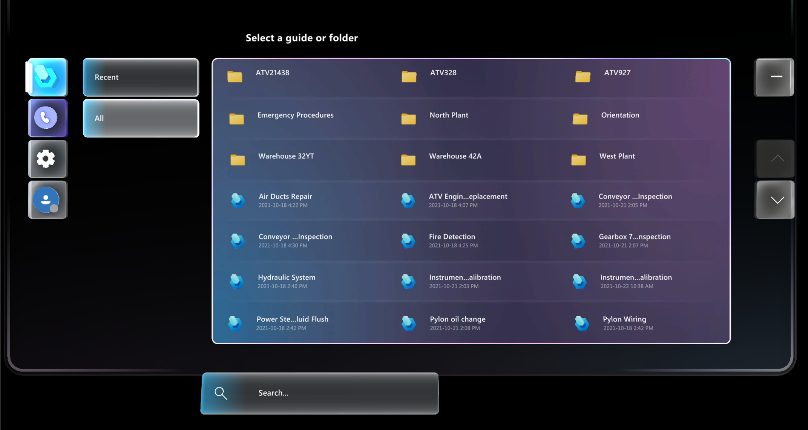

# Find and open a guide in the Dynamics 365 Guides HoloLens app 

You use the [Main menu](main-menu.md) to find and open a guide in the Microsoft Dynamics 365 Guides HoloLens app. 

1. Look at the palm of your hand to open the Main menu, and then select the **Work activity** button.

    
    
2. Select the **Recent** or **All** tab, and then select the appropriate file or folder. If you have a long list of files and/or folders, use the up and down arrows on the right side of the screen to scroll the list. 

     

    > [!NOTE]
    > Folders appear on the **All** tab, but not the **Recent** tab. 

3. To search for a guide:

    1. Select the magnifying glass to display the holographic keyboard.

    2. Enter some characters for the guide you're looking for. As you start to enter the characters, the guide list automatically filters to the guide names that match those characters.

       NEED NEW SCREEN SHOT HERE FOR TOUCH INTERFACE   

    3. To refine the criteria, select the magnifying glass again or select the box that shows the filter text.

    4.  Close the keyboard to return to the guide list.

## What's next?

- [Learn more about the Main menu](main-menu.md)
- [Learn how to create folders if you're an admin or an author](admin-create-folders.md)

