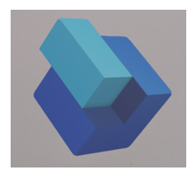
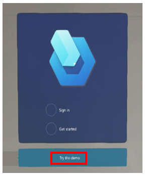
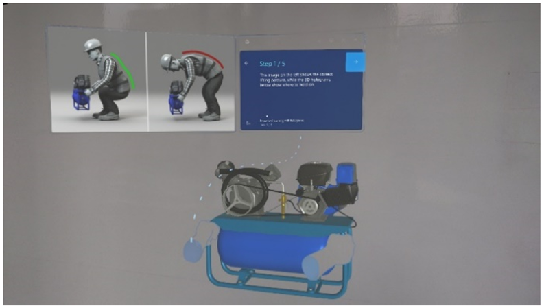
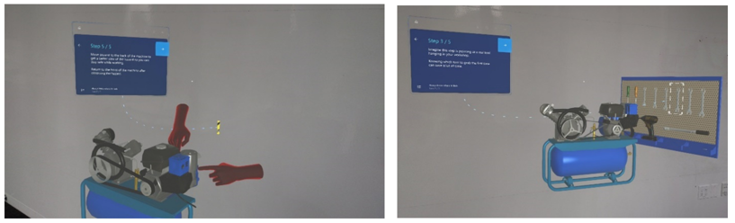

# Get started with Dynamics 365 Guides

So you’ve set up [!include[cc-microsoft](../includes/cc-microsoft.md)] [!include[pn-dyn-365-guides](../includes/pn-dyn-365-guides.md)] using the [Setup topic](setup.md) and you’re ready to get started. What do you do next? This topic provides some ideas to get you going. 

## Check out the demo

Dynamics 365 Guides provides a demo that showcases the value of the app for your company. This five-minute demo is useful for any type of Dynamics 365 Guides user, whether you're an author, operator, process engineer, or business decision maker. Use the demo to get a quick overview of how Dynamics 365 Guides works. You don't have to be online to use the demo. 

To start the demo:

1. Air tap the Dynamics 365 Guides logo.

   

2. Select the **Try this demo** button.

   
   
   The following sections provide a quick preview of what you'll see in the demo. 

### Find your way around 

Try the hands-free interface to activate buttons, even when your hands are full. Gaze at the **Next** button to move forward in a guide, and the **Back** button to move backward. 

### Step examples

Understand how steps can show safe procedures with 3D holograms and 2D photos. 

Experience step-by-step instructions that point to where the work takes place.

## Check out our documentation and videos

The following table provides useful links to learn about the three basic things you can do with [!include[pn-dyn-365-guides](../includes/pn-dyn-365-guides.md)]: author a guide, operate a guide, or analyze a guide.

|Task|Online documentation|Video(s)|
|----------------------------|--------------------------------------------|-----------------------------------------------|
|Author a guide|[Authoring overview](authoring-overview.md)|- [Author on the PC](https://aka.ms/pcauthor) - [Author on HoloLens](https://aka.ms/hololensauthor) - [Create a printed anchor](https://aka.ms/guidesprintedanchor) - [Create a digital anchor](https://aka.ms/guidesdigitalanchor)|
|Operate a guide|[Operator's manual](operator-guide.md)|[Operate a guide](https://aka.ms/guidesoperate)|
|Analyze guide usage|[Analyze a guide](analytics-guide.md)|[Analyze a guide](https://aka.ms/guidesanalyze)|

Not sure about a term? See our [Glossary of terms](glossary.md). 

> [!NOTE]
> To learn about new features in [!include[pn-dyn-365-guides](../includes/pn-dyn-365-guides.md)], see our [What's new page](new.md). To learn about new and upcoming [!include[pn-dyn-365-guides](../includes/pn-dyn-365-guides.md)] features, see our [April 2019 release notes](https://docs.microsoft.com/business-applications-release-notes/April19/dynamics365-mixed-reality/microsoft-dynamics365-guides/planned-features) and [2019 release wave 2 plan](https://docs.microsoft.com/dynamics365-release-plan/2019wave2/mixed-reality/dynamics365-guides/planned-features). The release notes and release plan capture all the details, end-to-end, top-to-bottom, in a single place that you can use for planning. 

## Jump in

The best way to learn [!include[pn-dyn-365-guides](../includes/pn-dyn-365-guides.md)] is by doing, so here are some tips on getting started: 

- Watch the demo (see the first section in this topic).

- [Watch our overview video](https://aka.ms/overview)

- Use the Example Guide:

    - We have included an Example Guide that you can use to learn about [!include[pn-dyn-365-guides](../includes/pn-dyn-365-guides.md)]. It walks you through common workflows and features, provides tips and tricks for great guide creation, and helps you get up to speed by doing.
    
      

    - Put on your [!include[cc-microsoft](../includes/cc-microsoft.md)] [!include[pn-hololens](../includes/pn-hololens.md)] device, start the [!include[pn-hololens](../includes/pn-hololens.md)] app in Operate mode, and then select the Example Guide. Go through the guide step-by-step to learn about key features. 

    - Edit the guide steps and assets using the PC authoring app, or place instructions or holograms using the [!include[pn-hololens](../includes/pn-hololens.md)] app in Author mode. 
    
- Create your first guide from scratch, try it out, and analyze it.

     - To create your first guide, find a simple step-by-step operation or assembly and a physical space for that operation or assembly that you have access to. We’ve created guides for operating a projector, pouring water into a glass, and making a bird house! Or use a real-world workflow in your business. 

     - Build your first guide using 3D toolkit objects (included with [!include[pn-dyn-365-guides](../includes/pn-dyn-365-guides.md)]). Create your tasks and steps and assign 3D content in the PC app, and then move to the [!include[pn-hololens](../includes/pn-hololens.md)] app to place your holograms and add dotted holographic lines to connect the instruction cards to the physical spaces they relate to. Refer to the [Authoring](authoring-overview.md) and [Operating](operator-guide.md) topics for help. 

     - After you’ve created your guide, try it out in Operate mode to see how it works. 

     - Analyze your usage of the guide with [!include[pn-power-bi](../includes/pn-power-bi.md)] reports. See [Analyze your guides](analytics-guide.md) for more information. 

## Need support?

If you run across an issue, check out our [FAQ](faq.md) and [Known Issues](known-issues.md) topics. If that doesn’t help, please contact Support. You can find information on contacting support in the [FAQ](faq.md).

### See also

[Author a guide](authoring-overview.md) 
[Operator's manual](operator-guide.md) 
[Analyze your guides](analytics-guide.md) 
[FAQ](faq.md) 
[Known issues](known-issues.md)
