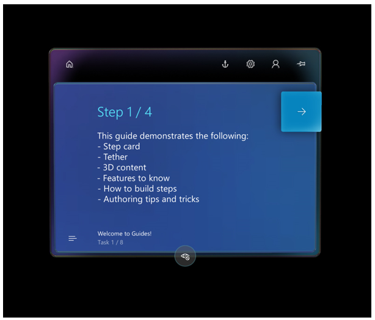
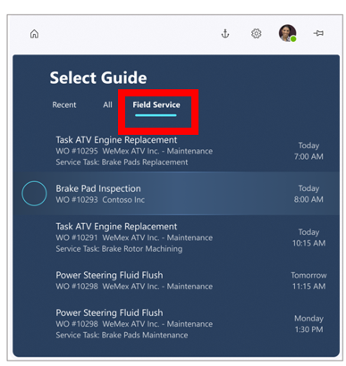

# Get started with Dynamics 365 Guides

Just getting started with [!include[cc-microsoft](../includes/cc-microsoft.md)] [!include[pn-dyn-365-guides](../includes/pn-dyn-365-guides.md)]? Not sure where to begin? Use this topic to get a quick overview of available resources and jumpstart your learning curve!

## Top resources

### Documentation

This is where you are now. We organized our documentation by role so you can quickly get to the content you need, whether you're an admin, author, or operator:

### Video tutorials

These step-by-step video tutorials provide a quick overview of key concepts: 
 
  -  [Overview of Dynamics 365 Guides](https://www.youtube.com/watch?v=dk-TbWtMb-4&feature=youtu.be)
  
  -  [Author a guide in the PC app](https://www.youtube.com/watch?v=PiN31iAiRrQ&feature=youtu.be)
  
  - Anchor your guide in the real world:
  
    -  [Using a printed anchor](https://www.youtube.com/watch?v=m_I-viB3np8&feature=youtu.be)
   
    -  [Using a digital anchor](https://www.youtube.com/watch?v=LNQ3W-p7_sU&feature=youtu.be)
   
  -  [Author in the HoloLens app](https://www.youtube.com/watch?v=HXG8zWOYqlk&feature=youtu.be)
  
  -  [Operate a guide](https://www.youtube.com/watch?v=XIRyvg38qlM&feature=youtu.be)
  
  -  [Analyze your guides using Power BI reports](https://www.youtube.com/watch?v=rkriIa4go1Q&feature=youtu.be)

### Demo

[!include[pn-dyn-365-guides](../includes/pn-dyn-365-guides.md)] provides a demo that showcases the value of the app for your company. This five-minute demo is useful for any type of [!include[pn-dyn-365-guides](../includes/pn-dyn-365-guides.md)] user, whether you're an author, operator, process engineer, or business decision maker. You don't have to be online to use the demo. 

To start the demo, air tap the [!include[pn-dyn-365-guides](../includes/pn-dyn-365-guides.md)] tile, and then select the **Try the demo** button.

   
   
### Example guide

[!include[pn-dyn-365-guides](../includes/pn-dyn-365-guides.md)] includes an Example guide that you can use to learn about the product. The Example guide walks you through common workflows and features, provides tips and tricks for creating great guides, and helps you get up to speed by doing.
    

To try it out, put on your [!include[cc-microsoft](../includes/cc-microsoft.md)] [!include[pn-hololens](../includes/pn-hololens.md)], start the [!include[pn-hololens](../includes/pn-hololens.md)] app in **Operate** mode, and then select **Example guide**. 

ADD SCREEN SHOT HERE

Go through the guide step-by-step to learn about key features. Then when you're ready to take the next step, use the PC application to edit the guide steps and assets, or place instructions or holograms using the [!include[pn-hololens](../includes/pn-hololens.md)] app in **Author** mode. 

## Understand concepts

Use these topics to get a quick overview of the product and how to author a guide:

- [Overview of Dynamics 365 Guides](index.md)

- [Authoring overview](authoring-overview.md)

- [How to create a great mixed reality guide](great-guide.md)

- [Glossary of terms](glossary.md)

## Set up and administer Dynamics 365 Guides

These are the most important topics for admins:

- [Requirements for installation](requirements.md)

- [Setup overview](setup.md)

- [Upgrade the solution](upgrade.md)

## Find out what's new

We're constantly updating Dynamics 365 Guides to include the top features requested by our customers. To find out what's new, check out the [What's new topic](new.md). This topic is also available by selecting the **Help** (question mark) button in the upper-right corner of the PC app, so it's always at your fingertips:

To learn about when features were introduced or to learn about upcoming features, see the Release plan topics:

- [2019 Wave 1 (April 2019 through September 2019)](https://docs.microsoft.com/business-applications-release-notes/April19/index)

- [2019 Wave 2 (October 2019 through March 2020)](https://docs.microsoft.com/en-us/dynamics365-release-plan/2019wave2/index)
  
- [2020 Wave 1 (April 2020 through September 2020)]()

## Integrations

You can integrate Dynamics 365 Guides with Dynamics 365 Field Service so field service technicians can use Dynamics 365 Guides to complete their work orders.

- Learn how to [Integrate Dynamics 365 Guides with Dynamics 365 Field Service](field-service.md)

## Need help or support?

If you run across an issue, check out these topics:

- [FAQ](faq.md)

- [Known Issues](known-issues.md) 

If you don't find what you're looking for, [find a list of phone numbers to contact Support](help.md).

