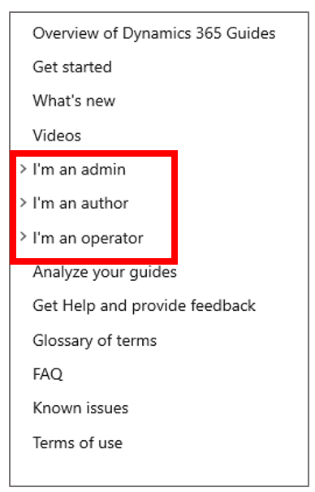
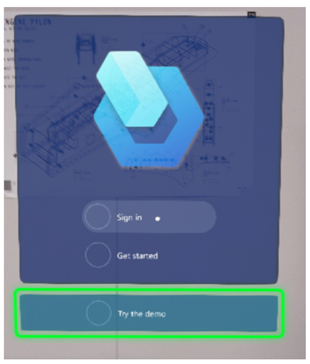
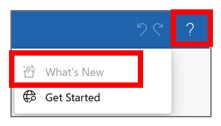

# Get started with Dynamics 365 Guides

Just getting started with [!include[cc-microsoft](../includes/cc-microsoft.md)] [!include[pn-dyn-365-guides](../includes/pn-dyn-365-guides.md)]? Not sure where to begin? Use this topic to get a quick overview of available resources.

## Top resources

### Documentation

This resource is where you are right now. We've organized the documentation by role, so that you can quickly find the content that you need, depending on whether you're an admin, author, or operator.

### Video tutorials

These step-by-step video tutorials provide a quick overview of key concepts:

-  [Overview of Dynamics 365 Guides](https://aka.ms/guidesoverview)

-  [Author a guide in the PC app](https://aka.ms/pcauthor)

- Anchor your guide in the real world:

    -  [Use a QR code anchor](https://youtu.be/NhdBG3emNUs)

    -  [Use a circular code anchor](https://aka.ms/guidesprintedanchor)

    -  [Use a holographic anchor](https://aka.ms/guidesdigitalanchor)   
   
-  [Author in the HoloLens app using HoloLens 1](https://aka.ms/hololensauthor)

-  [Operate a guide](https://aka.ms/guidesoperate)

### Demo

[!include[pn-dyn-365-guides](../includes/pn-dyn-365-guides.md)] provides a five-minute demo that showcases the value of the app for your company. This demo is useful for every [!include[pn-dyn-365-guides](../includes/pn-dyn-365-guides.md)] user, regardless of whether you're an author, operator, process engineer, or business decision maker. You don't have to be online to use the demo.

To start the demo, air tap the [!include[pn-dyn-365-guides](../includes/pn-dyn-365-guides.md)] tile, and then select **Try the demo**.

## Understand concepts

Use these topics to get a quick overview of the product and the process of authoring a guide:

- [Overview of Dynamics 365 Guides](index.md)

- [Authoring overview](authoring-overview.md)

- [How to create a great mixed reality guide](great-guide.md)

- [Glossary of terms](glossary.md)

## Set up and administer Dynamics 365 Guides

Here are the most important topics for admins:

- [Requirements for installation](requirements.md)

- [Setup overview](setup.md)

- [Upgrade the solution](upgrade.md)

- [Deployment playbook](admin-deployment-playbook.md)

## Find out what's new

We're constantly updating [!include[pn-dyn-365-guides](../includes/pn-dyn-365-guides.md)] to include the top features that customers have requested. To find out what's new, check out the [What's new topic](new.md). This topic is also available by selecting the **Help** (question mark) button in the upper-right corner of the PC app. Therefore, it's always at your fingertips.

To learn when features were introduced, or to learn about upcoming features, see the Release plan topics:

- [2020 Wave 2 (October 2020 through March 2021)](https://docs.microsoft.com/dynamics365-release-plan/2020wave2/finance-operations/dynamics365-guides/planned-features)

- [2020 Wave 1 (April 2020 through September 2020)](https://docs.microsoft.com/dynamics365-release-plan/2020wave1/mixed-reality/dynamics365-guides/planned-features)

- [2019 Wave 2 (October 2019 through March 2020)](https://docs.microsoft.com/dynamics365-release-plan/2019wave2/index)

- [2019 Wave 1 (April 2019 through September 2019)](https://docs.microsoft.com/business-applications-release-notes/April19/index)

## Integrations

You can integrate [!include[pn-dyn-365-guides](../includes/pn-dyn-365-guides.md)] with Dynamics 365 Field Service and Dynamics 365 Supply Chain Management.

- **Dynamics 365 Field Service integration.** Integrate [!include[pn-dyn-365-guides](../includes/pn-dyn-365-guides.md)] with Dynamics 365 Field Service to enable field service technicians to use [!include[pn-dyn-365-guides](../includes/pn-dyn-365-guides.md)] to complete their work orders. [Learn more about how to integrate Dynamics 365 Field Service](field-service.md).

- **Dynamics 365 Supply Chain Management.** Integrate [!include[pn-dyn-365-guides](../includes/pn-dyn-365-guides.md)] with the **Asset Management** module in Dynamics 365 Supply Chain Management to take advantage of mixed-reality guides in your day-to-day service and maintenance workflows. [Learn more about how to integrate Dynamics 365 Supply Chain Management](admin-integrate-asset-management.md).

## Need help or support?

If you encounter an issue, check out these topics:

- [FAQ](faq.md)

- [Known Issues](known-issues.md)

If you don't find what you're looking for, [find a list of phone numbers that you can use to contact Support](help.md).
