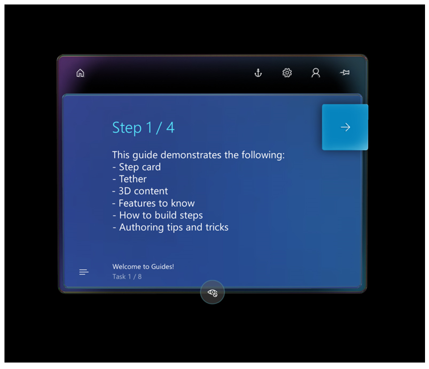

# Get started with Dynamics 365 Guides in preview

[!INCLUDE [cc-beta-prerelease-disclaimer](../includes/cc-beta-prerelease-disclaimer.md)]
 
So you’ve set up Microsoft Dynamics 365 Guides in preview using the [Setup topic](setup.md) and you’re ready to get started. What do you do next?

There are three basic things you can do with Dynamics 365 Guides: 

- Create a guide (author a guide).

- Use a guide (operate a guide).

- Analyze the guide usage (see how people operating the guide did at each step). 

See our [Authoring](authoring-overview.md), [Operating](operator-guide.md), and [Analyzing](analytics-guide.md) topics for step-by-step guidance. Not sure about a term? See our [Glossary of terms](glossary.md). 

> [!NOTE]
> To learn about new features in Dynamics 365 Guides, see our [What's new page](new.md). To learn about new and upcoming Dynamics 365 Guides features, see our [April 2019 release notes](https://docs.microsoft.com/business-applications-release-notes/April19/dynamics365-mixed-reality/microsoft-dynamics365-guides/planned-features) and [2019 release wave 2 plan](https://docs.microsoft.com/dynamics365-release-plan/2019wave2/mixed-reality/dynamics365-guides/planned-features). The release notes and release plan capture all the details, end-to-end, top-to-bottom, in a single place that you can use for planning. 

## Jumping in

The best way to learn Dynamics 365 Guides is by doing, so here are some tips on getting started: 

1.	Use the Example Guide:

    - We have included an Example Guide that you can use to learn about Dynamics 365 Guides. It walks you through common workflows and features, provides tips and tricks for great guide creation, and helps you get up to speed by doing!
    
      

    - Put on your Microsoft HoloLens device, start the HoloLens app in Operator mode, and then select the Example Guide. Go through the guide step-by-step to learn about key features. 

    - Edit the guide steps and assets using the PC authoring app, or place instructions or holograms using the HoloLens app in Author mode. 
    
2.	Create your first guide from scratch, try it out, and analyze it.

     - To create your first guide, find a simple step-by-step operation in a physical space that you have access to. We’ve created guides for operating a projector, pouring water into a glass, and making penguin olives! Or use a real-world workflow in your business. 

     - Build your first guide using standard 3D assets. Create your tasks and steps in the PC app, and then move to the HoloLens app to place the instructions and holograms in the physical space they relate to. Refer to the [Authoring](authoring-overview.md) and [Operating](operator-guide.md) topics for help. 

     - After you’ve created your guide, try it out in Operate mode to see how it works. 

     - Analyze your usage of the guide with Power BI reports. See [Analyze your guides](analytics-guide.md) for more information. 

3.	Need Support? If you run across an issue, check out our [FAQ](faq.md) and [Known Issues](known-issues.md) topics. If that doesn’t help, please contact Support. You can find information on contacting support in the [FAQ](faq.md).

## What makes a good guide?

Here are some tips for selecting high-impact use cases to get the most out of Dynamics 365 Guides. 

Focus on step-by-step procedures that:

- Operators don't know by heart (complex and/or spatially demanding procedures that aren't routinely performed).

- Require important support preparation (paper-based patterns, stickers, measures, and so on) that could be replaced with holographic instructions.

- Don't require millimeter-level accuracy. HoloLens sensors are not calibrated to support that level of accuracy.

- Take less than one hour to complete. If a procedure takes longer than one hour, the operator could experience discomfort.

Ask these questions when evaluating scenarios:

-	Is the procedure complex enough that it requires augmented work instructions? Think about things like how long it takes new operators to learn a task, how much time is spent deciphering schematics, cost of errors, and so on.

-	Can you convey the necessary information with centimeter-level accuracy? We can’t guarantee that holograms will maintain accuracy below 2 cm.

-	Does the procedure take less than an hour? 

-	Do operators need to be hands-free to complete the procedure?

But get creative and experiment with how Dynamics 365 Guides can help your employees learn by doing. We love hearing about new ways that customers are using Dynamics 365 Guides! 

### See also

[Author a guide](authoring-overview.md) 
[Operator's manual](operator-guide.md) 
[Analyze your guides](analytics-guide.md) 
[FAQ](faq.md) 
[Known issues](known-issues.md)
