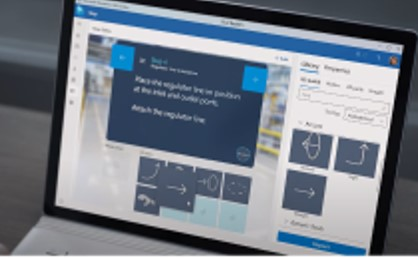
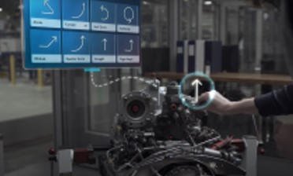
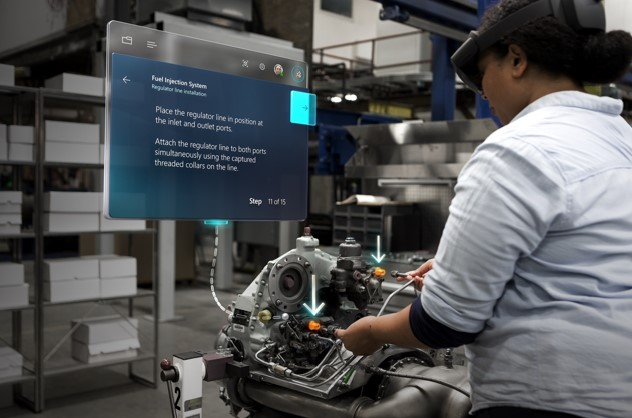
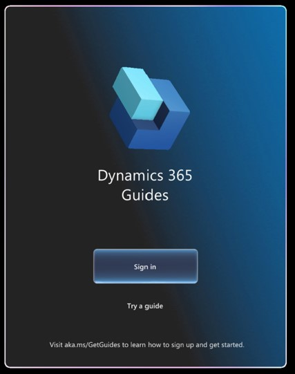

# Get started with Dynamics 365 Guides

Ready to get started with Microsoft Dynamics 365 Guides? Find the learning path below that suits you best. 

## Get started with guide authoring

If you're ready to get started with guide authoring, check out the following steps. 

||||
|-----------------------------------|-----------------------------------|-----------------------------------|
|**STEP 1**|**STEP 2**|**STEP 3**|
|**Author in the PC app**|**Place holograms in the world**|**Use, iterate, and share your guide**|
|Create step-by-step instructions and customize with images, videos, and 3D models.|Use the HoloLens app to place and customize the 3D models you chose in the PC app into the world. |Review your step-by-step instructions and share with others.|
|[Download the PC app](setup-step-three.md#download-the-pc-app)|[Launch the HoloLens app](setup-step-three.md#launch-the-hololens-app)|[View best practices](great-guide.md)|

### Understand authoring concepts

Use these pages to get a quick overview of the product and the guide-authoring process:

- [Overview of Dynamics 365 Guides](index.md)
- [Authoring overview](authoring-overview.md)
- [How to create a great mixed-reality guide](great-guide.md)
- [Glossary of terms](glossary.md)

## Get started with Microsoft Teams collaboration features

If you're ready to get started with Teams collaboration features, check out the following topics:

- [Call a remote collaborator (one-to-one or group call)](calling-start-call.md)
- [Join a scheduled meeting](calling-meetings.md)
- [Start a chat and share files](calling-chat-file-sharing.md)
- [Record a call](calling-record-call.md)
- [Screen sharing](calling-screen-sharing.md)
- [Annotations](calling-annotations.md)
- [View and access stored call data](call-logging.md)
- [Learn about Teams policies supported by Dynamics 365 Guides](admin-teams-policies.md)
- [Read the FAQ about Dynamics 365 Guides 8.0 and migration from Dynamics 365 Remote Assist](faq-version-8.md)

## Demo

[!include[pn-dyn-365-guides](../includes/pn-dyn-365-guides.md)] provides a five-minute demo that showcases the value of holographic work instructions for your company. This demo is useful for every [!include[pn-dyn-365-guides](../includes/pn-dyn-365-guides.md)] user, regardless of whether you're an author, operator, process engineer, or business decision maker. You don't have to sign in or be online to use the demo.

To start the demo, air tap the [!include[pn-dyn-365-guides](../includes/pn-dyn-365-guides.md)] tile, and then select **Try a guide**.

## Set up and administer Dynamics 365 Guides

Here are the most important pages for admins:

- [Requirements for installation](requirements.md)
- [Setup overview](setup.md)
- [Upgrade the solution](upgrade.md)
- [Deployment playbook](admin-deployment-playbook.md)

## Find out what's new

We're constantly updating [!include[pn-dyn-365-guides](../includes/pn-dyn-365-guides.md)] to include the top features that customers have requested. To find out what's new, check out our [What's new](new.md) page. This page is also available by selecting the **Help** (question mark) button in the upper-right corner of the PC app, so it's always at your fingertips.

To learn when features were introduced, or to learn about upcoming features, see the Release plan:

- [2022 Wave 1 (April 2022 through September 2022)](/dynamics365-release-plan/2022wave1/guides/dynamics365-guides/planned-features)

- [2021 Wave 2 (October 2021 through March 2022)](/dynamics365-release-plan/2021wave2/guides/dynamics365-guides/planned-features)

- [2021 Wave 1 (April 2021 through September 2021)](/dynamics365-release-plan/2021wave1/finance-operations/dynamics365-guides/planned-features)

- [2020 Wave 2 (October 2020 through March 2021)](/dynamics365-release-plan/2020wave2/finance-operations/dynamics365-guides/planned-features)

- [2020 Wave 1 (April 2020 through September 2020)](/dynamics365-release-plan/2020wave1/mixed-reality/dynamics365-guides/planned-features)

- [2019 Wave 2 (October 2019 through March 2020)](/dynamics365-release-plan/2019wave2/index)

- [2019 Wave 1 (April 2019 through September 2019)](/business-applications-release-notes/April19/index)

## Integrations with other Dynamics 365 products

You can integrate [!include[pn-dyn-365-guides](../includes/pn-dyn-365-guides.md)] with Dynamics 365 Field Service and Dynamics 365 Supply Chain Management.

- **Dynamics 365 Field Service integration.** Integrate [!include[pn-dyn-365-guides](../includes/pn-dyn-365-guides.md)] with Dynamics 365 Field Service to enable field service technicians to use [!include[pn-dyn-365-guides](../includes/pn-dyn-365-guides.md)] to complete their work orders. [Learn more about integrating Dynamics 365 Field Service](field-service.md).

- **Dynamics 365 Supply Chain Management.** Integrate [!include[pn-dyn-365-guides](../includes/pn-dyn-365-guides.md)] with production processes or asset management to take advantage of mixed-reality guides in your day-to-day service and maintenance workflows. [Learn more about integrating Dynamics 365 Supply Chain Management](admin-integrate-asset-management.md).

## Need help or support?

If you encounter an issue, check out these pages:

- [FAQ](faq.md)

- [Known Issues](known-issues.md)

If you don't find what you're looking for, [find a list of phone numbers that you can use to contact Support](help.md).

[!INCLUDE[footer-include](../includes/footer-banner.md)]
