# How to make a great mixed reality guide

Other online documentation in [!include[pn-dyn-365-guides](../includes/pn-dyn-365-guides.md)] focuses on helping you learn how to use the [!include[pn-dyn-365-guides](../includes/pn-dyn-365-guides.md)] applications and their various features. This document focuses on how to author great guide content to best communicate instructions to your operators. We suggest reading all other documentation first to get a good understanding of how to use the [!include[pn-dyn-365-guides](../includes/pn-dyn-365-guides.md)] applications, and then refer to this documentation to start authoring high-quality guides.

## Get started

### Gather content

Gather as much content as you can before you begin creating your guide. This includes images, videos, and 3D content (if you have any), 
and the physical objects themselves (if feasible). Don't worry if you don't have any 3D content. Guides includes a 3D Toolkit 
(including simple models such as arrows, hands, zones, and so on) that you can use to get started.

### Understand the space

Make sure you understand the space, the procedure, and the workflow you're authoring for. Arrange for access to the space so you 
understand the real-world environment. You'll also need access to the space to align the guide and place holograms later.

### Build references

A great way to start is to create a video of the procedure you want to show, or have someone (an expert in that process, for 
example) create one for you. You can refer to the video as you create your guide. If you're using a video as a starting point, 
make sure it's representative of the guide you want to create. For example, are you creating a guide for an expert or a novice?

### Understand your lesson objectives and target audience

It's critical to understand your lesson objectives and target audience before developing your guide. Lesson objectives include 
various sub-objectives needed to accomplish an overall [!include[pn-dyn-365-guides](../includes/pn-dyn-365-guides.md)] objective. Additionally, understanding your target 
audience will help you tailor your guide to provide the right amount of complexity needed to communicate information to your 
operators. For example, will your audience understand how to use specific tools or the names of specific machinery?

## Authoring features you can you use to make a great guide

### Guide Structure

#### Tasks

- When first organizing a guide's structure, break the assembly process into logical key objectives (tasks).

  –	Think about tasks as key check points throughout the guide.
  
  –	At the end of each task, the operator should accomplish one significant goal.
  
- Tasks should include only one main objective. If a task contains more than one main objective, break it into two or more tasks. 
This will help the operator retain the organization of the guide, leading to better retention.

- Tasks should follow a logical sequence of actions.

- When you start authoring a guide, talk the assembly process out loud – how would you verbally communicate this process 
to someone in person?

- To provide overall context, add an Overview and/or Welcome task at the beginning of the guide. 

  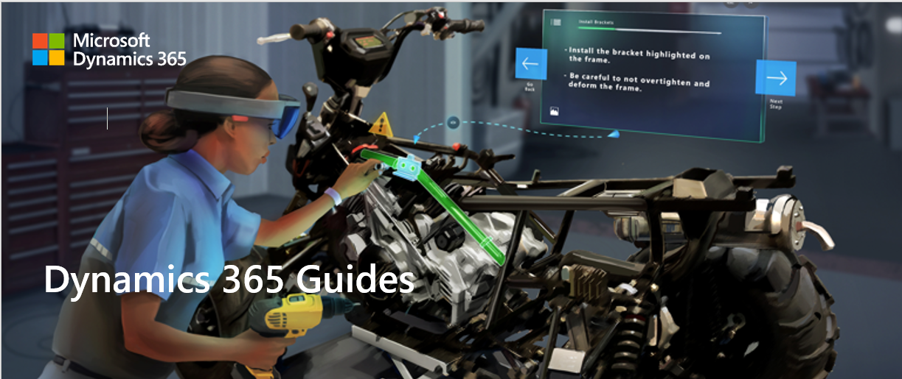

  This task can include the following steps:

  - A step that describes what the guide is about.

  - A step with a list of all the tasks in the guide. This will help create a roadmap of the assembly process for the operator, which leads to better retention.

  - If safety is a critical concern, you can add an additional step focused on specific safety measures you want operators 
to take before starting the guide.

- Tasks shouldn't include more than 30 steps. If a task contains more than 30 steps, break it into two or more tasks. Our research shows that having too many steps in a single task can overwhelm an operator, especially if they're learning the procedure for the first time.

#### Steps

- Unlike traditional instructions, step text in [!include[pn-dyn-365-guides](../includes/pn-dyn-365-guides.md)] isn't meant to describe everything because you have additional visual aids such as images, videos, and 3D holograms.

   –	When writing a step, consider all the different forms of communication you're using.
   
   –	Try to stick to one type of asset (image, video, or 3D hologram) per step. Too much media or 3D content can be overwhelming to 
   the operator and too time-consuming to absorb. Think about what type of content gets your point across best.
   
   –	In general, operators will read the text, look at images or videos, follow the dotted line, and observe 3D holograms. 
   Keep this order of operations in mind when writing a step.
   
- It's critical to keep your audience in mind when writing a step. Will your audience:

   –	Know the names of specific tools and what they can do?
   
     - If yes, you can use less detail since you don't need to explain what tools or parts are.
      
     - If no, you should add extra descriptions and clarifying visuals to support operators.
      
     - For a general audience, describe unique things (custom parts or tools) and don't describe generic things (generic tools).
      
   –	Understand basic safety requirements?
   
   –	Understand different environmental cues and conditions?
   
- Don't be afraid to add lots of steps.

   –	Remember to keep steps short for best effect.
   
   –	If you have multiple sentences in a single step, our research shows that operators will often read the first sentence, 
   try to complete the action, and miss the rest of the content on the step.
   
     Bad example:
     
     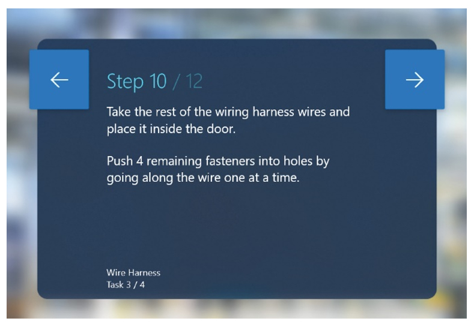
     
     Good example:
     
     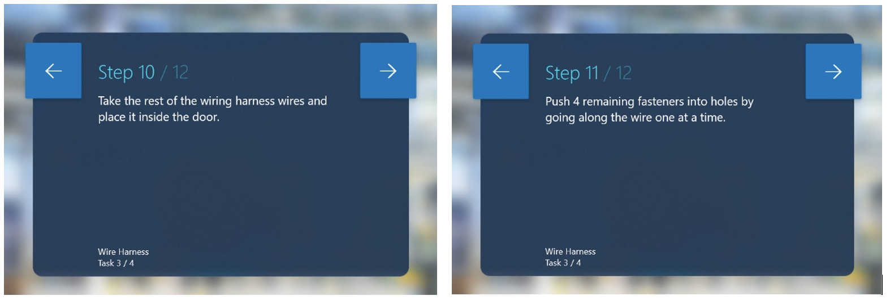     
       
     In this example, many operators might miss the second sentence and continue onto the next step.

- Keep text simple and colloquial.

   –	Don't be verbose.
   
   –	Write your guide in colloquial human language for best results. Don't use technical jargon that people don't know or understand.

   –	Try to cut out unnecessary words.

   –	Make sure to use language the intended audience will understand.

   –	On the PC, the app will warn you if your text is over the 280-character limit. If you're approaching the 280-character 
limit, this is a good indication that you're trying to put too much information in a single step.

   –	[!include[pn-dyn-365-guides](../includes/pn-dyn-365-guides.md)] doesn't currently support any text formatting (such as font size or styling), but you can use capitalization to point out key words or phrases.

   –	Adding numbered or multiple small steps inside a single step can often lead an operator to miss specific actions. Don't be afraid 
to create separate steps to make sure the operator completes the correct sequence of actions.

- Use descriptive action words like "locate," "find," "get," "go to", "pick up," "put down," "insert," "attach," and "remove."

- Keep language consistent throughout the entire guide. Items that are especially important for language consistency include:

   –	Part names
   
   –	Action verbs
   
   –	Referring to task names
   
- Consider adding additional separate steps that show individual tips and tricks. Adding tips/tricks in an action step often leads the operator to miss them.
   
  - It can be beneficial to add tips/tricks as a separate step before the action step.
       
  - Adding a **NOTE** step is useful for quality checks. This type of step can come before or after another step, depending on the 
       specific context.
            
  - Add a **WARNING** step for things that could be dangerous or cause a quality issue. This type of step can come before or after 
       another step, depending on the specific context. On HoloLens, you can add a warning style on a 3D hologram to reinforce the 
       warning step text.
       
     Good example:
     
     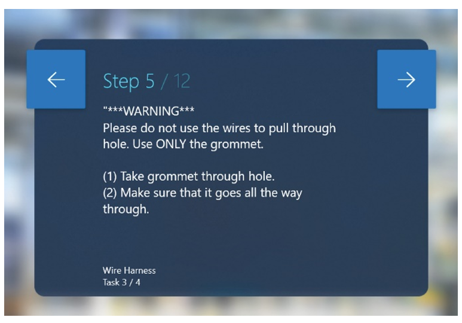
     
     Bad example:
     
     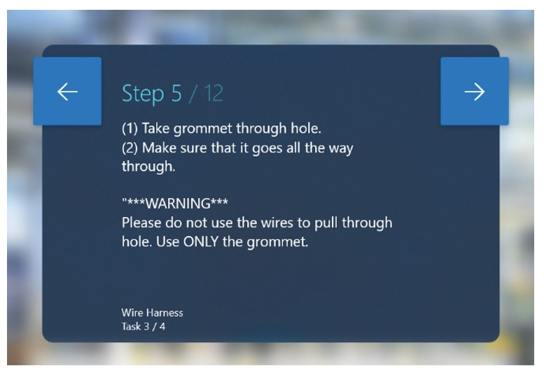
            
- Add a step at the end of each task to let the operator know that they're ending a task and to introduce them to the following 
       task. This helps the operator form a mental model of the guide structure, leading to better retention.
       
- If it isn't a generic tool/part (for example, a screwdriver, socket wrench, or washer), make sure to label and define the tool/part 
       the first time you introduce it to the operator. After labeling and describing the tool/part the first time, you don't need to define it throughout the rest of the guide.
       
- Validation. If certain actions are critical to the success of subsequent actions, make sure to add a validation step. Some 
validation examples include:

  –	Visual validation
       
   - "Make sure the green side is facing up."
          
   - "Make sure the text is upside down when screwing it in."
          
   - "Make sure the front of the machine is facing you and aligns to the top-right corner of the table before continuing on to the next step."
          
  –	Auditory validation
       
   - "Twist the knob to the right until you hear 2 loud clicks."
          
  –	Reference validation
       
   - "Reference image for correct orientation before continuing on to the next step. The following steps rely on correct 
          orientation of the circuit box."
          
- Hands:

  – Don't specify which hand to use (left/right) unless:
  
   - Using a specific hand is important to the process (for example, "Hold the left side down with your left hand, and use your right hand to turn the knob simultaneously")

   - Strength is required. If strength is required, make sure to specify dominant/non-dominant hand in the step instructions. For example: "Turn the knob three times with your dominant hand. It will require force."

## The dotted line (tether)

- The main purpose of the dotted line is to help the operator locate the place where the work happens.

- Use the dotted line when:

  –	Starting a guide. This helps orient the operator to the right general location where the work will take place.
  
  –	Moving to a different area on a new step.
  
  –	Locating a part.
  
  –	Moving to a different area of a large piece of machinery (for example, greater than 2' away from the previous step).
  
  – When using the dotted line to point to something small (1–2 cm), add a 3D hologram (a zone or arrow, for example) at the end of the dotted line to point to the specific area.

– Use the dotted line for "part pickup" in the following ways:

  –	For the first time picking up a part, use the dotted line to show the operator where it is.

  –	For the second time, or to put a tool back, you don't need to use the dotted line again (unless it's in a different location).  

## 2D images

We recommend using 2D images in the following scenarios:

- What to do and what not to do. When operators do something the wrong way consistently, it's useful to have an image that shows the correct way next to an image that shows the incorrect way. Highlight the key difference.

  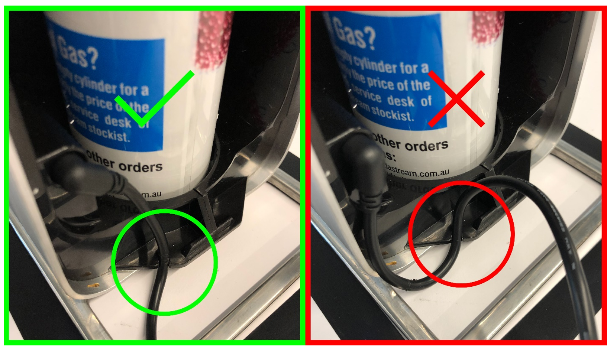 

- Validation

  –	Orientation validation. Using an image is a clear way to make sure parts or machinery have the correct orientation. This can be critically important if subsequent steps are based on correct orientation for a specific part or piece. Make sure to give enough environmental context to visually communicate to operators the correct orientation in the environment.
      
   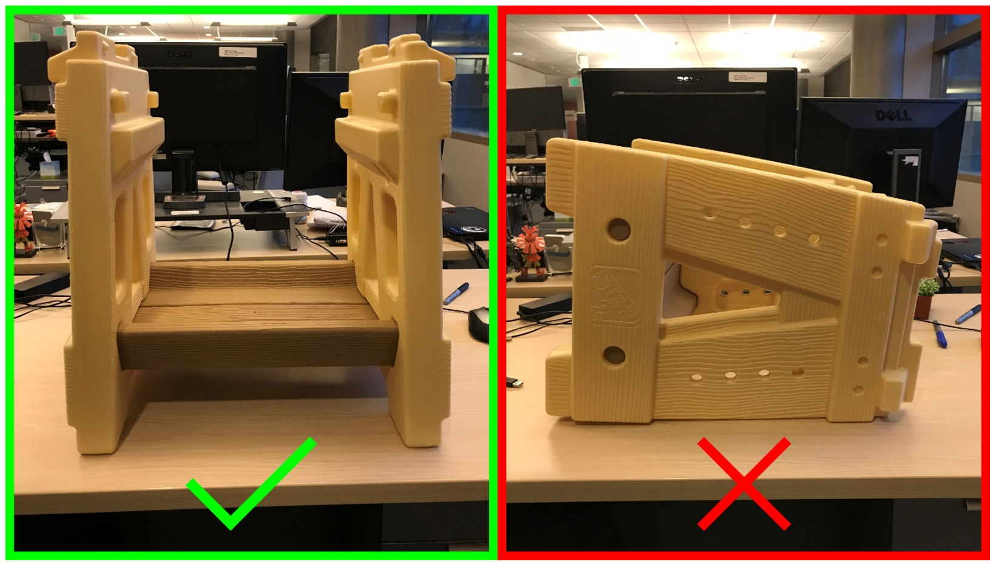  

  –	Part validation. Use images for part identification in cases where a workstation has multiple parts that could be confused with one another visually. This is especially useful when two or more parts looks very similar with one tiny difference.      

    Validate that an operator is picking up the correct part by comparing it to a picture or reference number.

- General notes for images. Make sure images:
     
  - Are clear
        
  - Are high quality. 1080p is recommended. 4K images are unnecessary.
        
  - Capture enough context to orient the operator contextually in the environment.
              
  - Are shown from the viewpoint of the operator.

  - Don't contain extra visual noise that can confuse or distract the operator from what you're trying to communicate.

  - Maintain a 16:9 ratio to fill the entire media panel.

  - Show enough of the details you're trying to communicate. Don't take images from too far away. 

  - Make sure to preview all images on HoloLens before using a guide. Image detail and color may appear different on HoloLens.

- If an image is critical, include the words **Refer to image for reference** before any additional action text in the step instructions. If you put the reference after an action, operators can miss it. You can even create a separate step to place before the action to make sure the operator sees the image.

   Good example:

   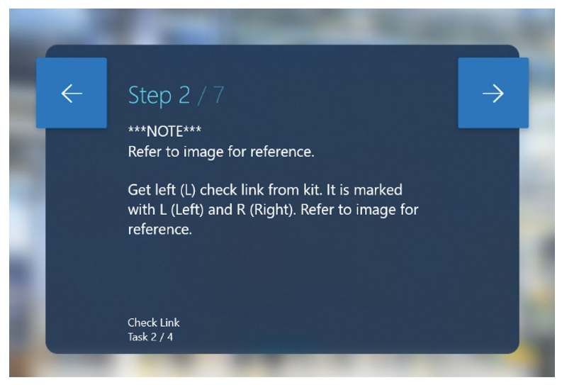  

   Bad example:

   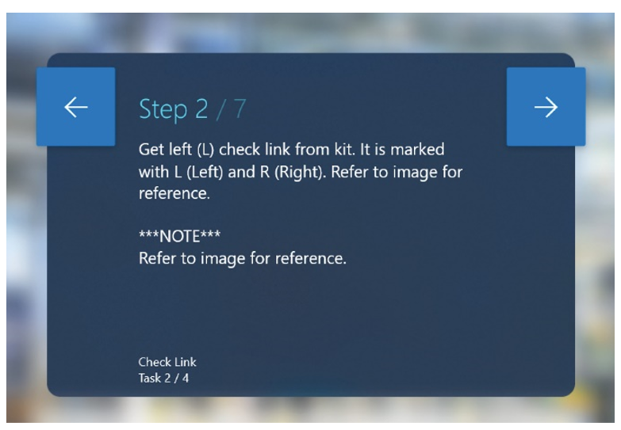 

## Videos

We recommend videos for unique interactions, such as:
   
–	Detailed hand processes.
     
–	Steps where millimeter accuracy is critical and 3D holograms may not be accurate enough.
     
–	Processes where standard holograms are too abstract, but custom holograms are too complex for your team to produce.

Only show how to do something one way. Showing multiple ways to complete a step can be confusing for operators. Pick the best method for completing the step.
     
### First-person vs. third-person videos

Shoot videos from a third-person or first-person perspective.
   
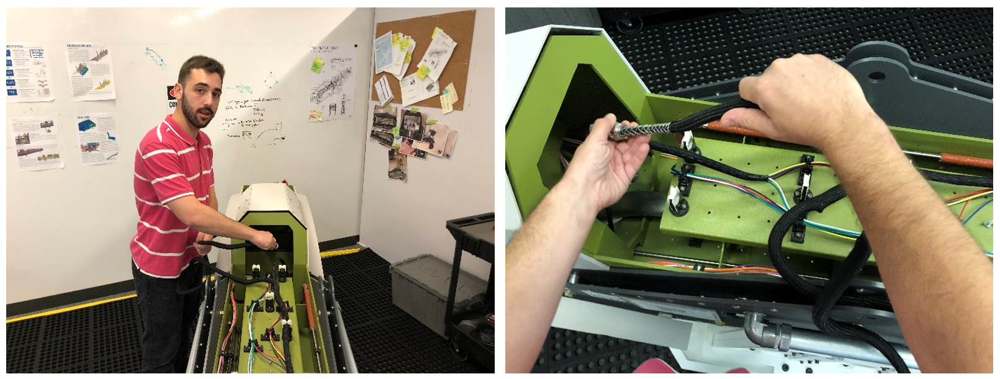 

- Third-person videos work best to:
     
  - Show environmental context of where to do the work.

  - Understand how the operator and machine interact.

- When filming in third person, it helps to start wide (to see the full context), and then zoom in to understand detailed operations.

- You can easily shoot third-person videos with any hand-held camera.

- First person videos work best:

  - For small, tight spaces

  - For fine hand work

  - When communicating the work from the perspective of the operator is critical to the success of the procedure.

- For first-person videos, we recommend mounting a camera to the authors head using a GoPro or similar device.
    
## 3D toolkit

### 3D toolkit categories:

#### Arrows

- Use arrows:

  - To communicate simple spatial information like position, direction, and translation.

  - When you want the operator to insert a part into something:

    –	Arrows are great for pointing to a specific location.

    –	Arrows can be used to show directionality. Example: "Twist the lever until tight" with corresponding half circle arrow showing movement direction

    –	You can use a combination of different arrows to show a sequence of different actions (for example, "Swing, then pull"). You can pair arrows with numbers.

    –	You can use arrows in combination with other 3D holograms (for example, checks and cross) to show where to put something and where not to put something.    
    
    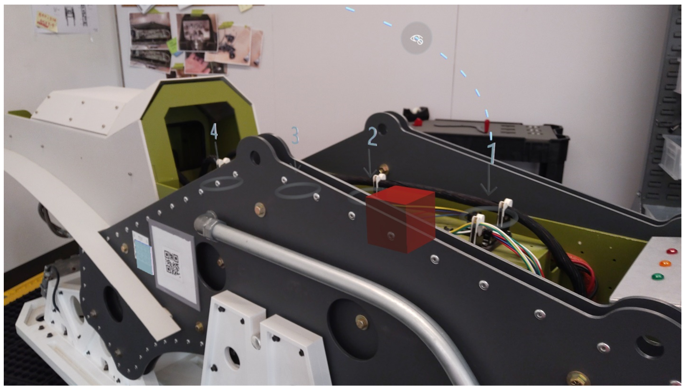 

      
#### Hands

- Hands are best for communicating specific hand orientations or movements.

- Use hands when you want the operator to use their hands in a specific way to grab or manipulate something. There are various poses for specific interactions that are available in the 3D toolkit such as Pull, Push, Pinch, Grab, and so on. Combine hands with arrows and/or additional 3D holograms to add additional meaning.

- Generally, the "Pick Up" or "Place" shader works best with hands allowing operators to visually align their hands with the hologram.

#### Numbers

- Use numbers for sequencing within a step. Example: "First pull the lever (1), and then place it in the key hole (2)."

- Don't use numbers to identify parts in the world. Example: "Pick up the screwdriver (1) and the socket wrench (2)."

- Don't use numbers to communicate how many of something to get. Example: "Pick up 3 screws" where holographic number 3 is next to screws.

#### Zones

- Zones are a good way to communicate areas to place items.

   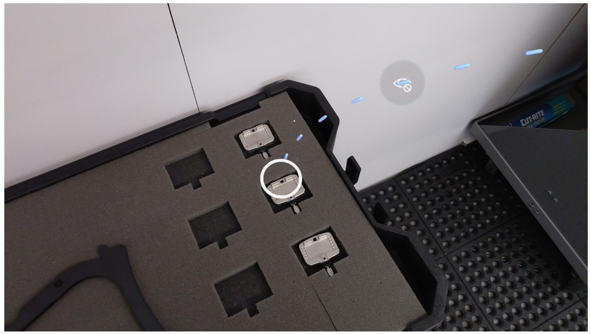

- Zones can be used to show the orientation and location of objects.

- Animated zones are effective in getting operators' attention.

- If you use zones to communicate orientation, it's helpful to pair them with a reference image.

#### Generic tools

- Generic tools can be used in two ways:

   –	Symbols. Use the scaled-down version of a generic tool (for example, a screw driver) next to a real-world part to indicate to the operator the type of tool to pick up or use.

   –	Models. Use a scaled-up version of a generic tool to indicate to the operator the actual scale of a specific tool to pick up or use.

#### Symbols

- The Check and Cross symbols are best at communicating:

  - Where and where not to place things

  - Where and where  not to run things through

  - Clearance areas

  - Which part of machinery or tool to select out of an array of options

- The Exclamation Point is best for communicating critical or alarming information.

  - We recommend using the Exclamation Point with the Avoid or Warning style.

  - Do not overuse the Exclamation Point, as it will lose its urgency after repeated use.

- The Lighting Bolt is best for communicating potential electrical hazards.

 - We recommend using the Lighting Bolt with the Avoid or Warning style.

## Custom 3D holograms

- In general, try to accomplish a step by using the 3D toolkit. If you can't achieve the desired result with 3D toolkit assets, you can use a custom asset, image, or video instead.

- Use custom high-fidelity assets where details matter, and custom low-fidelity assets for high-level principles where details aren't as important. For example, if detailed accuracy is important, like referencing a specific port or lever, highly detailed custom assets may be necessary. On the other hand, if you're trying to show how to align an object, a general shape may achieve the desired effect.

- Custom assets are best for communicating unique parts or unusual animation behaviors.

- Animated custom holograms are a great way to show the flow or movement patterns throughout a step.

- Use a custom hologram of the entire object for orientation and alignment steps.

- You can always use a combination of custom assets with the 3D toolkit on any step.

## Hologram styles

- Use styles to help create a visual hierarchy of 3D holograms.

- Use styles consistently to communicate specific actions. If you use styles consistently, as operators continue to use [!include[pn-dyn-365-guides](../includes/pn-dyn-365-guides.md)], they'll start to understand what styles are intended to convey, which will speed up their learning process.

### Hologram style options

#### Original

- For 3D toolkit assets, the Original shader is a white material.

   –	The Original white material is a good generic style because it doesn't have any strong pre-existing connotations for operators.

   –	If your focus is more on alignment or positioning, the Original shader is a good choice because it won't indicate any strong action indications for the operator.

- For custom assets, the Original shader is whatever is imported with the 3D model.

  –	Depending on the author's needs or requirements, you can import a custom model with any style on it. Some good examples include:

    - Specific colors on sections of a model to identify parts or pieces. You can then add step instructions that refer to the colored sections.

     - Realistic style to show what the actual object looks like.

#### Pick Up

- The Pick Up style shows an outline around the hologram.

- We recommend using the Pick Up style for:

  –	Having the operator pick up a part/piece. This works especially well on:
    
   - The hands holograms in the 3D toolkit because operators can align their hand to the hologram, positioning their hand in the right orientation and position.

   – Picking up parts because the outline around the real-world object visually distinguishes it from the rest of the environment.

#### Place

- The Place style is similar to the Pick Up style but has a dashed outline instead of a solid outline.

- We recommend using the Place style for trying to align a real-world object to a hologram, because operators can place the real object in the hologram to validate that it visually matches.

#### See-Through (includes See Through 1 and See Through 2)

- See-Through is best for de-emphasizing holograms in the real world because it makes the hologram semi-transparent and darker.

- When creating a visual hierarchy of holograms, use See-Through to soften less important holograms in the scene.

- See-Through 1 is less opaque than See-Through 2.

#### Warning

- The Warning style is yellow with black stripes, which is synonymous with warning.

- Use the Warning style when a hologram represents something that is potentially:

   –	Dangerous
   
   –	Electric
   
   –	Hazardous

#### Avoid

- Avoid is a red pulsing style that you can use to indicate to the operator that:

   –	They should avoid touching or interacting with a specific zone or part.
   
   –	They should avoid a clearance area.
   
   –	Something is dangerous or electrical. You can also use the Warning style based on the specific context.

#### X-Ray

- X-Ray resembles the effect of an x-ray scan.

- Use X-Ray when a hologram is placed in another object, which helps the operator understand the depth order of parts.

#### Metal

- The Metal style represents a highly glossy metal and can be used to give a hologram a realistic shiny material.

## Anchoring

- Place the anchor on the base object (rather than a static object such as a table or cart), so if orientation of the base object is incorrect, the operator can rescan and correct hologram positions.

  Good example:

  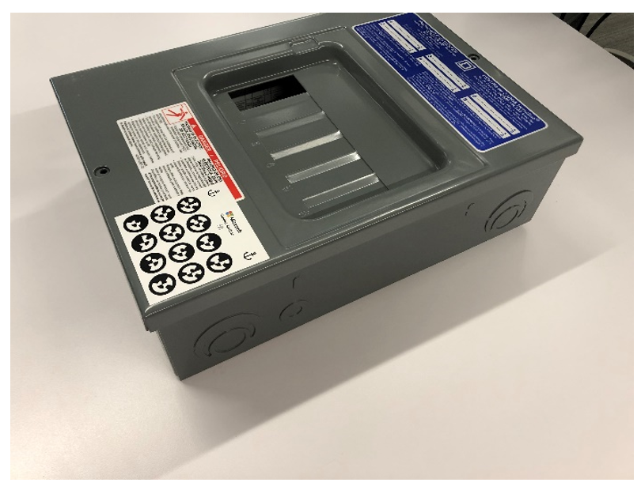

  Bad example:

  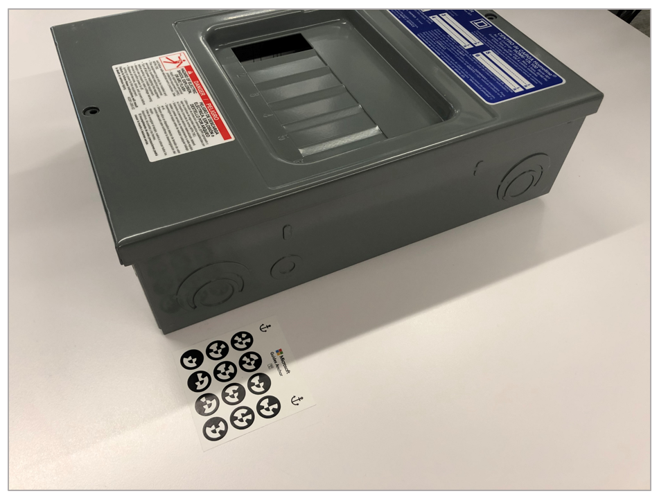

- Important orientation that could impact alignment of future steps can be coupled with visual guides via photos or custom holograms and text reminders to check their positioning.

- Make sure to explain anchoring fundamentals to operators, otherwise they may be confused about how to fix if they incorrectly align a real-world object.

## See also

[Author a guide](authoring-overview.md) 
[Overview of operating a guide](operator-overview.md) 
[Analyze your guides](analytics-guide.md) 
[FAQ](faq.md) 
[Known issues](known-issues.md)

[!INCLUDE[footer-include](../includes/footer-banner.md)]