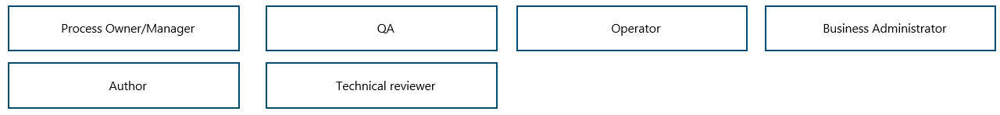
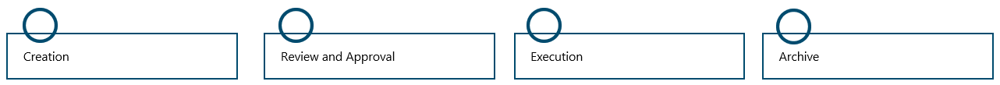
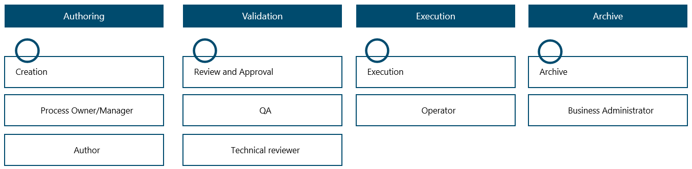
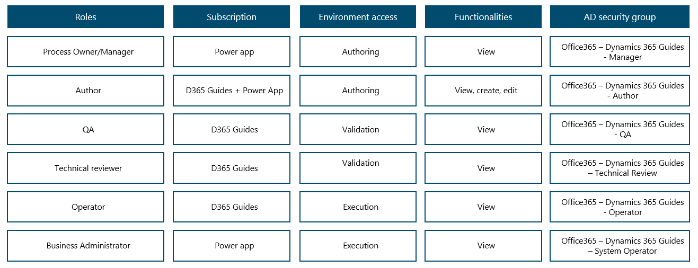

---
title: 
description: 
ms.date: 03/09/2023
ms.topic: 
ms.service: 
author: 
ms.author: 
manager: 
---

# Strategy for access control and IAM 

When working in a regulated industry, maintaining full control of access is key. To do so, the recommendation is to make use of the principle of least privilege (PoLP). PoLP is an information security concept stating that a user should only be granted access to the specific data, resources, and/or applications that are needed to complete the required task.

To properly configure your Identity and Access Management (IAM) and thereby maintain full access control of Guides content, it is recommended to define roles, functionalities, and environments. Likely, if your organization has facilitated stakeholder workshops as suggested in prerequisites for implementation and planning roll-out, you will have a great deal of the information needed to define these.

**Define roles**

To properly set up your IAM, it can be helpful to start out by considering which roles are involved in the process flow that guides undergo from their creation to archiving. In a process flow that adheres to regulated industry requirements, there will, as a minimum, always be an author and a QA: The guide needs to be authored, and it needs to be validated. These two roles are mandatory.

Furthermore, you might find that a process owner is involved in the initial steps of the Guides user journey. For example, a process owner could request the creation of a guide based on a need identified in production. If you wish to integrate the Guides process flow with existing processes involving, for instance, a Quality Management System (QMS) or a Learning Management System (LMS), you might need a role that handles the integration process and ensures that systems are in sync.  
  
Additionally, QA might need support to do validation from a technical reviewer that validates the guide in-depth with their HoloLens. Furthermore, there is also an operator role, who will launch and follow the instructions in the guide. The roles within your Guides flow fully depend upon your organization, your processes, and your needs. Identifying these roles in the preliminary implementation phases is key.

*Example: a set of defined roles within a Guides process flow*

**Define functionalities**

When the necessary roles have been defined, the next step is to define which technical features each of these roles requires.  
  
On the one hand, you have the author. As the author will create and develop guides, they need to be able to access the Guides Desktop App, Guides Mobile app, Guides via HoloLens, and, potentially, a Power App enabling the Author to transfer the guide further in the process flow (to review by a QA). This is necessary to create, configure, and test the guide. However, they might not need any further involvement.  
  
On the other hand, there is the role of the QA. They have nothing to do with the actual creation of the guide, but it is critical that they can view the guide, the related content, and the metadata to approve or reject the guide. Hence, these are other functionalities than those of the author. There might be other reviewers involved in the process as well, but neither of those should have the right to edit the guide.

To limit the number of users that can edit the guide, it can be helpful to assign a role within the flow who is responsible for delivering feedback across roles throughout the entire Guides flow. This is especially useful if you use both the Power Platform and a QMS without automated integrations. In that case, this role would also be the binding link between the two platforms, ensuring that any comments made in the QMS, for instance in relation to rejection of a particular guide, are delivered to the author so they can adjust the guide accordingly. Introducing this linking role means that the author's access can be restricted to the Power Platform only, and the QA's access can be restricted to the QMS only. This way you ensure that each role has limited access that keeps them within their defined role, their defined functionality, and their field of expertise. It is possible to support this process further if system integrations are made point-to-point or via a middle-layer integration platform.

*Example: a set of defined functionalities within a Guides flow*

**Creating the access control structure**

When roles and functionalities have been defined, the next task is to determine which environment these belong to. Assigning specific roles to specific environments is what ultimately enables you to ensure that content remains compliant and controlled by the right roles. In the example below, the four environments previously introduced are outlined: Authoring, Validation, Execution, and Archive.

*Example: Combined roles, functionalities, and environments*

The environments each represent different stages of the content's life cycle. While adhering to the PoLP and keeping the defined roles and needed functionalities in mind, it is possible to place each role within each environment. As illustrated in the graphics above, the author has access to the Authoring environment and no other environments. This decision is based upon the definition of the role and the related functionalities which are to create, configure and test guides. Hence, this role does not need access to any other parts of the content's lifecycle.

The configured roles, functionalities, and environments can all be linked to your organization's existing IAM system by defining an [AD security group](https://learn.microsoft.com/en-us/windows-server/identity/ad-ds/manage/understand-security-groups) with specific access and security elements related to each role. The benefit of this setup is that when users are granted a specific role, they are automatically provided with the necessary access to perform the assignments of the role they have. Furthermore, this IAM setup ensures that changes and terminations of access happen in a controlled and automated process in sync with the onboarding and offboarding of employees within the organization.

*Example: a full overview of elements that can be managed by AD groups and linked to the IAM process and other systems of relevance  
*

