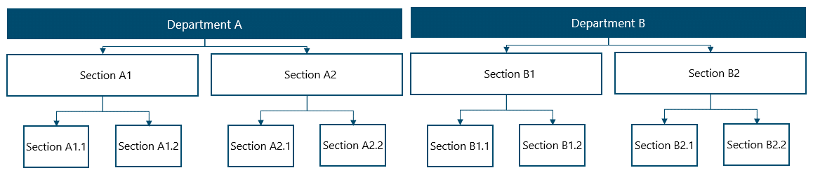
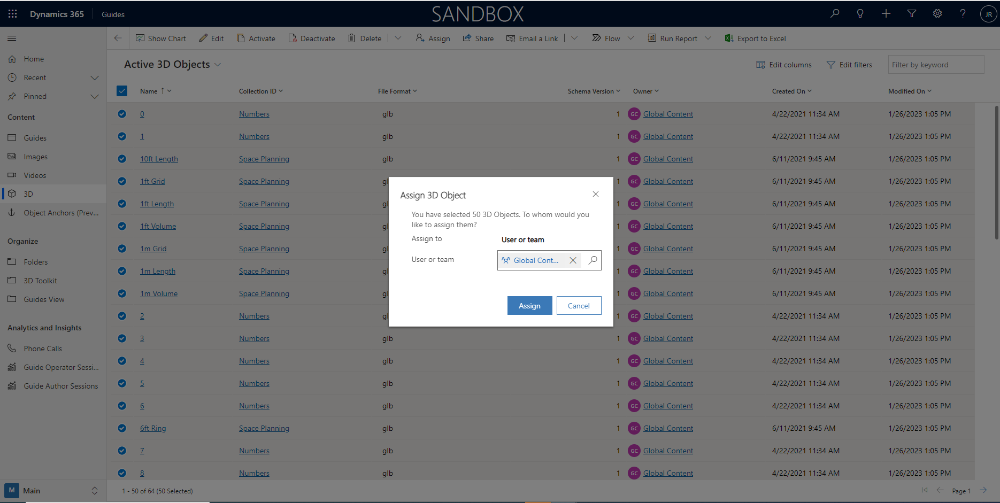

---
title: 
description: 
ms.date: 03/09/2023
ms.topic: 
ms.service: 
author: 
ms.author: 
manager: 
---

# Strategy for content and 3D Toolkit ownership 

When authoring guides, assets such as images, videos, and 3D objects will be at the author's disposal. A 3D toolkit with standard objects such as pointers and arrows are pre-installed, while all additional content, for instance, a 3D model of a machine part or approved company logos, will be provided by your organization or its suppliers.

In the implementation process, it is recommended to consider how to distribute ownership and hereby access to content within Guides. Let's take the objects in the built-in 3D toolkit as an example:

*N.B.: It is assumed that your organization's Power Platform strategy is to spread data across environments and control access to guides via Business Units.*

When the Guides application is initially deployed, the ownership of the 3D toolkit elements is by default assigned to the user deploying the solution. Since the 3D toolkit elements are likely to be used by several authors in your organization, you will benefit from assigning the ownership to a parent-Business Unit instead. Thereby, if allowed by your security role settings, all users in the Business Unit and its associated child-Business Units will be given access to utilize the toolkit elements. Because all child-Business Units inherit the access rights of its parent unit, be careful to choose the right ownership level to enable as well as restrict guides authors' content access.  
  
For instance, if the toolkit elements are to be used by authors in a company's A-sections (see example below), ownership of the 3D toolkit elements must be assigned to "Department A" for all the A-sections ("Section A1.1", "Section A1.2", "Section A2.1", and "Section 21.2") to inherit access.

  
Example: Business Unit structure with units corresponding to an organizational structure

Alternatively, your organization can create a separate Business Unit named, for example, "Global Content", and assign 3D toolkit element ownership to this unit (see example below). Subsequently, you'll give guides authors across the organization access to this separate unit specifically.

Example: 50 3D Objects getting assigned to Global Content Business Unit in the Power Platform.

Carefully choosing the ownership of the 3D toolkit can enable broad access to content for guides authors. However, it is necessary to regularly pay attention to content ownership. For instance, when someone updates the Guides application, your organization needs to check that content ownership does not change. Otherwise, authors risk losing content access, or authors are granted unauthorized access to content.

Also, whenever Microsoft adds 3D elements to the application package, ownership will need to be updated post deployment due to the automatic ownership assignment to the deploying user.

