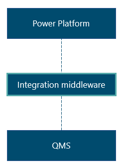
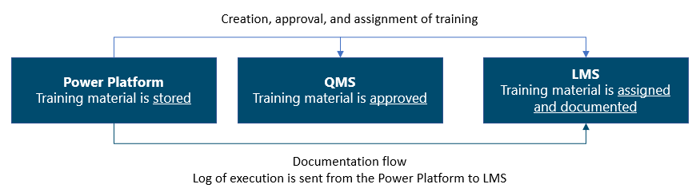

---
title: 
description: 
ms.date: 03/09/2023
ms.topic: 
ms.service: 
author: 
ms.author: 
manager: 
---

# Strategy for integrations to QMS/LMS 

Integrations are useful if you want to automate the manual process of data handover between systems, e.g., the Power Platform and a Quality Management System (QMS). If you have a well-established approval workflow within your QMS, you can re-use this workflow and its process triggers for the automation of approval flows: For example, it allows for automation of the creation of a QMS record entry, automation of making guides effective in an Execution environment, and automation of retiring guides from being effective (for example, if a SOP within the QMS is retired or the related content is retired). Whether or not integrations are a requirement from the beginning, it is recommended to consider this topic in the initial phases of the implementation, as it influences the user journey as well as the data model to be established.

**Pre~~-~~requisites for integration with QMS/Categorizing content in a regulated context**

The immersive content that guides consist of is stored within the Power Platform. This content cannot be launched within the QMS, which means that you need to ensure that 1) you create a link between the QMS and the externally stored content (the guide), and 2) you associate or create a new Document Type/Record Type in QMS that is chosen for digital guides. For this specific Document/record Type, you need to define the related requirements and documentation needed. A minimum requirement is to have the Guide ID and the QMS document/record type ID in both systems. These two ID's is recommended to be part of the data model from the beginning - even if automatic integration is not implemented at first. It is a prerequisite for enabling an automatic integration that the data to be exchanged are present in both systems' data models.

Second after data model definitions are to define the points of integration in the user journey and what activities (actions in systems) that will trigger the data flow between the systems.

There are two ways of doing integrations: process-based integration and technical integration.

**Process-based integration**

With this approach, you do not make any technical integrations. Rather, you re-use the flow within the QMS and transfer data manually. As mentioned in strategy for access control & IAM, it makes sense to assign a role responsible for ensuring the synchronization between the systems when handling integration manually.

Executing the integrations manually allows you to maintain control of the processes. ~~I~~t allows for the refinement of processes without having to adjust technical integration accordingly. It is recommended to use this approach if you are still in the maturing phase and have a limited number of transactions. In such case, it makes sense to thoroughly investigate the ways in which the two systems must interact and prepare the data model in Power Platform accordingly. A well-planned data model will simplify the technical integration in the future.

**Technical integration**

As the solution matures, technical integrations are recommended to automatize processes otherwise handled manually. There are two options for a technical integration: point-to-point integration or API-based middle-ware integration.

<u>Point-to-point integration</u> is when you connect two apps via custom code. It is a simple and efficient way to connect systems within your business. However, point-to-point integrations are not designed to keep up with changes, which means that the integration will fall short whenever changes and/or updates are introduced to either of the connected systems. In that case, you will need to qualify and validate both systems. Keeping the integration connectors up to date can be time-consuming which is why you might not find this type of integration to be the best choice. The frequency of updates to the connected systems will affect how viable point-to-point integration is in the long run.

*Example of point-to-point integration*

<u>API-based middle-ware integration</u> is when software acts as a bridge between two or several systems that need to communicate. Middleware integration allows the systems to communicate and establishes data flow amongst themselves without requiring the two applications to communicate directly. The bridge that the middleware integration creates also separates the system updates which means that both systems do not need to be re-validated if only one of the systems is changed and/or updated.

*Example of integration middleware*

Whether it is wise to choose point-to-point integration or API-based middleware integrations depends on your enterprise architecture strategy and the tools you have available within your organization. If you have middleware integration software, it makes sense to choose the API-based middleware integration. If you do not have middleware integration software, then point-to-point integration might be the best fit.

N.B.: All technical integrations need to be a part of the potential GxP validation and test. This is an argument for starting with process-based integration as time to go-live can be reduced. Process-based integration also involves less maintenance work until a critical level of data transfer is needed.

**Integration to LMS**

If you intend to use training material developed in Guides, you can connect Guides with your Learning Management System (LMS). With this connection, you can transfer users' usage data and completion of guides. The exact setup of this integration depends on the requirements for your specific industry. An example of the flow is illustrated below. Training material is stored in the Power Platform, approved in QMS, after which the training material is assigned to relevant employees and execution is documented.

There are three factors to consider if you plan to connect Guides with your LMS:

1. **Integration between QMS and LMS**

Establish an integration between QMS and LMS to automate the transfer of training from QMS and LMS and to ensure synchronization. If you do not have an integration, manually ensure that training material is made available from the QMS to the LMS.

2. **User-based or device-based licenses**

The approach to the LMS integration for evidence of completion depends on whether you use a user-based or device-based Guides setup. If you have a user-based setup, user statistics can provide proof of execution via logs in Power Platform. The regulatory requirements that apply to this logging as evidence, for example GxP and EU GDPR, must be verified with the QA department within the business as well as the Data Protection Officer (DPO).  
  
If you have a device-based license, user statistics and logs cannot be used directly from Power Platform. Instead, you can create a functionality in the training flow (via a Power App) where employees sign-off from their profile and thereby provide proof of execution. This can be supported by a digital signature component to be compliant with regulatory requirements for documentation. Furthermore, you can create an integrated functionality that enables users to evaluate the training as additional proof of execution. This approach can also be used for user-based license if QA and/or the DPO does not accept the Power Platform log as evidence for execution.

3. **Data model**

As with the QMS integration, it is recommended to prepare your data model for a LMS integration from the very beginning of the implementation. Adding a data field like for example "document type" in the Power Platform will ease the integration at a later point as it can be used to identify the records (guides) that are to be associated with LMS processes.

