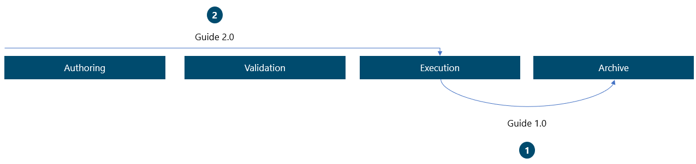
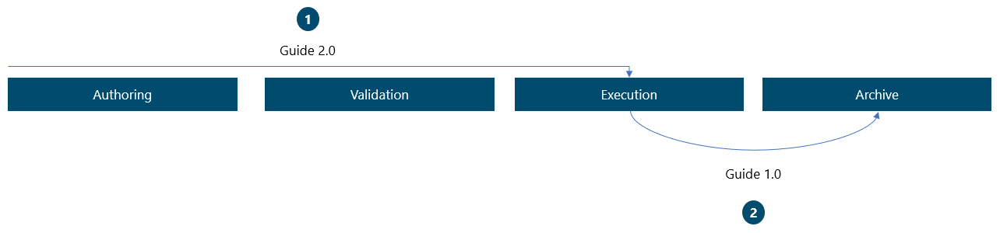

---
title: 
description: 
ms.date: 03/09/2023
ms.topic: 
ms.service: 
author: 
ms.author: 
manager: 
---

# Strategy for versioning guides 

To manage changes made to guides, use a versioning strategy. It is recommended your organization distinguish between two types of versioning: major revisions and minor revisions.

**Major versions**

Whenever your organization needs a new version of a guide that exists in an Execution environment, a new major version should be created. This means that a guide named "Guide 1.0" will change to "Guide 2.0". The "2.0" indicates that the updated guide has superseded a previous version. Major versioning enables tracking of changes made to the affected guides. A new major version of a guide needs to be validated, as with any other guide, before being moved to the Execution stage. Hence, the version is logged in the Quality Management System (QMS) and thereby traceable.

When creating a new major version of a guide, you need to consider what to do with the guide that the new major version supersedes:

1.  Immediate retirement: retire the superseded guide to an Archiving environment before authoring the new major version.

2.  Supersede retirement: retire the superseded guide to an Archiving environment when the new major version is approved and ready for execution.

If a procedure has changed, and the current guide thereby no longer compliant, you will most likely find the need to follow the **immediate retirement** approach as the current guide might jeopardize the safety and/or regulative procedures if instructions are launched and followed by an operator. Here, the first step is to retire the guide by moving it to the Archive. Next, you create, validate, and launch the new major version of the guide.

*Example of approach 1: Immediate retirement*

Another scenario might be that, for instance, Power BI reports for usage data of the guide show that the operators pause at a specific step card. This could be due to unclear instructions that you want to refine. As this update revolves around optimization and not procedural changes, you might find that there is no need to retire the current version until the new one is approved and ready for execution. In this case, the guide will not be retired until it is **superseded** by the new major version.

*Example of approach 2: Supersede retirement*

**Minor versions**

Whereas major versions are mandatory, minor versions are optional. Minor versions are all version changes made before the guide reaches the Execution environment. If your organization do not find it necessary to track the content life cycle prior to the Execution stage, minor versions can be left out.

Only the highest minor version will be transferred to the Execution environment.

*Example of minor versioning*

The explanation on versioning refers to the versioning of guides within Power Platform. This is not necessarily the same as the record versioning in QMS (the record in QMS links to the guide in the Power Platform). Depending on the system and process implemented, the record version in QMS could change whenever changes are made to the metadata such as change of title or author.

It is recommended that the versioning in Power Platform and the QMS is decoupled as this enables the most flexible process. Keeping the versioning synchronized can be cumbersome, as a change in versioning in QMS will require a versioning change in Power Platform. This will require a re-approval of the guide despite the change in the record in QMS not having any impact on the actual guide.

