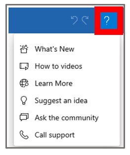

# Get help and provide feedback

Need help with Microsoft Dynamics 365 Guides? Select the **Help** (question mark) button in the upper-right corner of the PC app to find the help that you need.

 

| Menu item | Description |
|---|---|
| What's New | Get the details of each release of Dynamics 365 Guides, organized by release date. |
| How to videos | Find step-by-step instructions for authoring, operating, and analyzing guides. |
| Learn More | Access our in-depth documentation (that is, this set of pages). |
| Suggest an idea | Tell us about a specific feature that you think will improve the app. |
| Ask the community | Reach out to the Dynamics 365 Guides team or the [user community](https://community.dynamics.com/365/guides/f/dynamics-365-guides-forum) by asking a question in our forums. |
| Call support | Find out how to [contact customer support](https://support.microsoft.com/hub/4343728/support-for-business) if you need help. |
