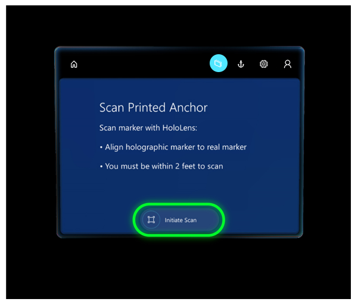
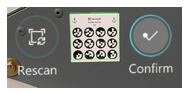
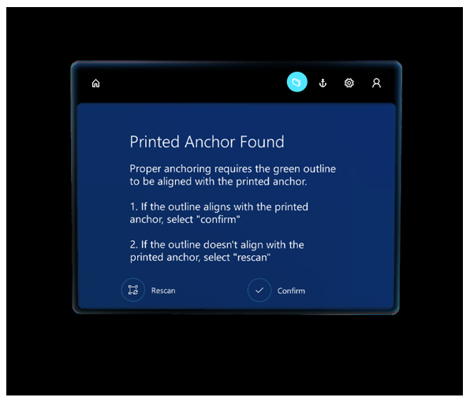

# Anchor a guide using the Dynamics 365 Guides HoloLens app in Author mode

The first thing you see when you open a guide in the Dynamics 365 Guides HoloLens app is the anchoring instructions created in the Dynamics 365 Guides PC app. How you anchor the guide depends on the type of anchor created in the PC app. For more information on creating an anchor and the types of anchors, see [anchor your guide to the real world in Dynamics 365 Guides PC app](anchor.md).

## Anchor a guide using a printed anchor

1. With your HoloLens on, stand about two feet in front of the printed anchor.

2. In the **Scan Printed Anchor** screen, select **Initiate Scan**.

   

   On your [!include[pn-hololens](../includes/pn-hololens.md)], you'll see an anchor hologram that looks like this:

   
   
3. Look at the printed anchor with your [!include[pn-hololens](../includes/pn-hololens.md)] until a green outline appears. Use your gaze to align the green box to the marker, and then select **Confirm**.

   

   When the guide is correctly aligned, you'll see the **Printed Anchor Found** screen. 
   
   
   
## Anchor a guide using a digital anchor

- Use air tap and hold to move and align the digital anchor to its real-world counterpart. To rotate the anchor, tap and hold the blue spheres.

   
   
>[!TIP]
   >On [!include[pn-hololens](../includes/pn-hololens.md)] 2, you can use your hand to directly select and place a digital anchor when authoring a guide.     

## Re-anchor a guide

When you anchor your guide, the anchoring information is stored on your [!include[pn-hololens](../includes/pn-hololens.md)] so you don’t have to re-anchor the guide every time you open it. You can use the **Anchor** button tore-anchor a guide at any time, though, if you feel the holograms are out of alignment. For more information, see [Place holograms, add styles, and more](hololens-app-orientation.md)

> [!NOTE]
> You might need to adjust the hardware offset in [!include[pn-hololens](../includes/pn-hololens.md)] 1 devices to ensure accurate placement of 3D content. [Learn more about adjusting for hardware offset](https://docs.microsoft.com/dynamics365/mixed-reality/guides/known-issues#uploading-new-3d-models-with-names-matching-any-of-the-pre-packaged-models-in-the-3d-toolkit-will-overwrite-the-files-in-the-3d-toolkit).

## What's next?

[Place holograms, add styles, and more](hololens-app-orientation.md) 

