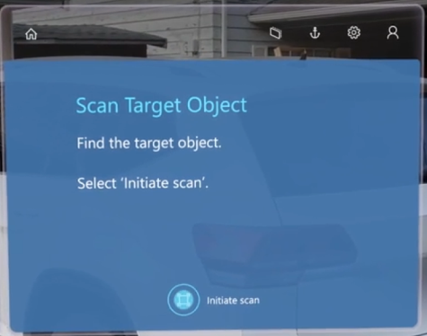
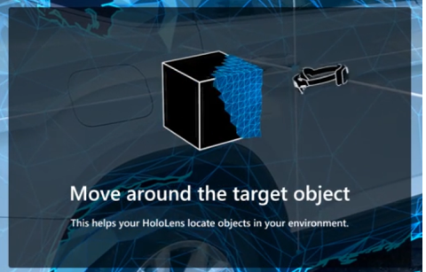
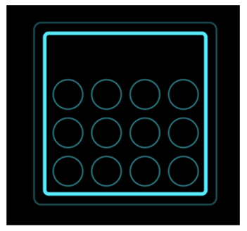

# Anchor a guide in the Dynamics 365 Guides HoloLens app (for authors)

When you open a guide in the [!include[cc-microsoft](../includes/cc-microsoft.md)] [!include[pn-dyn-365-guides](../includes/pn-dyn-365-guides.md)] HoloLens app, the first thing that you see is the anchoring instructions that were created in the [!include[pn-dyn-365-guides](../includes/pn-dyn-365-guides.md)] PC app. The method that you use to anchor the guide depends on the type of anchor that was created in the PC app. For more information about how to create an anchor, and the types of anchors, see [Anchor your guide to the real world in Dynamics 365 Guides PC app](anchor.md).

## Anchor a guide by using an object anchor (Anchor Object Anchors Preview)

1. Put on your HoloLens, and then locate the target object in your physical environment.

2. In the **Scan Target Object** dialog box, select **Initiate scan**.

     
 
3. Look at the target object with your HoloLens, and then move around the object to scan it. 

    HoloLens automatically recognizes the object based on the object anchor. 

4. Continue to move around the object if you're prompted to do so.

     
  
5. When the scan is successful, the object will have a green overlay.

    > [!NOTE]
    > Objects that have moved or are moving may cause variable accuracy. If you have issues with object detection and content alignment, try clearing the mesh and all holograms. To do this, on HoloLens, go to **Settings** > **System** > **Holograms** > **Remove all holograms**. This will clear the location of all holograms placed in your world, not just the object anchor.

6. If this is your first time scanning the object, select **Confirm** or **Rescan**. If the object has been scanned previously, the guide will be successfully anchored to the object anchor. HoloLens automatically goes to the first step of the guide. 

> [!TIP]
> You can re-align holographic content that might seem offset from the real world (for example, a rectangle that should be highlighting a tool, but is floating in the air away from the tool bench). When using an object anchor, a good way to control hologram offset is to test alignment by placing arrows from the 3D toolkit at key points on either ends of the object (for example, a corner or button). If the arrows are not aligned to the target object, you may need to tap the **Anchor** button to rescan. 
 
## Anchor a guide by using a QR code anchor

1. Put on your HoloLens, and stand about two feet in front of the QR code anchor.

2. On the **Scan QR Code Anchor** page, select **Initiate Scan**.

    

3. With your [!include[pn-hololens](../includes/pn-hololens.md)], look at the QR code anchor until a green outline appears. Use your gaze to align the green box with the anchor, and then select **Confirm**.

    

4. On the **QR Code Anchor Found** page, select **Confirm**.

    
    
    >[!TIP]
    >You can re-align holographic content that might seem offset from the real world (for example, a rectangle that should be highlighting a tool, but is floating in the air away from the tool bench). When using a QR code anchor, a good way to control hologram offset is to make sure the green outline aligns with the QR code. If the green outline isn’t aligned, you may need to tap the **Anchor** button to rescan. 

## Anchor a guide by using a circular code anchor

1. Put on your HoloLens, and stand about two feet in front of the circular code anchor.

2. On the **Scan Circular Code Anchor** page, select **Initiate Scan**.

    

    On your [!include[pn-hololens](../includes/pn-hololens.md)], you will see a holographic image that looks like the following illustration.

    

3. With your [!include[pn-hololens](../includes/pn-hololens.md)], look at the circular code anchor until a green outline appears. Use your gaze to align the green box with the anchor, and then select **Confirm**.

    

4. On the **Circular Code Anchor Found** page, select **Confirm**.

    
    
    >[!TIP]
    >You can re-align holographic content that might seem offset from the real world (for example, a rectangle that should be highlighting a tool, but is floating in the air away from the tool bench). When using a circular code anchor, a good way to control hologram offset is to make sure the green outline aligns with the circular code. If the green outline isn’t aligned, you may need to tap the **Anchor** button to rescan. 

## Anchor a guide by using a holographic anchor

- Use air tap and hold to move the holographic anchor and align it to its real-world counterpart. To rotate the anchor, tap and hold the blue spheres. On [!include[pn-hololens](../includes/pn-hololens.md)] 2, you can use your hand to directly select and place a digital anchor when you author a guide.

    

    >[!TIP]
    >You can re-align holographic content that might seem offset from the real world (for example, a rectangle that should be highlighting a tool, but is floating in the air away from the tool bench). When using a holographic anchor, select the **Anchor** button to make sure the digital version of the real object and the object itself are still aligned. 

## Re-anchor a guide

When you anchor your guide, the anchoring information is stored on your [!include[pn-hololens](../includes/pn-hololens.md)]. Therefore, you don't have to re-anchor the guide every time that you open it. However, you can use the **Anchor** button to re-anchor a guide at any time, if you feel that the holograms are out of alignment. For more information, see [Place holograms, add styles, and more](hololens-app-orientation.md)

> [!NOTE]
> To help guarantee accurate placement of 3D content, you might have to adjust the hardware offset on [!include[pn-hololens](../includes/pn-hololens.md)] 1 devices. For more information, see [How do I address hardware offset in HoloLens 1 devices to ensure accurate placement of holograms for printed anchor alignment](./known-issues.md).

## What's next?

Use the following table to find more information on anchoring.

|Area|Link|
|----------------------|------------------------------------------------------------------|
|Anchoring overview|[Overview of anchoring a guide](pc-app-anchor.md)|
|Creating types of anchors|[Create a QR code anchor in the PC app](pc-app-anchor-qr-code.md)|
||[Create a circular code anchor in the PC app](pc-app-anchor-circular-code.md)|
||[Create a holographic anchor in the PC app](pc-app-anchor-holographic.md)|
||[Change from one anchoring type to another in the PC app](pc-app-anchor-change-type.md)|
|Hologram precision|[Effect of calibration, pre-scanning, and environment](pc-app-anchor-improve-hologram-precision.md)|
||[Effect of anchor types/placement](pc-app-anchor-types-placement-precision.md)
|HoloLens app for operators|[Anchor your guide as an operator in the HoloLens app](operator-anchor.md)

[!INCLUDE[footer-include](../includes/footer-banner.md)]
