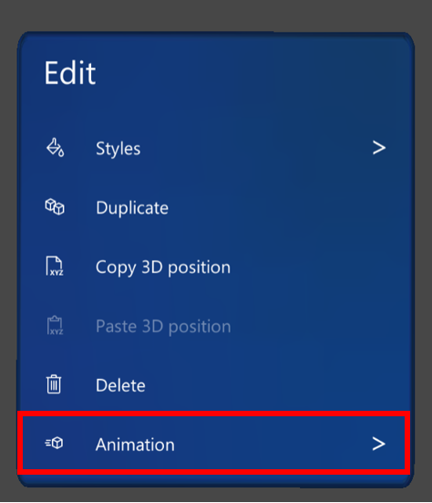
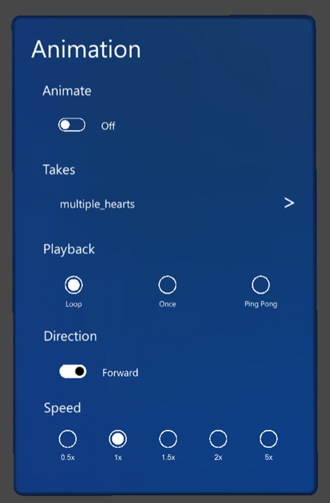

# Change animation options for a 3D model in the Dynamics 365 Guides HoloLens app

If you're working with a 3D model in the Microsoft Dynamics 365 Guides HoloLens app, and the 3D model includes multiple animations, you can select a specific animation to play back. You can also set playback options (speed, direction, and looping options). 

The following 3D tookit objects in the Zone category have built-in animation options:

- Circle Dashed
- Rectangle Dashed
- Square Dashed

If an object doesn't have built-in animation, the **Animation** command is grayed out (not available). 

## Change animation options

1. Select the 3D model.

2. On the **Edit** menu, select **Animation**.

    
    
    You'll see the following **Animation** dialog box.

    

3. In the **Animation** dialog box, select from the following options.

    |Option|Description|
    |----------------|---------------------------------------------------------------------|
    |**Animate**|Enable or disable the animation. You might want to use this option if an animation interferes with your ability to place a model in space. You can turn it off, and then turn it back on again. If disabled, the first or last frame of the animation is shown, depending on whether **Direction** is set to **Forward** or **Backward**.|
    |**Takes**|Select a specific animation to play from a 3D model that contains multiple animations.|
    |**Playback**|- If **Loop** is selected, the animation is repeated until the operator leaves the step.  - If **Once** is selected, the animation is played one time and then stops.  - If **Ping Pong** is selected, the animation repeats back and forth in each direction. |
    |**Direction**|- If **Forward** is selected, the animation runs from the first frame to the last frame of the animation as defined in the 3D model.  - If **Backward** is selected, the animation runs from the last frame to the first frame.|
    |**Speed**|Set the relative speed of the animation. For example, if the speed is set to 2.0x, the animation plays at twice the speed as defined in the model. |
    
> [!NOTE]
> For information on working with multiple animations in a single 3D model in 3DS Max, see [Use multiple animation clips in a 3DS Max model](https://doc.babylonjs.com/extensions/Exporters/3DSMax_to_glTF#single-animation-clip).

## What's next?

- [Get oriented with the HoloLens app](hololens-app-orientation.md)
- [Place and manipulate holograms](hololens-app-place-holograms.md)
- [Add a dotted line for a focus area](hololens-app-dotted-line.md)
- [Use styles for emphasis](hololens-app-styles.md)
- [Copy a 3D model's position](hololens-app-copy-3D-model-position.md)
- [Create a trigger for step navigation](hololens-app-trigger.md)
