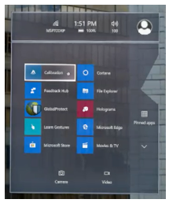

## Calibrate your HoloLens for authoring in the Dynamics 365 Guides HoloLens app

To help guarantee that holograms appear in the correct locations for guides you author in Dynamics 365 Guides, you must set the interpupillary distance (IPD) for your HoloLens. This step must be completed for every [!include[pn-hololens](../includes/pn-hololens.md)] user, whether you're an author or operator. In an industrial setting where holograms are used to direct operators to perform operational tasks, it's crucial that the holograms be correctly aligned. Incorrect alignment can cause operator confusion and costly damage.

Here are the results if you don't configure the IPD for each user:

- Holograms will be out of alignment by 1 to 2 cm.

- Holograms will appear as if they're sunk into or floating above surfaces that they're sitting on.

- Holograms won't be stable. As you walk around, you will notice that they move.

> [!IMPORTANT]
> It's particularly crucial for authors to make sure that their IPD is set correctly. Otherwise, all operators who use the guide will see misaligned holograms.

You can set your IPD by using the Calibration app included with [!include[pn-hololens](../includes/pn-hololens.md)].

## Calibrate your HoloLens 1 device

1. Use the bloom gesture to open the **Start** menu.

2. Air tap **Calibration**.

    

3. Follow the instructions on your [!include[pn-hololens](../includes/pn-hololens.md)].

All users must do this calibration after they sign in to the device. If [!include[pn-hololens](../includes/pn-hololens.md)] is running [!include[pn-ms-windows-short](../includes/pn-ms-windows-short.md)] Holographic for Business edition, the IPD settings are saved on the device. When you sign in to the same [!include[pn-hololens](../includes/pn-hololens.md)], your IPD settings are automatically applied, even after you switch users; you don't have to recalibrate the device. However, if [!include[pn-hololens](../includes/pn-hololens.md)] is running [!include[pn-ms-windows-short](../includes/pn-ms-windows-short.md)] Holographic edition, user settings aren't saved because this version of the operating system is designed for a single user. So you must recalibrate the device whenever you switch users.

To determine which version of the operating system you're using on [!include[pn-hololens](../includes/pn-hololens.md)], follow these steps.

1. Use the bloom gesture to open the **Start** menu.

2. Air tap **Settings \> System**.

3. Air tap **About**.

## What's next?

[Install the app and sign in](install-sign-in-hololens-app.md) 
[Gestures for navigating the app](author-gestures.md) 
