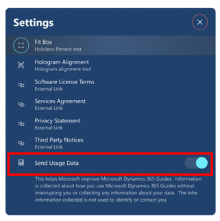

# Opt out of sending telemetry data to Microsoft in the Dynamics 365 Guides HoloLens app

For privacy reasons, you can turn off the ability to send telemetry data to Microsoft in the [!include[cc-microsoft](../includes/cc-microsoft.md)] [!include[pn-dyn-365-guides](../includes/pn-dyn-365-guides.md)] HoloLens app. Microsoft uses this data to improve the product. By opting out, you prevent Microsoft from collecting any data about your activity.

To turn telemetry data off for [!include[pn-hololens](../includes/pn-hololens.md)], follow this step.

- In **Settings**, turn off the **Send Usage Data** option.

    

> [!NOTE]
> This option applies only to the device where it's set. If you use [!include[pn-dyn-365-guides](../includes/pn-dyn-365-guides.md)] on more than one device, you must change the setting on the other devices too. For information about how to turn off this setting for the PC app, see [Author a guide in the PC application](pc-app-overview.md).

## See also

[Opt out of sending telemetry data in the PC app](data-opt-out-pc-app.md)

[!INCLUDE[footer-include](../includes/footer-banner.md)]