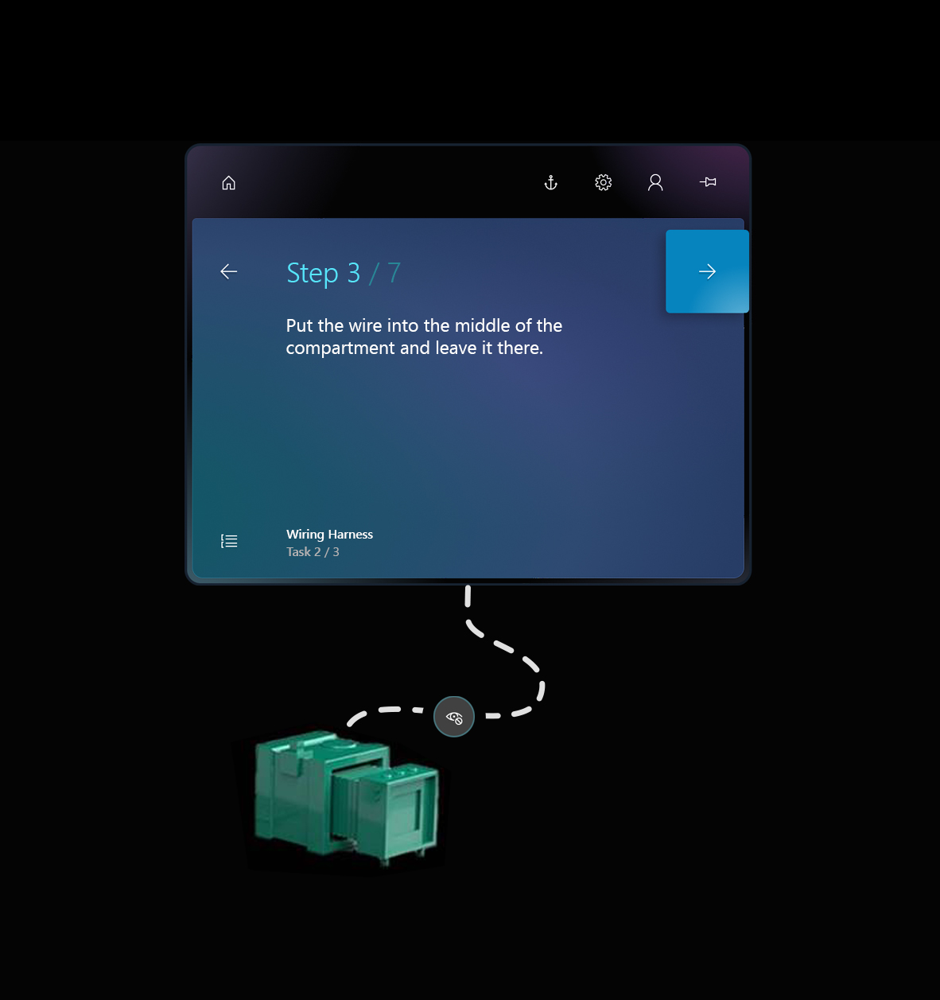

# Add a dotted line in the Dynamics 365 Guides HoloLens app to link a Step card to a focus area 

You can add a dotted line in the Microsoft Dynamics 365 Guides HoloLens app to link a Step card to the area where the work is done. Dotted lines are a very simple but powerful 
feature; they show operators where to focus.

## Add a dotted line

1. Tap and hold the gem below the Step card.

2. Drag it to the real-world location that you want.

    

    > [!TIP]
    > Placement isn't exact. If you're connecting a dotted line to a 3D object from the 3D toolkit, place the dotted line in the general area, and then place the 3D object (for example, a number) at the end of the dotted line.

## Remove a dotted line

- Select the "X" where the dotted line originates. The gem is restored to the bottom of the Step card.

    

## What's next?

- [Get oriented with the HoloLens app](hololens-app-orientation.md)
- [Place and manipulate holograms](hololens-app-place-holograms.md)
- [Use a style to add emphasis](hololens-app-styles.md)
- [Duplicate a 3D model](hololens-app-duplicate-model.md)
- [Copy a 3D model's position](hololens-app-copy-3D-model-position.md)
- [Change animation options](hololens-app-animations.md)
- [Create a trigger for step navigation](hololens-app-trigger.md)
    
[!INCLUDE[footer-include](../includes/footer-banner.md)]
