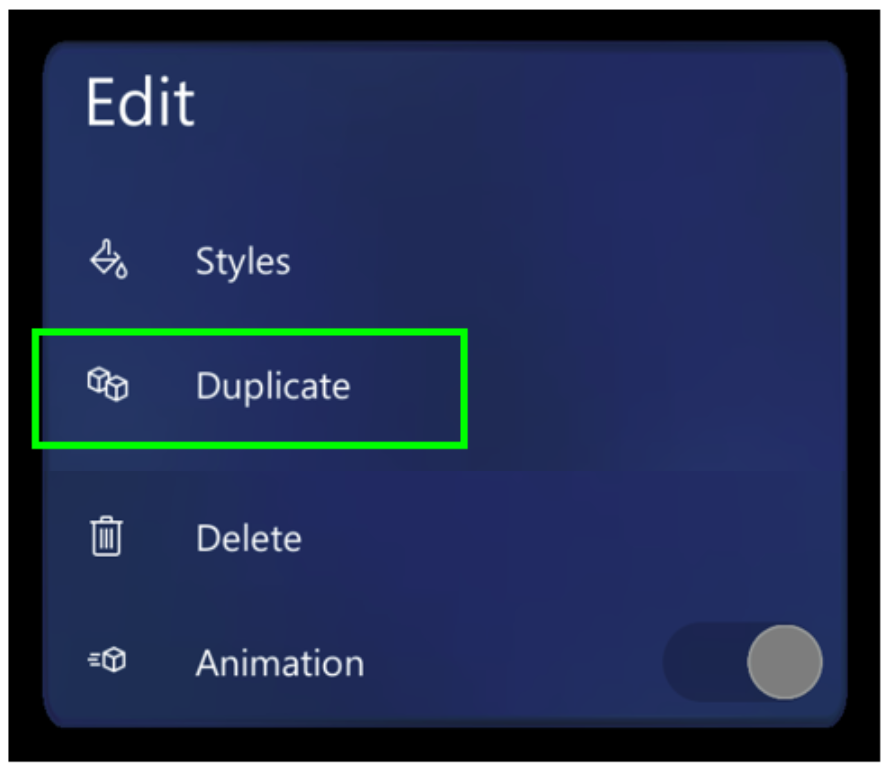

# Duplicate a 3D model in the Dynamics 365 Guides HoloLens app 

Sometimes when you're working with the Microsoft Dynamics 365 Guides HoloLens app, you might need multiple copies of the same 3D models to point to similar items in the 
work area. Instead of adding new instances of a 3D model from the bin and setting the position and style each time, you can save time by duplicating the 3D model. 
The duplicates will have the same rotation and style settings as the original.

## Duplicate a 3D model

1. Air tap a hologram that you've already placed in the real world to select it.

2. Air tap the **Edit Hologram** (pencil) button.

    

3. Select **Duplicate**.

    

    > [!TIP]
    > On [!include[pn-hololens](../includes/pn-hololens.md)] 2, you can reach out and select the **Duplicate** command directly with your finger. For more information on manipulating holograms in HoloLens 2, see [Authoring and navigating gestures for HoloLens 2](authoring-gestures-HL2.md).

## What's next?

- [Get oriented with the HoloLens app](hololens-app-orientation.md)
- [Place and manipulate holograms](hololens-app-place-holograms.md)
- [Add a dotted line for a focus area](hololens-app-dotted-line.md)
- [Use styles for emphasis](hololens-app-styles.md)
- [Copy a 3D model's position](hololens-app-copy-3D-model-position.md)
- [Change animation options](hololens-app-animations.md)
- [Create a trigger for step navigation](hololens-app-trigger.md)
