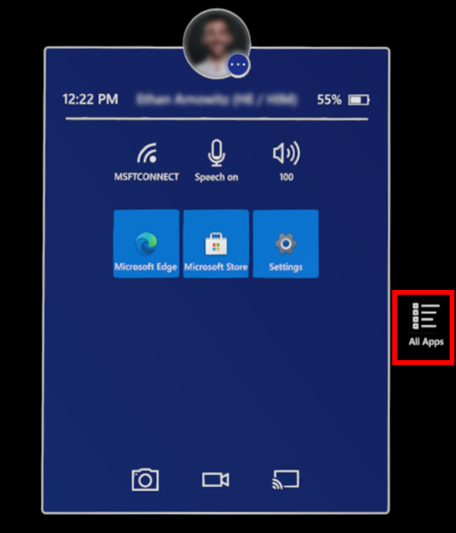
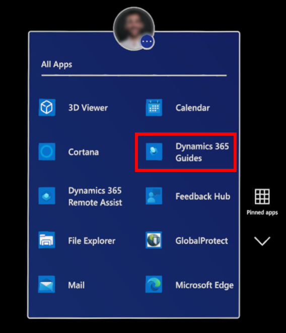
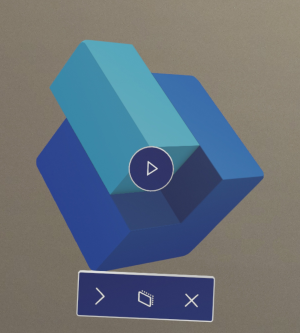
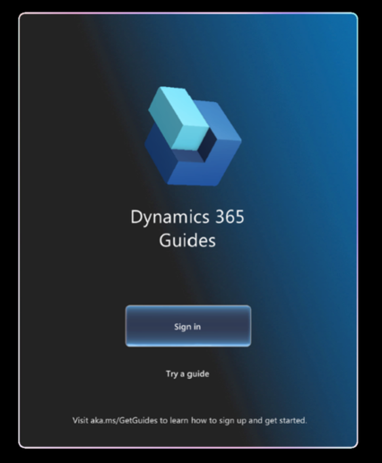
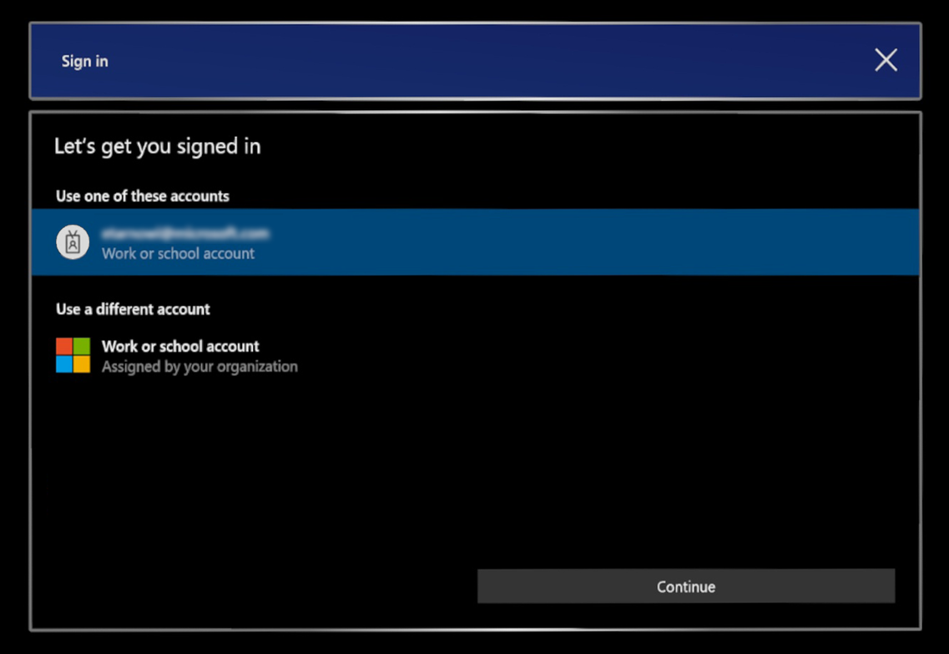
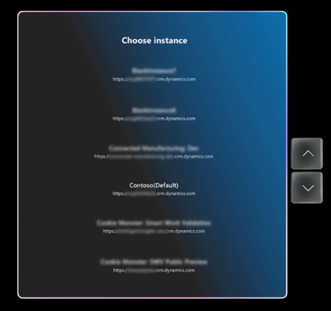
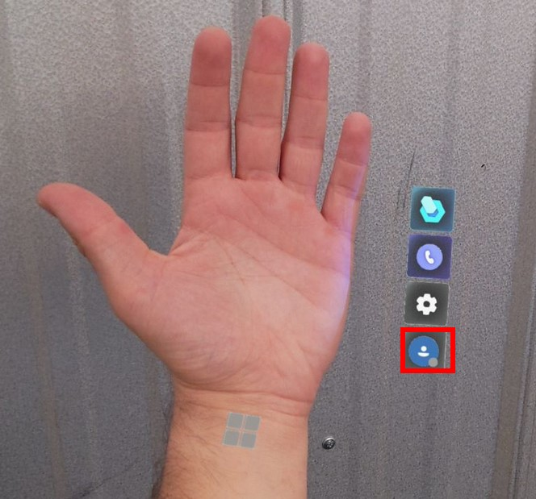

# Install and sign in to the Dynamics 365 Guides HoloLens app

If you haven't already installed the [!include[cc-microsoft](../includes/cc-microsoft.md)] [!include[pn-hololens](../includes/pn-hololens.md)] app on your [!include[pn-hololens](../includes/pn-hololens.md)] device (or if it hasn't already been installed for you), you can install it from the [!include[cc-microsoft](../includes/cc-microsoft.md)] Store.

> [!NOTE]
> You must have a license to install the [!include[pn-dyn-365-guides](../includes/pn-dyn-365-guides.md)] [!include[pn-hololens](../includes/pn-hololens.md)] app. You can also [sign up for a free trial of Dynamics 365 Guides](setup.md).

## Install the app from the Microsoft Store

1. Make sure that you have [!include[cc-microsoft](../includes/cc-microsoft.md)] [!include[pn-hololens](../includes/pn-hololens.md)] build 10.0.14393.0 or later installed on your [!include[pn-hololens](../includes/pn-hololens.md)] device. We recommend that you update to newer versions when they're available. For information about how to use [!include[pn-ms-windows-short](../includes/pn-ms-windows-short.md)] Update for Business, see [Manage updates to HoloLens](/HoloLens/hololens-updates).

2. On your [!include[pn-hololens](../includes/pn-hololens.md)] device, use the [bloom gesture](authoring-gestures-HL2.md) to open the **Home** menu. Then open the [!include[cc-microsoft](../includes/cc-microsoft.md)] Store app, and search for "[!include[pn-dyn-365-guides](../includes/pn-dyn-365-guides.md)]".

3. Select **Install** to download and install the [!include[pn-dyn-365-guides](../includes/pn-dyn-365-guides.md)] application.

## Sign in to a new HoloLens

If you sign in to a brand-new [!include[pn-hololens](../includes/pn-hololens.md)] device, you'll be prompted to complete the **Setup** wizard. In the **Setup** wizard, you can  sign in with an existing account or you can create a new account. The **Setup** wizard also guides you through steps to calibrate and prepare your [!include[pn-hololens](../includes/pn-hololens.md)].

## Open and sign in to the HoloLens app for the first time

1. Select **All Apps**.

    

2. Select the down arrow, and then select the [!include[pn-dyn-365-guides](../includes/pn-dyn-365-guides.md)] app.

    

    > [!NOTE]
    > If you're signing in to the HoloLens app for the first time, you'll need to provide permissions to use the HoloLens eye tracker, camera, and microphone before you can sign in. [Learn more about permissions required to use the HoloLens app](hololens-permissions.md).

3. Select the play button for the 3D app launcher to open Dynamics 365 Guides.

   

4. In the **Dynamics 365 Guides** screen, select **Sign in**.

   

5. On the **Let's get you signed in** page, select **Workplace or school account**, select **Continue**, and then enter the credentials that your admin provided. For the credentials, the user name will be in the form `username@domain.com`. For example, if your user name is LauraO, and you work for the Contoso company, the user name will be `laurao@contoso.com`.

    

6. If you have access to more than one instance, select an instance to use.

    

7. Follow the instructions to access the Main menu and choose an activity. [Learn more about the Main menu](main-menu.md). 

    

## Sign out of the HoloLens app

1. Look at your palm to open the Main menu, and then select the **Profile** button.

    

2. Select **Sign out**.

## What's next?

- [Learn more about using the Main menu to open a guide or start a call](main-menu.md)
- [Find a guide](find-guide.md)
- [Make a call](make-call.md)
- [Calibrate your HoloLens](/mr-docs/guides/hl1)

[!INCLUDE[footer-include](../includes/footer-banner.md)]
