# Place holograms, add styles, and more in the Dynamics 365 Guides HoloLens app

After you anchor your guide in the [!include[cc-microsoft](../includes/cc-microsoft.md)] [!include[pn-dyn-365-guides](../includes/pn-dyn-365-guides.md)] [!include[pn-hololens](../includes/pn-hololens.md)] app in **Author** mode, you will see the Step card page. The Step card is the hub of everything that you do with your guide. It's also what your operators see when they use the guide. The Step card follows the operators around to keep the instructions where they need them as they move around their workspace.

You and your operators can move through a guide by gazing at the **Next** and **Back** buttons. If you select the **Back** button, it returns you to the most-recently-visited step (similar to a web browser **Back** button). You can also use gestures such as air tap. 

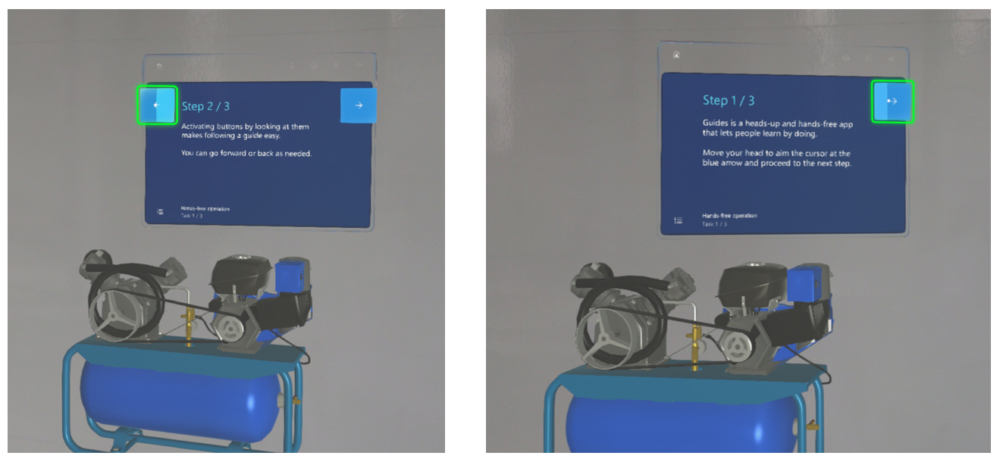

> [!TIP]
> When you switch between the PC app and the HoloLens app, select **Refresh** to make sure that you have the latest version of the guide.

## Get oriented with the Step card page

The following illustration shows the different user interface (UI) elements of the Step card page in the [!include[pn-hololens](../includes/pn-hololens.md)] app.

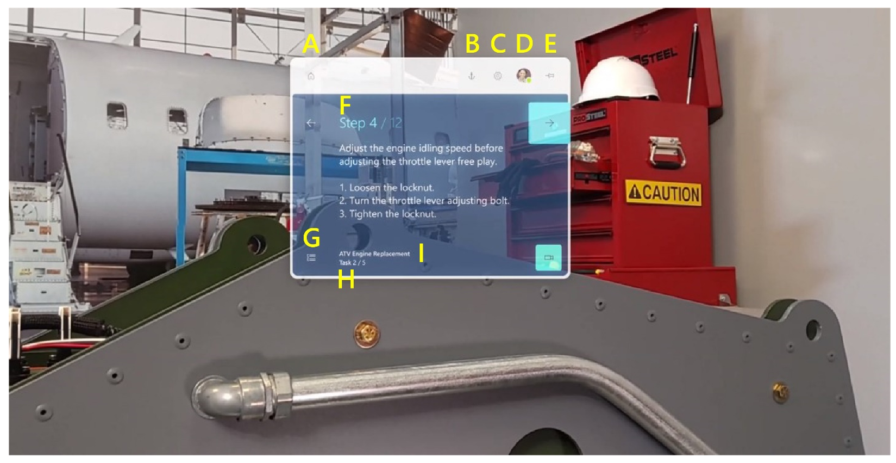

Here's what each button or UI element is used for.

| Number | UI element | Name | Purpose |
|---|---|---|---|
| 1 | 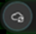 | Save | Save the guide. |
| 2 | 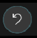 | Undo | Undo the last change. You can undo up to 100 changes. |
| 3 |  | Redo | Redo the last change. You can redo up to 100 changes. |
| 4 |  | Home | Select a different guide. |
| 5 |  | Follow mode | Have the Step card follow you, or lock it to a location.
[!include[pn-dyn-365-guides](../includes/pn-dyn-365-guides.md)] includes a feature that is called **Follow** mode. Wherever you look, the Step card follows your gaze. Therefore, you never have to worry where your instructions are. When you turn off **Follow** mode, the Step card stays where it is. You can move the Step card wherever you want at any time. Just grab it by using the navigation bar.
 |
| 6 | 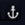 | Anchor | Re-anchor (realign) your guide.
[!include[pn-hololens](../includes/pn-hololens.md)] can sometimes lose tracking. To fix this issue, you must re-anchor the guide by gazing at the anchor again.
 |
| 7 |  | Settings | Access the following setting:<ul><li>**Build number**. See the build that you're using.</li></ul> |
| 8 |  | Profile | Sign in and out. |
| 9 | 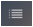 | Outline | Go to the **Outline** page.
You can use the **Outline** page to quickly move around your guide.
 |
| 10 |  | Step counter | See what step you're on in the task. |
| 11 |  | Task name | The name of the task you're on. |
| 12 |  | Gem | By dragging the gem, you can create a dotted line to draw attention to a focus area. |
| 13 | (See the green rectangular area in the illustration.) | Bin | See the 3D parts (models) that can be added for the step. 3D parts include 3D objects from the 3D toolkit and any 3D models (computer-aided design \[CAD\] drawings) that you import to mimic 3D parts in your operator's real-world environment. |

> [!NOTE]
> Changes are automatically saved in the cloud as you author in [!include[pn-hololens](../includes/pn-hololens.md)]. Just be sure to select **Refresh** when you go back to the computer, to help guarantee that you have the latest version of the guide.

## Test the flow of your guide

After you're oriented on [!include[pn-hololens](../includes/pn-hololens.md)], we recommend that you go through your whole guide in **Operate** mode to see how it flows. As you step through your guide, make a note of things that you want to change in the PC app. For example, you might have to move some steps around, add tasks or steps, or add more supporting assets. In general, it's best to make these changes in the PC app before you start to place holograms, tethers, and styles.

## Add a dotted line to link a Step card to a focus area

You can add dotted lines (*tethers*) to link your Step cards to the areas where the work is done. These dotted lines show the operator where to focus.

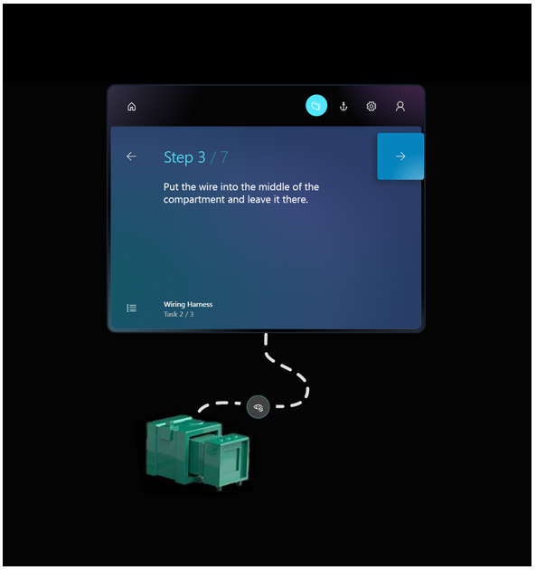

### Add a dotted line

1. Tap and hold the gem below the Step card.

2. Drag it to the real-world location that you want.

    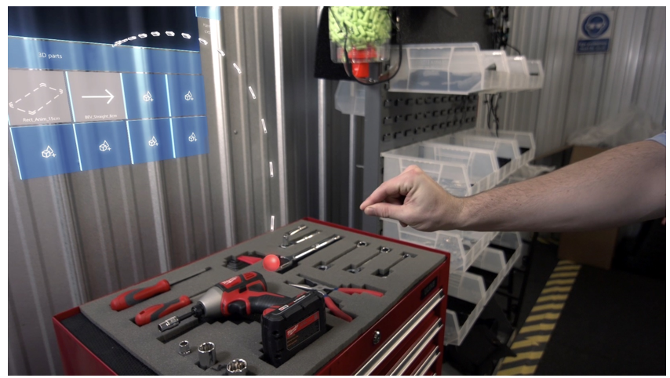

    > [!TIP]
    > Placement isn't exact. Therefore, if you're connecting a dotted line to a 3D object from the 3D toolkit, place the dotted line in the general area, and then place the 3D object (for example, a number) at the end of the dotted line.

### Remove a dotted line

- Select the "X" where the dotted line originates. The gem is restored to the bottom of the Step card.

    

## Place your holograms

During this stage of the process, you will walk through each step in your guide and place any assets that you associated with that step when you authored it in the PC app. For example, if you added a 3D part to help operators with a step, you will place that part over its physical counterpart in the real world. If you added a 3D object from the 3D toolkit (for example, an arrow or a number), you will place that object in an appropriate place in the real world, where it can draw the user's focus. You can place the same 3D part or 3D object as many times as you want.

### What about images and videos?

You don't have to do anything to place an image or a video that is associated with a step. They automatically appear when the operator goes to the step.

### Place a 3D part

1. In the bin, air tap the 3D part that you want to place.

2. Use gaze and gestures to place the 3D part hologram over its counterpart in the real world. For information about how to manipulate holograms by using gaze and gestures, see the [Manipulating holograms](#manipulate) section later in this topic.

### Place a 3D model from the 3D toolkit

You can place a 3D model from the 3D toolkit in the same way that you place a 3D part, if you added that 3D model to the bin in the PC app. If you didn't add the 3D model in the PC app, you can also add it directly from the [!include[pn-hololens](../includes/pn-hololens.md)] app.

1. Air tap an empty box in the bin.

2. Air tap a category (for example, **Arrows** or **Hands**), and then air tap the specific 3D model that you want to add.

    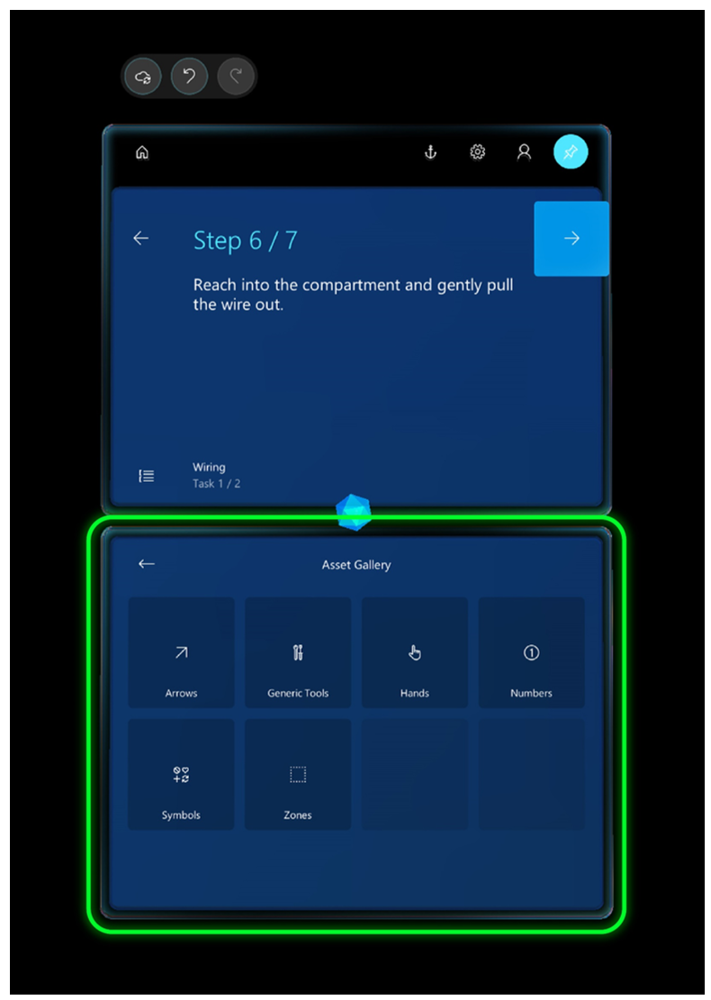

    The item is added to your bin, and you can then place it in the same way that you place a 3D part.

### Best practices for working with 3D content

- Make sure that the 3D content isn't in the way of the operator who is doing the task.

- Keep the field of vision in mind when you place assets. If you put a hologram behind someone, it will be very hard to find.

- Use 3D content sparingly and for a clear purpose. Too much content can clutter the instructions and make them harder to follow.

- Remember that you can attach a tether to 3D content to make it more discoverable.

## Manipulate holograms

To place a 3D model from one of your bins, follow these steps.

1. Air tap a 3D model to add it to the real world. It will appear in front of the Step card in your world.

2. Raise your hand in the ready gesture, and gaze at the model to preview it. You will know that it's in a preview state if the 3D controls appear around it.

    If you put your hand down, the 3D controls will disappear. Therefore, if you're just looking at holograms, the controls won't get in your way. You must both look at the part and put your hand up into the ready position.

3. While the 3D controls are visible, air tap and hold anywhere on the move control to pick up the model. Move the model where you want it to go, and then release to place the model.

When you tap a 3D part to move it, you select it at the same time. After a 3D part is selected, you can put your hand down, and the 3D controls will remain until you preview or select another part, or until you air tap somewhere in empty space.

> [!TIP]
> On [!include[pn-hololens](../includes/pn-hololens.md)] 2, you can manipulate holograms directly with your hands. To select a hologram, place your hand on it to show the 3D controls. Then grab the hologram, move it, and release to place it. When you've finished, air tap anywhere in an empty space. For more information about how to manipulate holograms in HoloLens 2, see [Authoring and navigating gestures for HoloLens 2](authoring-gestures-HL2.md).

#### Rotate a hologram

It's unlikely that an asset will be correctly oriented when you first place or move it. You can use the rotation controls to rotate it the way that you want.

To rotate a hologram, follow this step.

- Air tap and hold a rotation control, and then follow one of these steps:

    - Use the up/down sphere to rotate vertically.

    - Use the left/right sphere to rotate horizontally.

    - Use the free-hand sphere to rotate in any direction.

    > [!TIP]
    > You can gaze at any sphere to see which direction it can be rotated in.

    When you're using a rotation control, it's helpful to imagine that you're physically grabbing the sphere and rotating around the object, like a wheel.

The following illustrations show how to use the different rotation controls.

**Free rotation**

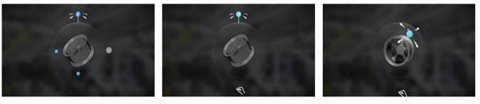

**Left/right rotation**

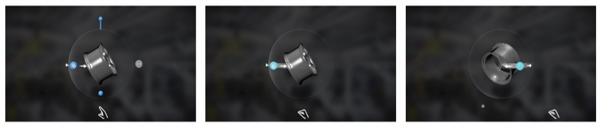

**Up/down rotation**

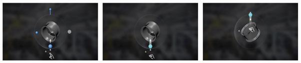

> [!TIP]
> On [!include[pn-hololens](../includes/pn-hololens.md)] 2, you can operate the rotation controls with your hands. Pinch one of the available rotation controls with your hand, and rotate the hologram the way that you want. For more information about how to manipulate holograms in HoloLens 2, see [Authoring and navigating gestures for HoloLens 2](authoring-gestures-HL2.md).

### Change the size of a hologram after you place it

- Air tap and hold the **Scale Hologram** control, and then move your hand up or down.

    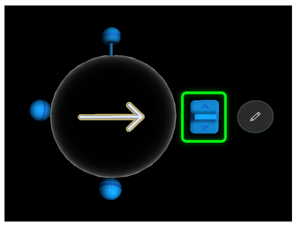

    > [!TIP]
    > On [!include[pn-hololens](../includes/pn-hololens.md)] 2, you can pinch the **Scale Hologram** control with your hand, and then move it up or down to change the size of the hologram.

## Add styles for emphasis

You can use styles to provide visual cues for extra emphasis. For example, you can add the **Warning** style to indicate caution or the **Avoid** style to make sure that an operator doesn't do something that could cause harm. As your operators get used to the visual language that styles provide, their learning process will become faster.

> [!NOTE]
> Currently, you can't add styles from the PC app. They exist only in [!include[pn-hololens](../includes/pn-hololens.md)].

To add a style, follow these steps.

1. Select a hologram that you've already placed in the real world to select it.

2. Select the **Edit Hologram** (pencil) button.

    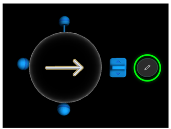

3. Select **Styles**.

    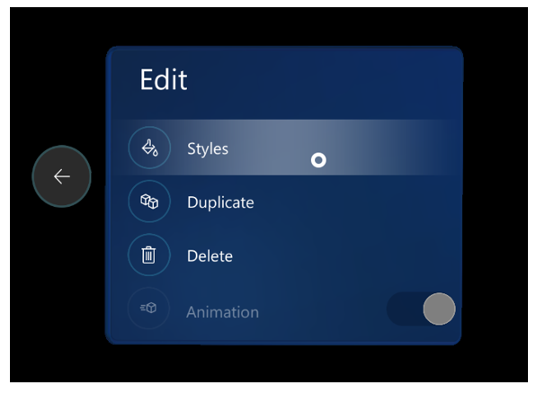

    > [!TIP]
    > On [!include[pn-hololens](../includes/pn-hololens.md)] 2, you can reach out and select **Styles** and subsequent menu items directly with your finger. For more information about how to manipulate holograms in HoloLens 2, see [Authoring and navigating gestures for HoloLens 2](authoring-gestures-HL2.md).

4. Select the style that you want to use.

    

Here's a list of the styles that are included in [!include[pn-dyn-365-guides](../includes/pn-dyn-365-guides.md)] and information about when to use each.

| Style | Purpose | How it appears to the operator |
|---|---|---|
| Original | Restore the original appearance. | Default appearance |
| Pick up | Tell the operator to pick something up. | Outline |
| Place | Show the operator where to place something. | Dotted line |
| See-through 1 | Show something without obscuring the operator's view. | 50 percent transparent |
| See-through 2 | Layer one thing on top of another so that the operator can see through two layers. | 75 percent transparent |
| Warning | Warn about a safety or quality concern. | Yellow and black stripes |
| Avoid | Show areas or things to avoid. | Red flashing |
| X-ray | Show things that occur inside something. | A pulse that appears through it |
| Metal | Provide a realistic metal finish for an object. | Metallic |

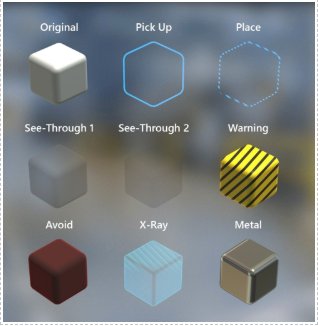

### Best practices for styles

- Use styles to reinforce actions.

- Use styles only for the purpose that they were intended for. After operators learn the visual language of styles, they will know that a particular style means a specific thing, which will speed up their learning process.

## Duplicate a 3D model to use it for similar items

Sometimes, you need multiple copies of the same 3D models to point to similar items in the work area. Instead of adding new instances of a 3D model from the asset bin, and setting the position and style each time, you can save time by duplicating the 3D model. The duplicates will have the same rotation and style settings as the original.

To duplicate a model, follow these steps.

1. Air tap a hologram that you've already placed in the real world to select it.

2. Air tap the **Edit Hologram** (pencil) button.

    

3. Select **Duplicate**.

    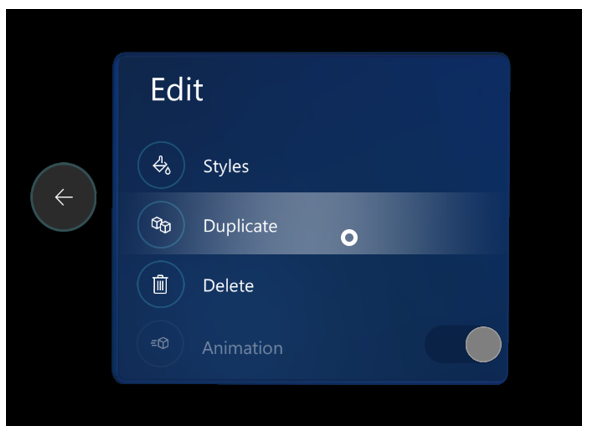

    > [!TIP]
    > On [!include[pn-hololens](../includes/pn-hololens.md)] 2, you can reach out and select **Duplicate** directly with your finger. For more information about how to manipulate holograms in HoloLens 2, see [Authoring and navigating gestures for HoloLens 2](authoring-gestures-HL2.md).
    
## Copy and paste a 3D model's position

You might want to duplicate a 3D model and keep the same position, orientation, and scale for different steps of a guide. This is especially useful for fully digital guides for which instructions are placed on top of the holographic version of a machine, that must be present and identical on several steps. 

To replicate the 3D position properties (position, orientation, and scale) of a 3D model:

1. Select the hologram that has the position, orientation, and scale that you want to copy.

2. Select the **Edit Hologram** (pencil) button.

    
 
3. Select **Copy 3D position**. 
 
    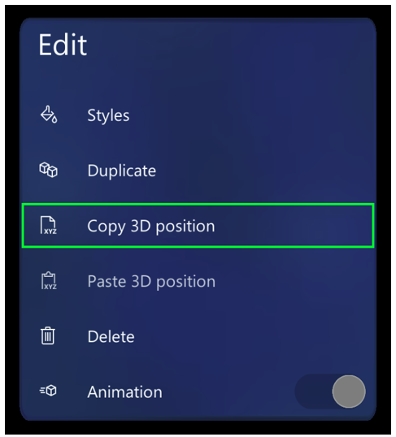

    > [!TIP]
    > The 3D position parameters are copied to the Clipboard so you can paste them as many times as you want in the same or a different step or guide. The Clipboard is cleared when you close the HoloLens app.

4. Select the target hologram.

5. Select the **Edit Hologram** button again, and then select **Paste 3D position**.

    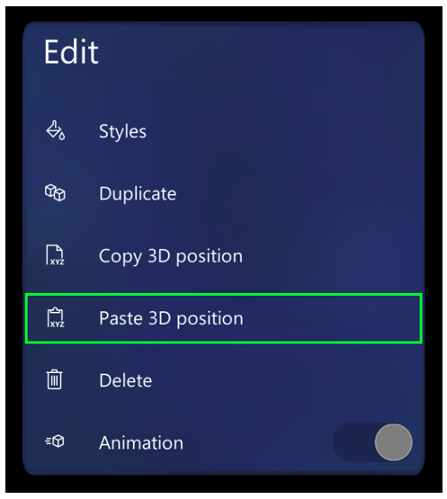
 
> [!TIP]
> You can also use voice commands (say **copy 3D position** and **paste 3D position**) at any time to speed up the process. [See a full list of voice commands that you can use in the HoloLens app](voice-commands.md).

### Using Copy 3D position to reconstruct CAD assemblies

The reference point used by **Copy 3D position** is the pivot point of the object, which might be different from the center of the transparent white-bounding sphere shown for selection and movement purposes. This enables you to rapidly reconstruct Computer-aided Design (CAD) assemblies that you import into Dynamics 365 Guides as separate models and that share the same pivot point. After importing, position, orient, and scale one of the assembly models, and then copy/paste the 3D position onto the other assembly models to reconstruct the whole CAD assembly very quickly. 

## Turn off animations

If you're using animated 3D models in your guide, you can turn off animation if you plan to show a model with the animation in one step but without the animation in another step. This option is available from the **Edit** menu when you select the model.

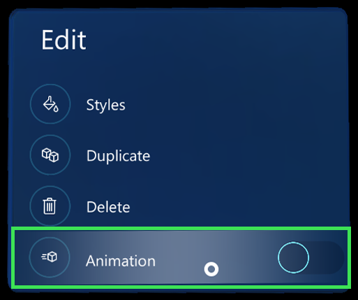

You can also use this option when you place animated models in space. Turn animation off, place the model, and then turn animation back on. In this way, the animation won't interfere with your ability to place the model.
