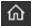
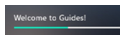
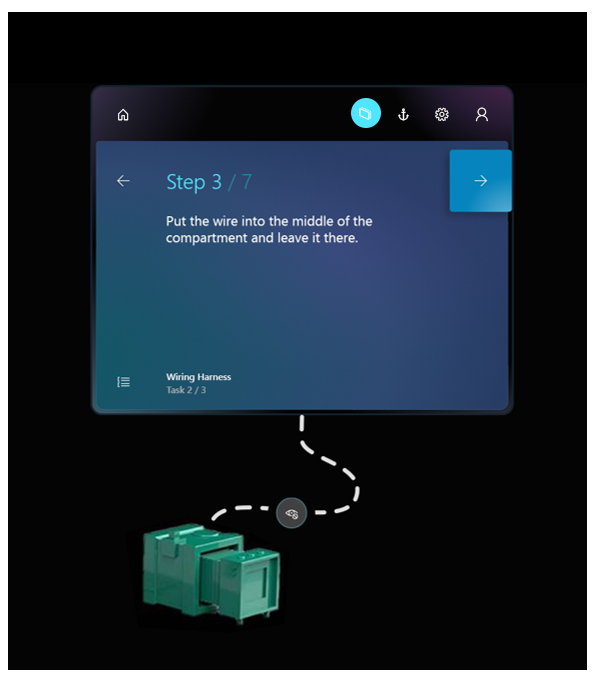
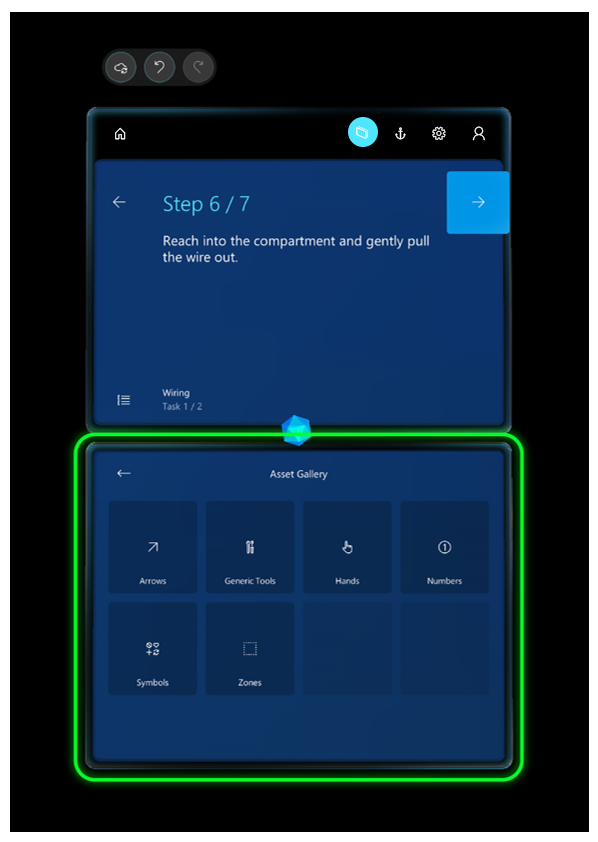

# Place holograms, add styles, and more in the Dynamics 365 Guides HoloLens app

After you anchor your guide in the Dynamics 365 Guides HoloLens app in **Author** mode, you’ll see the Step card screen. The Step card  is the hub of everything you do with your guide. The Step card is also what your operator will see when they use the guide. The Step card follows the operator around to keep the instructions where they need them as they move around their work space.

You and your operators can navigate through a guide by gazing at the **Next Step** and **Go Back** arrows. You can also use gestures such as air tap to navigate through a guide. 

>[!TIP]
>When switching between the PC and HoloLens apps, select **Refresh** to make sure you have the latest version of the guide.

## Get oriented with the Step card screen

The following graphic shows the different user interface elements of the Step card screen in the HoloLens app.

 
Here’s what each button or UI element is used for:

|Number|UI element|Name|Purpose|
|--|---|------------|----------------------------------------------------------------------------------------------------------------|
|1||Save|Save the guide.|
|2||Undo|Undo the latest change. You can undo up to 100 changes.|
|3||Redo|Redo the latest change. You can redo up to 100 changes.|
|4||Home|Choose a different guide.|
|5||Follow mode|Have the Step card follow you or lock it to a location.  Guides includes a feature called Follow mode. Wherever you look, the Step card follows your gaze so you never have to worry where your instructions are. When you turn off Follow mode, the card stays where it is. You can just grab the card at any time by using the navigation bar to move it wherever you like. |
|6||Anchor|Re-anchor (realign) your guide.  [!include[pn-hololens](../includes/pn-hololens.md)] can sometimes lose tracking. To fix this, you’ll need to re-anchor the guide by gazing at the printed anchor (marker) or digital anchor again.|
|7||Settings|Access the following settings:  - **Build number**. Shows the build you’re using.|
|8||Profile|Sign in and out.|
|9||Step progress|Shows where you are in the step.|
|10||Outline|Go to the **Outline** page.  Use the **Outline** page to quickly navigate around your guide.|
|11||Task name|The name of the task.|
|12||Task Progress	|Shows where you are in the open task.|
|13||Gem|Drag the gem to create a dotted line to draw attention to a focus area.|
|14|See green rectangular area above|Bin|3D parts (models) available to add for the step. 3D parts include 3D objects from the 3D toolkit and any 3D models (CAD drawings) that you import to mimic 3D parts in your operator's real-world environment.|

> [!NOTE]
> Changes are automatically saved in the cloud as you author in [!include[pn-hololens](../includes/pn-hololens.md)]. Just be sure to select **Refresh** when you go back to the PC to ensure that you have the latest version of the guide.

## Test the flow of your guide
Once you’re oriented on [!include[pn-hololens](../includes/pn-hololens.md)], we recommend that you go through your whole guide in **Operate** mode to see how it flows. As you step through your guide, make note of things you want to change in the PC application. For example, you might need to move some steps around, add tasks or steps, or add more supporting assets. It’s generally best to make these changes in the PC application before you start placing holograms, tethers, and styles. 
 
## Add a dotted line to link a Step card to a focus area

You can add dotted lines (*tethers*) to link your Step cards to the areas where the work gets done. These dotted lines show the operator where to focus. 

To place a dotted line:

1.	Tap and hold the gem below the Step card.

2.	Drag it to the real-world location that you want.

    

    >[!TIP}
    >Placement isn’t exact, so if you’re connecting a dotted line to a 3D object from the 3D toolkit, place the dotted line in the general area, and then place the 3D object (a number, for example) at the end of the dotted line. 

## Place your holograms

In this stage of the process, you’ll walk through each step in your guide and place any assets that you associated with that step when you authored it in the PC application. For example, if you added a 3D part to help operators with a step, you’ll place that part over its physical counterpart in the real world. If you added a 3D object from the 3D toolkit (an arrow or a number, for example), you’ll place that object in an appropriate place in the real world to draw the user’s focus. You can place the same 3D part or 3D object as many times as you want.

### What about images and videos?

You don’t need to do anything to place an image or a video associated with a step. They automatically appear when the operator goes to the step.

### Place a 3D part 

1. In the bin, air tap the 3D part that you want to place.

2. Use gaze and gestures to place the 3D part hologram over its counterpart in the physical world. For information on manipulating holograms with gaze and gestures, see [Manipulating holograms](#manipulate) below.

### Place a 3D model from the 3D toolkit

You can place a 3D model from the 3D toolkit in the same way you place a 3D part if you added that 3D model to the bin in the PC application. If you didn't add the 3D model in the PC application, you can also do it directly from the [!include[pn-hololens](../includes/pn-hololens.md)] app: 

1.	Air tap an empty box in the bin.

2.	Air tap a category (an arrow or hand, for example), and then air tap the specific 3D model you want to add.

    

    The item will be added to your bin and you can then place it as you would a 3D part.
    
### Best practices for working with 3D content

- Make sure that the 3D content is not in the way of the operator doing the task. 

- Keep the field of view in mind when you place assets. If you put a hologram behind someone, it will be very hard to find.

- Use 3D content sparingly and with a clear goal. Too much content can clutter the instructions and make it harder to follow.

- Remember that you can attach a tether to 3D content to make it more discoverable. 

### Manipulating holograms

To place a 3D model from one of your bins:

1.	Air tap a 3D model to add it to your real world. It will appear in your world in front of the Step card.

2.	Raise your hand to the ready gesture and gaze at the model to preview it. The way you can tell if it’s in a preview state is that the 3D controls appear around it.

    If you put your hand down, the 3D controls will go away. This way, if you're just looking at holograms, the controls won't get in your way. You need to look at the part as well as put your hand up in the ready position.

3. With the controls visible, air tap + hold anywhere on the move control to pick up the model. Move the model where you want it to go and release to place the model.

When you tap a 3D part to move it, you select it at the same time. When it's selected, when you put your hand down, the 3D controls remain until you preview or select another part, or air tap anywhere in empty space.

>[!TIP]
>On HoloLens 2, you can manipulate holograms directly with your hands. To select a hologram, place your hand on it to show the 3D controls. Then grab the hologram, move it, and release to place it. Air tap anywhere in an empty space when you're done.
 
#### Rotate a hologram

It’s unlikely an asset will be at the correct orientation when you initially place or move it. Use the rotation controls to rotate it the way you want.

To rotate a hologram:

- Air tap and hold a rotation control, and then do one of the following:

  - Use the up/down sphere to rotate vertically.
  
  - Use the left/right sphere to rotate horizontally.
  
  - Use the free-hand sphere to rotate in any direction.

  You can gaze at any sphere to see which direction it will rotate.

  When rotating, it helps to think as if you are physically grabbing the sphere and rotating around the object, like a wheel.
The following graphics show how to use the different rotation controls:

Free rotation

Left/right rotation

Up/down rotation

 
>[!TIP]
>On HoloLens 2, you can operate the rotation controls with your hands. Grab one of the available rotation controls with your hand and rotate the hologram the way you want.

### Change the size of a hologram after placing it

- Air tap and hold the **Scale Hologram** control, and then move your hand up or down.  

   
   
   >[!TIP]
   >On HoloLens 2, you can grab the **Scale Hologram** control with your hand and move it up or down to change the size of the hologram. 

## Add styles for emphasis
Use styles to provide visual cues for extra emphasis. For example, add the Warning style to show caution or the Avoid style to make sure an operator doesn’t do something that could cause harm. As your operators get used to the visual language provided by styles, it will speed up their learning process.

> [!Note]
> At this time, you can’t add styles from the PC application. They exist only in [!include[pn-hololens](../includes/pn-hololens.md)]. 

To place a style:

1.	Air tap a hologram you’ve already placed in the real world to select it.

2.	Air tap the **Edit Hologram** button.

    

3.	Air tap **Styles**. 

    
    
    >[!TIP]
    >On HoloLens 2, you can reach out and select **Styles** and subsequent menu items directly with your finger.
 
4.	Select the style you want to use.

    
 
Here’s a list of styles included in [!include[pn-dyn-365-guides](../includes/pn-dyn-365-guides.md)] and when to use each:

|Style	|Purpose	|How it appears to the operator|
|---------------|-------------------|--------------------------------------------|
|Original|Restore to original appearance.	|Default appearance|
|Pick up	|Tell the operator to pick up something.	|Outline|
|Place	|Show the operator where to place something.	|Dotted line|
|See-through 1	|Show something without obscuring the operator’s view.	|50% transparent|
|See-through 2	|Layer one thing on top of another so the operator can see through two layers.	|75% transparent|
|Warning	|Warn about a safety or quality concern.	|Yellow and black striped|
|Avoid	|Show areas or things to avoid.	|Red flashing|
|X-ray	|Show things that happen inside something.	|Shows a pulse through it|
|Metal	|Provide a realistic metal finish for an object.	|Metallic|

 
### Best practices for styles

- Use styles to reinforce actions.

- Use styles only for the purpose they were intended. When operators learn the visual language of styles, they’ll know that a particular style means a certain thing, which will speed up the learning process. 

## Duplicate a 3D model to use for similar items

Sometimes, you need multiple copies of the same 3D models to point to similar items in the work area. Rather than adding new instances of a 3D model from the asset bin and having to set the position and style each time, you can save time by duplicating the 3D model. The duplicate will have the same rotation and style settings as the original.

To duplicate a model:

1.	Air tap a hologram you’ve already placed in the real world to select it.

2.	Air tap the **Edit Hologram** button.

    
    
3. Select **Duplicate**.

    
    
    >[!TIP]
    >On HoloLens 2, you can reach out and select **Duplicate** directly with your finger.
    
## Turn off animations

If you're using animated 3D models in your guide, you can turn animation off if you plan to show it with animation in one step and without animation in another. This option is available from the **Edit** menu when you select the model.

You can also use this option when you place animated models in space. Turn animation off, place the model, and then turn animation back on. This way the animation won't interfere with your ability to place it.
