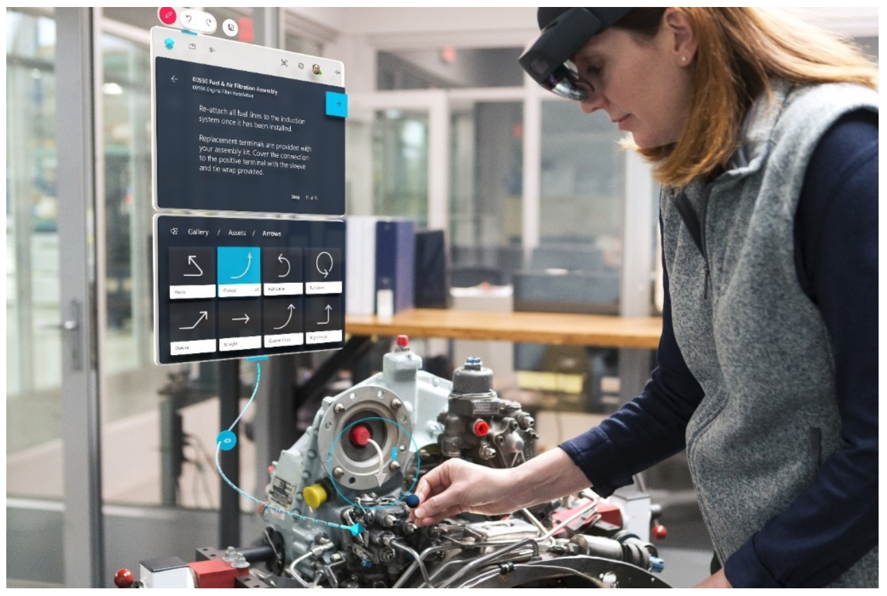

# Overview of authoring a guide in the Dynamics 365 Guides HoloLens app

 [Watch a video about HoloLens authoring on HoloLens 1](https://aka.ms/hololensauthor)

The second major step in the process of authoring a guide in [!include[cc-microsoft](../includes/cc-microsoft.md)] [!include[pn-dyn-365-guides](../includes/pn-dyn-365-guides.md)] occurs in the [!include[pn-hololens](../includes/pn-hololens.md)] app. In [!include[pn-hololens](../includes/pn-hololens.md)] **Author** mode, you complete these tasks:

- Anchor your guide.

- Place your holographic 3D content in a relevant space in the real world.

- Add dotted lines to visually link your steps to physical objects in the real world.

- Optional: Add styles to 3D content to add various treatments. For example, you can indicate a warning or caution.

- Test the flow of your guide.

    

> [!TIP]
> **New for [!include[pn-hololens](../includes/pn-hololens.md)] 2.** [!include[pn-dyn-365-guides](../includes/pn-dyn-365-guides.md)] now includes [!include[pn-hololens](../includes/pn-hololens.md)] 2 advanced hand-tracking capabilities. When you author a guide, you can now work directly with holograms by grabbing the manipulation controls with your hands to position the holograms, rotate them, and change their size. However, when you select a guide, scan an anchor, or work in the Step card editor, you make selections in the same way that you did on [!include[pn-hololens](../includes/pn-hololens.md)] 1.
>
> Watch this space for future developments about [!include[pn-hololens](../includes/pn-hololens.md)] 2 hand tracking in [!include[pn-dyn-365-guides](../includes/pn-dyn-365-guides.md)]!

## What's next?

[Install and sign in to the app](install-sign-in-hololens-app.md) 
[Anchor your guide](hololens-app-anchor.md) 
[Place holograms, add styles, and more](hololens-app-orientation.md)

[!INCLUDE[footer-include](../includes/footer-banner.md)]
