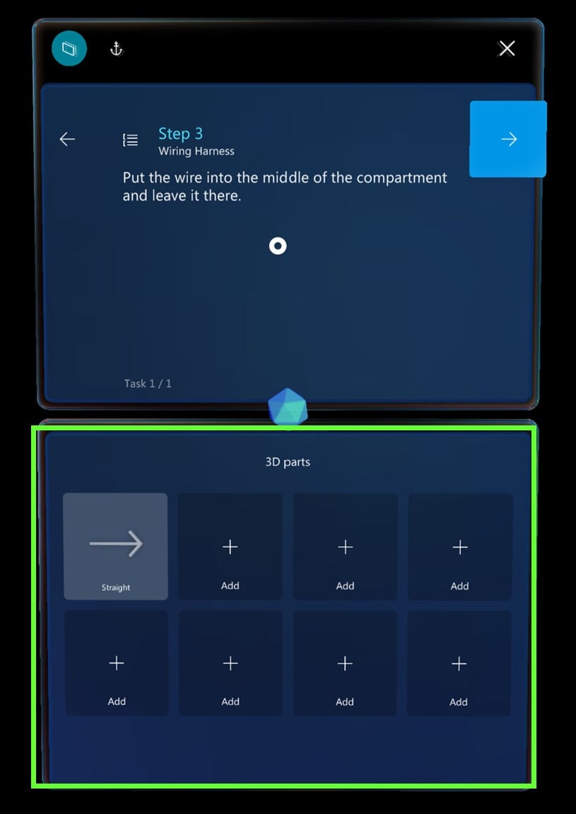

# Place and manipulate holograms in the Dynamics 365 Guides HoloLens app

After [creating a guide with the PC app](create-guide.md) in Microsoft Dynamics 365 Guides, the next step in the authoring process is to place the holograms in your real-world environment. During this stage of the process, you'll walk through each step in your guide and place any assets that you associated with that step when you authored 
it in the PC app. For example, if you added a 3D part to help operators with a step, you'll place that part over its physical counterpart in the real world. If you added a 3D object from the toolkit (for example, an arrow or a number), you'll place that object in an appropriate place where it can draw the user's attention. You can place the same 3D part or 3D object as many times as you want.

> [!NOTE]
> You don't have to do anything to place an image or video that you added in the PC app. Images and videos automatically appear when the operator goes to the step.

## Place a 3D part

1. In the bin, air tap the 3D part that you want to place.

2. Use gaze and gestures to place the 3D part hologram over its counterpart in the real world. [Manipulate the hologram](#manipulate-holograms) if needed.

## Place a 3D model from the toolkit

If you added a 3D model to the bin in the PC app, you can place the 3D model in the same way that you place a 3D part. You can also add a 3D model directly from the HoloLens app (you don't have to add it in the PC app first).

1. Air tap one of the **Add** boxes in the bin.

1. Air tap a category (for example, **Arrows** or **Hands**), and then air tap the specific 3D model that you want to add.

    

    The item is added to your bin. You can then place it in the same way that you place any 3D part.

   There are only eight **3D parts** boxes in the bin, which limits the variety of 3D objects you can add to a single step. When placing holograms on the HoloLens, you can, however, place an unlimited number from the bin. For example, you can add up to eight different 3D objects (arrows, boxes, nuts, drills, and so on) to the bin, but you can place as many arrows, boxes, nuts, and drills from each **3D Parts** box that you want when in HoloLens. Either tap the asset bins to spawn 3D objects or go to a 3D model's **Edit** menu and select **Duplicate**.

## Best practices for working with 3D content

- Make sure that the 3D content isn't in the way of the operator who is doing the task.

- Keep the field of vision in mind when you place your holograms. If you put a hologram behind someone, it will be very hard to find.

- Use 3D content sparingly and for a clear purpose. Too much content can clutter the instructions and make them harder to follow.

- Remember that you can attach a dotted line to 3D content to make it more discoverable.

- See [tips for pointing at small, closely spaced objects in the real world.](pc-app-point-small-objects.md)

## Manipulate holograms

To place a 3D model from one of your bins, follow these steps.

1. Air tap a 3D model to add it to the real world. It appears in front of the Step card in your world.

1. Raise your hand in the ready gesture and gaze at the model to preview it. To place a model, you must look at the model **and** put your hand up into the ready position. You'll know that the model is in a preview state when the 3D controls appear around it.

    > [!TIP]
    > If you put your hand down, the 3D controls disappear. This is a good way to view the holograms by themselves without the controls getting in the way. 

1. While the 3D controls are visible:

    1. Air tap and hold anywhere on the move control. 

    1. Move the model where you want it to go, and then release to place it.

    When you tap a 3D model to move it, you select it at the same time. After a 3D model is selected, if you put your hand down, the 3D controls remains until you preview or select another part, or until you air tap somewhere in empty space.

> [!TIP]
> On HoloLens 2, you can manipulate holograms directly with your hands. To select a hologram, place your hand on it to show the 3D controls. Then grab the hologram, move it, and release to place it. When you've finished, air tap anywhere in an empty space. For more information about how to manipulate holograms in HoloLens 2, see [Authoring and navigating gestures for HoloLens 2](authoring-gestures-HL2.md).

### Rotate a hologram

It's unlikely that an asset is correctly oriented when you first place or move it. You can use the rotation controls to rotate it the way that you want.

To rotate a hologram:

- Air tap and hold a rotation control, and then follow one of these steps:

    - Use the up/down sphere to rotate vertically.

    - Use the left/right sphere to rotate horizontally.

    - Use the free-hand sphere to rotate in any direction.

    > [!TIP]
    > You can gaze at any sphere to determine rotation direction.

    When you're using a rotation control, it's helpful to imagine that you're physically grabbing the sphere and rotating around the object, like a wheel.

The following illustrations show how to use the different rotation controls.

**Free rotation**

**Left/right rotation**

**Up/down rotation**

> [!TIP]
> On HoloLens 2, you can operate the rotation controls with your hands. Pinch one of the available rotation controls with your hand, and then rotate the hologram the way that you want. For more information on manipulating holograms in HoloLens 2, see [Authoring and navigating gestures for HoloLens 2](authoring-gestures-HL2.md).

## Change the size of a hologram after you place it

- Air tap and hold the **Scale Hologram** control, and then move your hand up or down.

    

    > [!TIP]
    > On HoloLens 2, you can pinch the **Scale Hologram** control with your hand, and then move it up or down to change the size of the hologram.

## Next steps

- [Add a dotted line for a focus area](hololens-app-dotted-line.md)
- [Use a style to add emphasis](hololens-app-styles.md)
- [Copy a 3D model's position](hololens-app-copy-3D-model-position.md)
- [Change animation options](hololens-app-animations.md)
- [Create a trigger for step navigation](hololens-app-trigger.md)
    
[!INCLUDE[footer-include](../includes/footer-banner.md)]
