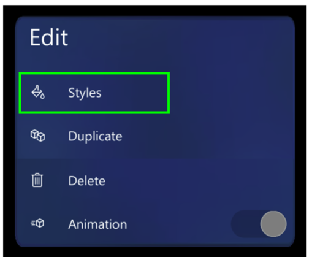

# Use a style to add emphasis to a hologram in the Dynamics 365 Guides HoloLens app

You can add styles in the Microsoft Dynamics 365 Guides HoloLens app to provide visual cues for your holograms. For example, you can add the **Warning** style to 
indicate caution or the **Avoid** style to make sure that an operator doesn't do something that could cause harm. As your operators get used to the visual language 
that styles provide, their learning process will speed up.

## Add a style

1. Select a hologram that you've already placed in the real world.

2. Select the **Edit Hologram** (pencil) button.

    

3. Select **Styles**.

    

    > [!TIP]
    > On [!include[pn-hololens](../includes/pn-hololens.md)] 2, you can select the **Styles** command and subsequent menu items directly with your finger. For more information about manipulating holograms in HoloLens 2, see [Authoring and navigating gestures for HoloLens 2](authoring-gestures-HL2.md).

4. Select the style that you want to use.

    

Here's a list of the styles included in [!include[pn-dyn-365-guides](../includes/pn-dyn-365-guides.md)] and information about when to use each.

| Style | Purpose | How it appears to the operator |
|---|---|---|
| Original | Restore the original appearance. | Default appearance |
| Pick up | Tell the operator to pick something up. | Outline |
| Place | Show the operator where to place something. | Dotted line |
| See-through 1 | Show something without obscuring the operator's view. | 50 percent transparent |
| See-through 2 | Layer one thing on top of another so that the operator can see through two layers. | 75 percent transparent |
| Warning | Warn about a safety or quality concern. | Yellow and black stripes |
| Avoid | Show areas or things to avoid. | Red flashing |
| X-ray | Show things that occur inside something. | A pulse that appears through it |
| Metal | Provide a realistic metal finish for an object. | Metallic |

## Best practices for styles

- Use styles to reinforce actions.

- Use styles only for the purpose that they were intended for. After operators learn the visual language of styles, they'll know that a particular style means a specific thing, which will speed up their learning process.

## What's next?

- [Get oriented with the HoloLens app](hololens-app-orientation.md)
- [Place and manipulate holograms](hololens-app-place-holograms.md)
- [Add a dotted line for a focus area](hololens-app-dotted-line.md)
- [Duplicate a 3D model](hololens-app-duplicate-model.md)
- [Copy a 3D model's position](hololens-app-copy-3D-model-position.md)
- [Change animation options](hololens-app-animations.md)
- [Create a trigger for step navigation](hololens-app-trigger.md)
