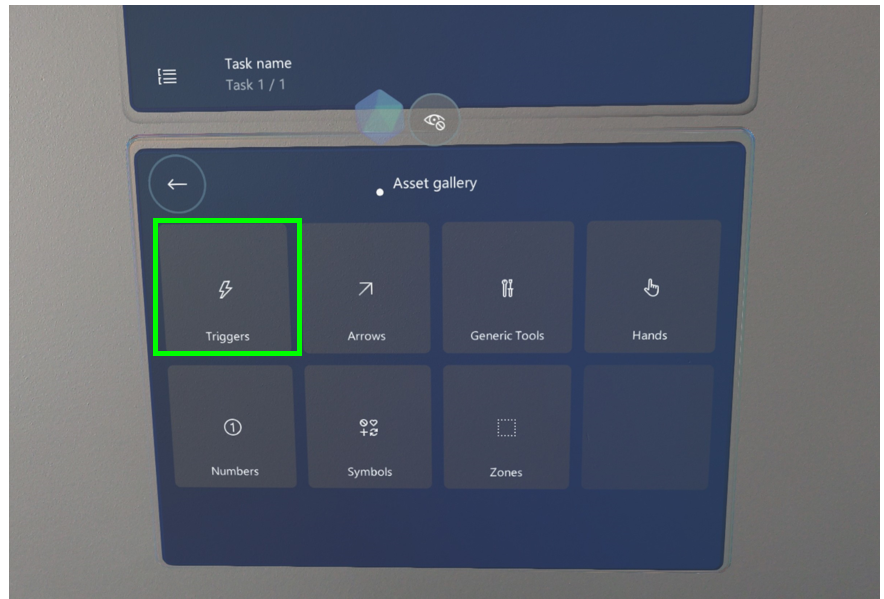
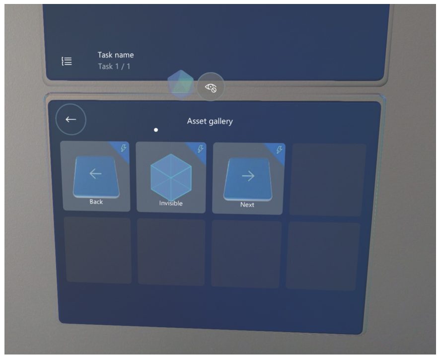
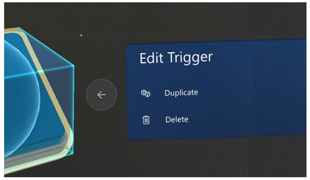

# Create and place a trigger for step navigation in the Dynamics 365 Guides HoloLens app

After you create a trigger in the [Microsoft Dynamics 365 Guides PC app](pc-app-trigger.md), you can place and test it in the HoloLens app. You can also create the trigger directly in the HoloLens app, as described in this article.

## Create a trigger in the HoloLens app

1. Select an empty box in the bin.

2. In the **Asset gallery**, select the **Triggers** category.

    

3. Select the type of trigger (**Back**, **Invisible**, or **Next**) you want to create. For information on types of triggers, see [Create a trigger with the PC app](pc-app-trigger.md).

    
 
3. The item is added to the bin and is ready to place in the real world.

## Tips for placing and sizing triggers

You can [place and size a trigger](hololens-app-orientation.md#place-your-holograms) just like any other hologram in the HoloLens app. When placing a trigger, keep the following in mind though:

- **Position.** Place the trigger where the work happens at "working height" (above the belt). If you’re creating an invisible trigger, remember that the trigger is activated **when the operator’s hand exits the trigger cube**, so it’s a good idea to put the trigger in a location where the operator ends the action. You’ll need to test the trigger in **Operate** mode to make sure it behaves the way you expect.

   Also, avoid placing triggers in drawers or under counters. If you can't see your hand, HoloLens 2 can't see it either. 

- **Size.** It’s important to make the trigger cube the right size. If you make the trigger too big, the operator might activate the trigger unexpectedly at the wrong time. If you make the trigger too small, the operator might miss it completely. The trigger needs to be big enough to place hands inside.

- **Using multiple triggers.** Since triggers always have a cube shape, in some cases, you may want to use multiple triggers to make sure the operator activates the trigger. For example, if the area you want to cover for a trigger is rectangular in shape, you could put multiple duplicate triggers next to each other if you don’t know the exact spot where the operator’s hand will exit the trigger area. You can add as many triggers as you want for each step.

> [!TIP]
> You can duplicate a trigger by using the **Duplicate** command in the **Edit Trigger** menu.

## Delete or duplicate a trigger

You can edit a trigger the same way you edit any other hologram in the HoloLens app.

1. Select the trigger hologram.

2. Select the **Edit Hologram** (pencil) button.

    
 
3. Select **Duplicate** or **Delete**.

    
 
    > [!NOTE]
    > You can’t use styles or animations with visible or invisible triggers.

## What’s next?

[Learn about triggers from an operator’s point of view](hololens-app-orientation.md)

