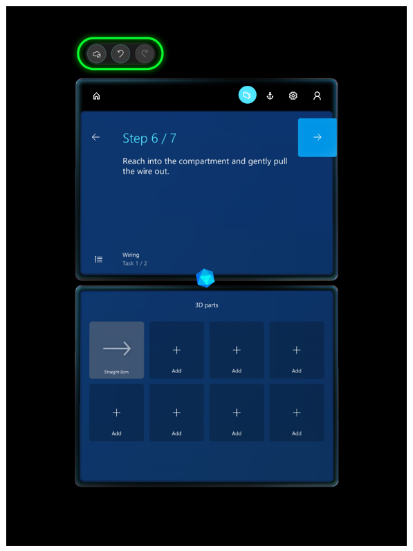

# Author in the HoloLens application for Dynamics 365 Guides

[Watch a video on HoloLens authoring](https://aka.ms/hololensauthor)

The second major step in authoring a guide in [!include[cc-microsoft](../includes/cc-microsoft.md)] [!include[pn-dyn-365-guides](../includes/pn-dyn-365-guides.md)] takes place on the [!include[pn-hololens](../includes/pn-hololens.md)] application. In [!include[pn-hololens](../includes/pn-hololens.md)] Author mode, you:

- Anchor your guide.

- Place your holographic 3D content in its relevant space in the real world.

- Add dotted lines to visually tie your steps to physical objects in the real world.

- Add styles (optional) to 3D content to add treatments such as a warning or caution.

- Test the flow of your guide.

  

## Install the HoloLens app

If you haven’t already installed the [!include[pn-hololens](../includes/pn-hololens.md)] app on your [!include[pn-hololens](../includes/pn-hololens.md)] device (or it hasn't already been installed for you), install it from the [!include[cc-microsoft](../includes/cc-microsoft.md)] Store for Consumers.

To install the HoloLens app:

1.	Make sure you have [!include[cc-microsoft](../includes/cc-microsoft.md)] [!include[pn-hololens](../includes/pn-hololens.md)] build 10.0.14393.0 or later installed on your [!include[pn-hololens](../includes/pn-hololens.md)] device. We recommend updating to newer versions when available. See [Manage updates to HoloLens](https://docs.microsoft.com/HoloLens/hololens-updates) for instructions on using [!include[pn-ms-windows-short](../includes/pn-ms-windows-short.md)] Update for Business.

2.	On your [!include[pn-hololens](../includes/pn-hololens.md)], use the [bloom gesture](authoring-gestures.md) to open the **Home** menu, and then open [!include[cc-microsoft](../includes/cc-microsoft.md)] Store and search for “[!include[pn-dyn-365-guides](../includes/pn-dyn-365-guides.md)]”.

3.	Select **Install** to download and install the [!include[pn-dyn-365-guides](../includes/pn-dyn-365-guides.md)] application.

### Sign in to the HoloLens app
If you sign in with a brand new [!include[pn-hololens](../includes/pn-hololens.md)] device, you’ll be prompted to walk through the Setup wizard. In the Setup wizard, you can sign in with an existing account or create a new one, depending on the version of [!include[pn-ms-windows-short](../includes/pn-ms-windows-short.md)] that you’re running. The Setup wizard will also walk you through steps to calibrate and prepare your [!include[pn-hololens](../includes/pn-hololens.md)] for use.

#### Calibrate your HoloLens

To have the holograms appear in the correct locations, the interpupillary distance (IPD) must be set. This is true for any [!include[pn-hololens](../includes/pn-hololens.md)] user, whether you’re an author or an operator. In an industrial setting where a hologram is used to direct the operator to do operational tasks, it’s crucial that holograms be aligned properly. Otherwise it can cause operator confusion and can result in costly damage.

If you don’t configure the IPD for each user: 

- Holograms will be out of alignment by 1–2 cm. 

- Holograms will appear as if they’re sunk into or floating above surfaces they’re sitting on.

- Holograms will not be stable. As you walk around, you’ll notice that they move.

> [!IMPORTANT] 
> It’s particularly crucial for authors to ensure that their IPD is set correctly. Otherwise, all operators using the guide will see misaligned holograms. 

To set your IPD, use the Calibration app included with [!include[pn-hololens](../includes/pn-hololens.md)] using the following steps: 

1.	Do the bloom gesture to launch the **Start** menu.

2.	Air tap on **Calibration** to begin calibrating your [!include[pn-hololens](../includes/pn-hololens.md)].

    
 
3.	Follow the instructions on your [!include[pn-hololens](../includes/pn-hololens.md)].

Each user will need to do this calibration after logging into the device. If [!include[pn-hololens](../includes/pn-hololens.md)] is running [!include[pn-ms-windows-short](../includes/pn-ms-windows-short.md)] Holographic for Business edition, the IPD setting will be saved on the device. When the user logs into the same [!include[pn-hololens](../includes/pn-hololens.md)], their IPD setting will be applied automatically even after switching users—they won’t need to recalibrate. If [!include[pn-hololens](../includes/pn-hololens.md)] is running [!include[pn-ms-windows-short](../includes/pn-ms-windows-short.md)] Holographic edition, however, user settings aren’t saved, because this version of the operating system is designed for a single user. Each time you switch users, you’ll need to recalibrate the device. 

To determine which version of the operating system you’re using on [!include[pn-hololens](../includes/pn-hololens.md)]: 

1.	Do the bloom gesture to launch the **Start** menu.

2.	Air tap on **Settings > System**.
 
3.	Air tap **About**.
 
### Open and sign in to HoloLens for the first time

After ensuring that your [!include[pn-hololens](../includes/pn-hololens.md)] is correctly calibrated, you can open the [!include[pn-hololens](../includes/pn-hololens.md)] application.
1.	Go to **All Apps**.

    

2.	Select the down arrow.

    

3.	Open the [!include[pn-dyn-365-guides](../includes/pn-dyn-365-guides.md)] application.

    
 
4.	In the **Welcome** screen, select **Sign in**. 

5.	In the **Email and accounts** screen, select **Work or school account**, and then select **Continue**. 

6.	In the **Work or school account** screen, enter the credentials you created during the trial sign-up or the credentials provided to you by the administrator who installed the app. 

    
 
7.	Select an instance to use if you have more than one instance, and then select **Continue**.

8. In the **Select Guide** screen, gaze at the guide you want to open until the circle fills, which selects that guide.

    

9.	In the **Select Mode** dialog box, gaze at the box to the left of **Author** to select it. 

    
    
> [!TIP]
> [!include[pn-dyn-365-guides](../includes/pn-dyn-365-guides.md)] comes with an example guide you can use to get ideas for your own guides. Check it out!  

## Anchor your guide
The first thing you see when you open a guide is the anchoring instructions from the PC authoring application. 

### To anchor a guide using a printed anchor

1. Stand about two feet in front of the printed anchor.

2. In the **Scan printed anchor** screen, select **Initiate Scan**.

   

   On your [!include[pn-hololens](../includes/pn-hololens.md)], you'll see an anchor hologram that looks like this:

   
   
3. Look at the printed anchor with your [!include[pn-hololens](../includes/pn-hololens.md)] until a green outline appears. Use your gaze to align the green box to the marker, and then select **Confirm**.

   

   When the guide is correctly aligned, you'll see the **Printed anchor found** screen. 
   
   
   
### To anchor a guide using a digital anchor

- Use air tap and hold to move and align the digital anchor to its real-world counterpart. To rotate the anchor, tap and hold the blue spheres.

   

### Re-anchor a guide

When you anchor your guide, the anchoring information is stored on your [!include[pn-hololens](../includes/pn-hololens.md)] so you don’t have to re-anchor the guide every time you open it. You can re-anchor a guide at any time, though, if you feel the holograms are out of alignment. For more information, read about the **Anchor** button in the next section.

> [!NOTE]
> You might need to adjust the hardware offset in [!include[pn-hololens](../includes/pn-hololens.md)] 1 devices to ensure accurate placement of 3D content. [Learn more about adjusting for hardware offset](https://docs.microsoft.com/dynamics365/mixed-reality/guides/known-issues#uploading-new-3d-models-with-names-matching-any-of-the-pre-packaged-models-in-the-3d-toolkit-will-overwrite-the-files-in-the-3d-toolkit).

## Get oriented on HoloLens
After you anchor your guide, you’ll see the Step card. The Step card is the hub of everything you do with your guide and how you navigate in the app. The Step card is also what your operator will see when they use the guide. The Step card follows the operator to keep the instructions where they need them as they move around their work space.

Navigate through the guide by gazing at the **Next Step** and **Go Back** arrows. You can also use gestures such as air tap to navigate through a guide. 

At the top of the Step card screen, you’ll see three buttons: **Save**, **Undo**, and **Redo**.

 
The **Undo** and **Redo** buttons work like **Undo** and **Redo** in any Microsoft Office program. You can undo 100 changes or redo 100 changes.  

> [!NOTE]
> Changes are automatically saved in the cloud as you author in [!include[pn-hololens](../includes/pn-hololens.md)]. Just be sure to select **Refresh** when you go back to the PC to ensure that you have the latest version of the guide.

The Step card also includes several other buttons and UI elements:

 
Here’s what each button or UI element is used for:

|Number|Button/Example|Name|Purpose|
|--|---|------------|----------------------------------------------------------------------------------------------------------------|
|1||Home|Choose a different guide.|
|2||Follow mode|Have the Step card follow you or lock it to a location.  Guides includes a feature called Follow mode. Wherever you look, the Step card follows your gaze so you never have to worry where your instructions are. When you turn off Follow mode, the card stays where it is. You can just grab the card at any time by using the navigation bar to move it wherever you like. |
|3||Anchor|Re-anchor (realign) your guide.  [!include[pn-hololens](../includes/pn-hololens.md)] can sometimes lose tracking. To fix this, you’ll need to re-anchor the guide by gazing at the printed anchor (marker) or digital anchor again.|
|4||Settings|Access the following settings:  - **Build number**. Shows the build you’re using.|
|5||Profile|Sign in and out.|
|6||Step progress|Shows where you are in the step.|
|7||Outline|Go to the **Outline** page.  Use the **Outline** page to quickly navigate around your guide.|
|8||Task name|The name of the task.|
|9||Task Progress	|Shows where you are in the open task.|

## Test the flow of your guide
Once you’re oriented on [!include[pn-hololens](../includes/pn-hololens.md)], we recommend that you go through your whole guide in Operate mode to see how it flows. As you step through your guide, make note of things you want to change in the PC application. For example, you might need to move some steps around, add tasks or steps, or add more supporting assets. It’s generally best to make these changes in the PC application before you start placing holograms, tethers, and styles. 
 
## Add a dotted line to link a Step card to a focus area

You can add dotted lines (*tethers*) to link your Step cards to the areas where the work gets done. These dotted lines show the operator where to focus. 

To place a dotted line:

1.	Tap and hold the gem below the Step card.

2.	Drag it to the real-world location that you want.

    

### Best practices for dotted lines

- Placement isn’t exact, so if you’re connecting a dotted line to a 3D object from the 3D toolkit, place the dotted line in the general area, and then place the 3D object (a number, for example) at the end of the dotted line. 

## Place your holograms

In this stage of the process, you’ll walk through each step in your guide and place any assets that you associated with that step when you authored it in the PC application. For example, if you added a 3D part to support a step, you’ll place that part over its physical counterpart in the real world. If you added a 3D object from the 3D toolkit (an arrow or a number, for example), you’ll place that object in an appropriate place in the real world to draw the user’s focus. You can place the same 3D part or 3D object as many times as you want.

You don’t need to do anything to place an image or a video associated with a step. They automatically appear when the operator goes to the step.

The 3D assets associated with each step appear below the Step card in the bin:

### Place a 3D part 

1. In the bin, air tap the 3D part that you want to place.

2. Use gaze and gestures to place the 3D part hologram over its counterpart in the physical world. For information on manipulating holograms with gaze and gestures, see the next section.

### Place a 3D model from the 3D toolkit

You can place a 3D model from the 3D toolkit in the same way you place a 3D part if you added that 3D model to the bin in the PC application. If you didn't add the 3D model in the PC application, you can do it directly from the [!include[pn-hololens](../includes/pn-hololens.md)] app: 

1.	Air tap an empty box in the bin (under **3D parts**).

2.	Air tap a category (an arrow or hand, for example), and then air tap the specific 3D model you want to add.

    

    The item will be added to your bin and you can then place it as you would a 3D part.

### Manipulating holograms

To place a 3D model from one of your bins:

1.	Air tap a 3D model to add it to your real world. It will appear in your world in front of the Step card.

2.	Raise your hand to the ready gesture and gaze at the model to preview it. The way you can tell if it’s in a preview state is that the 3D controls appear around it.

    If you put your hand down, the 3D controls will go away. This way, if you're just looking at holograms, the controls won't get in your way. You need to look at the part as well as put your hand up in the ready position.

3. With the controls visible, air tap + hold anywhere on the move control to pick up the model. Move the model where you want it to go and release to place the model.

> [!NOTE]
> When you tap a 3D part to move it, you select it at the same time. When it's selected, when you put your hand down, the 3D controls remain until you preview or select another part, or air tap anywhere in empty space.
 
#### Rotate a hologram

It’s unlikely an asset will be at the correct orientation when you initially place or move it. Use the rotation controls to rotate it the way you want.

To rotate a hologram:

- Air tap and hold a rotation control, and then do one of the following:

  - Use the up/down sphere to rotate vertically.
  
  - Use the left/right sphere to rotate horizontally.
  
  - Use the free-hand sphere to rotate in any direction.

>[!Tip]
> Gazing at any of the spheres will let you know which direction the sphere will rotate.

When rotating, it helps to think as if you are physically grabbing the sphere and rotating around the object, like a wheel.
The following graphics show how to use the different rotation controls:

Free rotation

Left/right rotation

Up/down rotation

 
> [!Important]
> To manipulate holograms effectively, make sure that your [!include[pn-hololens](../includes/pn-hololens.md)] is calibrated properly. 

#### Change the size of a hologram after placing it

- Air tap and hold the **Scale Hologram** control, and then move your hand up or down.  

   

### Best practices for working with 3D content

- Make sure that the 3D content is not in the way of the operator doing the task. 

- Keep the field of view in mind when you place assets. If you put a hologram behind someone, it will be very hard to find.

- Use 3D content sparingly and with a clear goal. Too much content can clutter the instructions and make it harder to follow.

- Remember that you can attach a tether to 3D content to make it more discoverable. See the next section to learn about tethers.

## Turn off animations

If you're using animated 3D models in your guide, you can turn animation off if you plan to show it with animation in one step and without animation in another. This option is available from the **Edit** menu when you select the model.

You can also use this option when you place animated models in space. Turn animation off, place the model, and then turn animation back on. This way the animation won't interfere with your ability to place it.

## Add styles for emphasis
Use styles to provide visual cues for extra emphasis. For example, add the Warning style to show caution or the Avoid style to make sure an operator doesn’t do something that could cause harm. As your operators get used to the visual language provided by styles, it will speed up their learning process.

> [!Note]
> At this time, you can’t add styles from the PC application. They exist only in [!include[pn-hololens](../includes/pn-hololens.md)]. 

To place a style:

1.	Air tap a hologram you’ve already placed in the real world to select it.

2.	Air tap the **Edit Hologram** button.

    

3.	Air tap **Styles**. 

    
 
4.	Select the style you want to use.

    
 
Here’s a list of styles included in [!include[pn-dyn-365-guides](../includes/pn-dyn-365-guides.md)] and when to use each:

|Style	|Purpose	|How it appears to the operator|
|---------------|-------------------|--------------------------------------------|
|Original|Restore to original appearance.	|Default appearance|
|Pick up	|Tell the operator to pick up something.	|Outline|
|Place	|Show the operator where to place something.	|Dotted line|
|See-through 1	|Show something without obscuring the operator’s view.	|50% transparent|
|See-through 2	|Layer one thing on top of another so the operator can see through two layers.	|75% transparent|
|Warning	|Warn about a safety or quality concern.	|Yellow and black striped|
|Avoid	|Show areas or things to avoid.	|Red flashing|
|X-ray	|Show things that happen inside something.	|Shows a pulse through it|
|Metal	|Provide a realistic metal finish for an object.	|Metallic|

 
### Best practices for styles

- Use styles to reinforce actions.

- Use styles only for the purpose they were intended. When operators learn the visual language of styles, they’ll know that a particular style means a certain thing, which will speed up the learning process. 

## Duplicate a 3D model to use for similar items

Sometimes, you need multiple copies of the same 3D models to point to similar items in the work area. Rather than adding new instances of a 3D model from the asset bin and having to set the position and style each time, you can save time by duplicating the 3D model. The duplicate will have the same rotation and style settings as the original.

To duplicate a model:

1.	Air tap a hologram you’ve already placed in the real world to select it.

2.	Air tap the **Edit Hologram** button.

    
    
3. Select **Duplicate**.

    
    
## Opt out of sending telemetry data to Microsoft

For privacy reasons, you can turn off the ability to send telemetry data to Microsoft. Microsoft uses this data to improve the product. Opting out prevents Microsoft from collecting any activity data.

To turn telemetry data off for HoloLens:

- In **Settings**, turn the **Send Usage Data** slider to off.

    
    
> [!NOTE]
> This option applies only to the device on which it's set. If you use Dynamics 365 Guides on more than one device, you need to modify the setting on those other devices. To turn this setting off for the PC application, see [Author a guide in the PC application](pc-authoring.md). 

## What's next?

To learn more about [!include[pn-dyn-365-guides](../includes/pn-dyn-365-guides.md)], here are some helpful links:

- [Use a guide as an operator](operator-guide.md)
- [Analyze your guides to improve efficiency](analytics-guide.md)
- [FAQ](faq.md)

To learn more about [!include[cc-microsoft](../includes/cc-microsoft.md)] mixed-reality apps and [!include[pn-hololens](../includes/pn-hololens.md)], use the following links: 

- [What is mixed reality](https://docs.microsoft.com/windows/mixed-reality/mixed-reality)?
- [Microsoft Dynamics 365 Layout](https://dynamics.microsoft.com/mixed-reality/layout/)
- [Microsoft Dynamics 365 Remote Assist](https://dynamics.microsoft.com/mixed-reality/remote-assist/)
- [Connect to Wi-Fi on HoloLens](https://docs.microsoft.com/windows/mixed-reality/connecting-to-wi-fi-on-hololens)
- [Calibrate your HoloLens](https://docs.microsoft.com/windows/mixed-reality/calibration)
