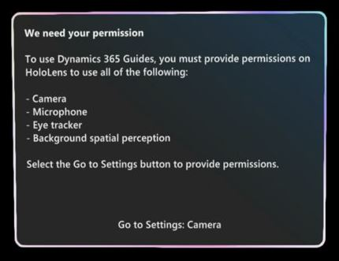

# Permissions required to use the Dynamics 365 Guides HoloLens app

To use the Microsoft Dynamics 365 Guides HoloLens app, you must first provide necessary permissions. When you open the HoloLens app for the first time, you're prompted to provide these permissions through separate dialog boxes. For example, you'll see this dialog box for the eye tracker.

If you don't provide the necessary permissions, you'll see the following dialog box that prompts you to provide them.

The following table describes the five permissions and what they're required for.  

|Permission|Requrired?|Description|
|----------------------|----------------------------------------------------------|
|Eye tracking||Required to use the Main menu and to create a great experience. Eye tracking lets HoloLens know what you’re looking at and helps validate your intentions.  Eye tracking has been designed with user privacy in mind. Microsoft doesn’t store any biometric or other identifiable information.| 
|Camera||Required to [make video calls](calling-start-call.md), to understand the space around you, and more.| 
|Microphone||Required to [make voice calls](calling-start-call.md) and use [voice commands](voice-commands.md).|  
|Background spatial perception (movement)||Required for [annotations](calling-annotations.md).|
|Location||Optional. If you choose to allow location permissions, the location data is stored in Microsoft Dataverse and is displayed in the [**Phone Calls** form  in the Guides model-driven app](call-logging.md).|

You can also turn each permission on/off through **Settings**. 

## See also

- [Install and sign in to the HoloLens app](hololens-app-install-sign-in.md)
- [Frequently asked questions about Dynamics 365 Guides](faq.md)
